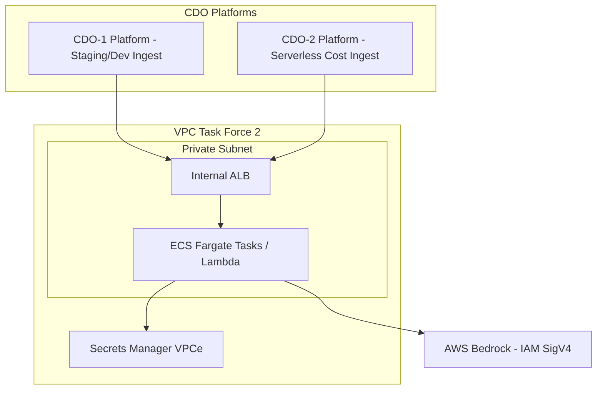

# Hợp đồng Triển khai (Deployment Contract) - Task Force 2 (FinOps Watch)

<!-- Owner: Nhóm AI 2
     Signed by: AI Lead + CDO Leads × 2 + Reviewer panel
     Date signed: 2026-06-25 (W11 T5)
     🔒 FREEZE - Không thay đổi nếu không có yêu cầu thay đổi chính thức (Formal Change Request) -->

## 1. Mục đích

Hợp đồng này định nghĩa **phương thức triển khai và vận hành của AI Engine** (compute target, scaling, quản lý secrets, mạng lưới network, chiến lược rollback, và các ranh giới bảo mật cứng). Nhóm CDO sẽ dựa vào các thông số này để thiết lập hạ tầng kết nối ổn định, an toàn và đảm bảo dung lượng (capacity) phù hợp.

---

## 2. Nguyên tắc cốt lõi

**Nhóm AI chỉ triển khai một bản thể duy nhất (host ONCE) của AI Engine trong toàn bộ Task Force.** Các nền tảng CDO của các nhóm trong Task Force 2 sẽ gọi chung vào endpoint này và được phân biệt (multi-tenant) dựa trên thuộc tính tài khoản liên kết (`tenant_id` hoặc `line_item_usage_account_id`).

---

## 3. Cấu hình tính toán (Compute)

| Thuộc tính (Aspect) | Cấu hình đề xuất (Configuration) |
|---|---|
| **Môi trường chạy (Target)** | ECS Fargate task (hoặc AWS Lambda nếu tải xử lý batch nhẹ và chạy định kỳ theo cron) |
| **Tên Cluster** | `tf-2-aiops-cluster` |
| **Tên Dịch vụ (Service)** | `ai-engine` |
| **Nguồn Docker Image** | ECR Repo URI + tag phiên bản (`v1.0.0`) |
| **CPU cho mỗi Task** | 1024 (1 vCPU) |
| **Memory cho mỗi Task** | 2048 MB |

---

## 4. Cơ chế tự động mở rộng (Scaling)

| Thuộc tính (Aspect) | Giá trị (Value) |
|---|---|
| **Số lượng Task tối thiểu (Min)** | 2 |
| **Số lượng Task tối đa (Max)** | 10 |
| **Điều kiện kích hoạt 1 (CPU)** | Target CPU sử dụng vượt quá 70% |
| **Điều kiện kích hoạt 2 (Request)** | Số lượng yêu cầu đồng thời vượt quá 100 requests/task |
| **Thời gian chờ mở rộng (Scale-up cooldown)**| 60 giây |
| **Thời gian chờ thu hẹp (Scale-down cooldown)**| 300 giây |
| **Gặp lỗi khởi động lạnh (Cold Start)** | (Nếu deploy dạng Lambda) Provisioned Concurrency = 2 |

---

## 5. Quản lý bí mật (Secrets)

| Tên Secret | Nguồn gốc / Phương thức lưu trữ |
|---|---|
| `BEDROCK_API_KEY` / IAM Role | AWS Secrets Manager: `tf-2/ai-engine/bedrock` |
| `AWS_REGION` | Biến môi trường (Environment Variable) |

> [!IMPORTANT]
> **Không sử dụng Long-lived IAM Access Keys.** Mọi thông tin xác thực phải được cấp quyền qua IAM Instance/Execution Role hoặc Secrets Manager với chính sách tự động xoay vòng key (rotation policy).

---

## 6. Mạng lưới (Networking)

| Thuộc tính (Aspect) | Cấu hình mạng (Configuration) |
|---|---|
| **Loại Subnet** | Subnet riêng tư (Private Subnet) |
| **Load Balancer (ALB)** | Nội bộ (Internal ALB) - **Tuyệt đối không public ra Internet** |
| **Security Group** | `tf-2-ai-engine-sg` |
| **Luật truy cập vào (Ingress)** | Chỉ cho phép lưu lượng từ Security Group của các nền tảng CDO trong cùng Task Force |
| **Luật truy cập ra (Egress)** | Chỉ cho phép gọi tới các AWS Bedrock endpoint và Secrets Manager VPC endpoint |
| **Hệ thống phân giải tên miền (DNS)**| Tên miền nội bộ phân giải qua Route 53 Private Hosted Zone |

---

## 7. Ranh giới bảo mật cứng & Cơ chế ngăn chặn an toàn (Hard Boundaries & Containment)

Để đảm bảo hệ thống FinOps Watch hoạt động liên tục nhưng không gây ảnh hưởng tới hoạt động kinh doanh của khách hàng, hạ tầng IAM và quyền hạn của AI Engine phải tuân thủ nghiêm ngặt các ranh giới sau:

### 7.1. Ba ranh giới tuyệt đối (Never List)
CDO phải cấu hình IAM Policy cho AI Engine/Containment Engine sao cho:
1. **KHÔNG BAO GIỜ terminate tài nguyên Production** (Không tắt instance, không tắt RDS ở tài khoản prod).
2. **KHÔNG BAO GIỜ delete dữ liệu** (Không xóa S3 object, EBS volume, hay database snapshot).
3. **KHÔNG BAO GIỜ modify IAM** (Không sửa role, policy, hay phân quyền).

### 7.2. Phân chia quyền can thiệp theo môi trường (Scope of Containment)

- **Môi trường Production (Tài khoản: `prod-core`, `prod-payments`)**:
  - Chỉ cho phép hành động **Dry-run**, gắn thẻ đề xuất đánh giá (`tag-for-review`) hoặc gửi cảnh báo thông báo (alert).
  - Không tự động can thiệp tắt hay giới hạn tài nguyên.
- **Môi trường Dev / Sandbox / Staging (Tài khoản: `dev`, `staging`, `ml-research`)**:
  - Cho phép tự động can thiệp (Auto-containment) với các hành động an toàn đã được định nghĩa trước:
    - *Schedule shutdown*: Tự động tắt tài nguyên chạy ngoài giờ làm việc hoặc cuối tuần đối với các instance dev/sandbox.
    - *Quota cap*: Áp đặt hạn mức chi phí hoặc hạn mức sử dụng (ví dụ: giới hạn số lượng GPU instance chạy đồng thời trên dev account).
    - *Auto-tagging*: Tự động gắn tag các tài nguyên vô danh hoặc sai tag để yêu cầu sửa đổi trong 24 giờ trước khi cảnh báo leo thang.

### 7.3. Ghi vết kiểm toán (Audit Trail)
- Mọi hành động ngăn chặn (containment actions) tự động hoặc thủ công phải ghi nhận đầy đủ thông tin:
  - Định danh người kích hoạt/hệ thống kích hoạt (Actor).
  - Trạng thái trước và sau khi can thiệp (Before/After state).
  - Kịch bản khôi phục nhanh (Rollback path).
- Toàn bộ log audit trail này phải được lưu giữ tối thiểu **90 ngày** (Retention >= 90 days).

---

## 8. Sơ đồ kiến trúc triển khai (Deployment Diagram)

---

## 9. Chiến lược triển khai và Rollback

### 9.1. Triển khai Canary (Rollout)
- **Bước 1**: Định tuyến 10% lưu lượng truy cập -> Duy trì trong 5 phút.
- **Bước 2**: Định tuyến 50% lưu lượng truy cập -> Duy trì trong 5 phút.
- **Bước 3**: Chuyển đổi 100% lưu lượng truy cập.

**Điều kiện hủy bỏ (Abort Criteria)** - tự động rollback ngay lập tức nếu:
- Tỷ lệ lỗi (Error Rate) của AI Engine > 1%.
- Độ trễ p99 (P99 Latency) > 800 ms.

### 9.2. Cơ chế khôi phục (Rollback)
- **Phương thức chính**: Sử dụng ArgoCD rollback về Git SHA trước đó.
- **Thời gian phục hồi mục tiêu (RTO)**: < 60 giây.

---

## 10. Giám sát & Đo lường (Observability)

- **Định điểm OTel**: Cấu hình OpenTelemetry Collector URL qua biến môi trường để đẩy các metric hoạt động.
- **Đầu ra Log**: Toàn bộ log của ứng dụng được đẩy về CloudWatch Logs (Thời gian lưu giữ: 14 ngày).
- **Health Check**: Endpoint `/health` (Port 8080). Chu kỳ kiểm tra 30 giây. Trạng thái Unhealthy kích hoạt sau 3 lần kiểm tra liên tiếp thất bại.

---

## 11. Câu hỏi mở (Open Questions)

- [ ] **Q1**: Có cần triển khai mô hình Multi-region cho AI Engine để phục vụ Disaster Recovery hay không (nằm trong hay ngoài scope Capstone)?
- [ ] **Q2**: Hạn mức chi phí (Cost ceiling) hàng ngày cho chính hệ thống FinOps Watch hoạt động là bao nhiêu (ví dụ: giới hạn số lượng token gọi sang Bedrock)?
