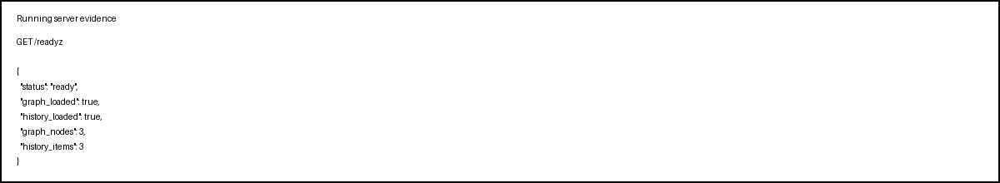

# AIOps Model Serving Design

Mình chọn kiến trúc FastAPI theo hướng “serve toàn bộ pipeline”, không chỉ serve model. Endpoint `/incident` nhận batch alert, chuẩn hóa input bằng Pydantic, sau đó đi qua hai bước chính: correlation để gom alert thành cluster, và RCA để chọn root cause cùng action khuyến nghị. Ở bài tập này, correlation và RCA được giả lập bằng logic deterministic để đảm bảo hệ thống chạy ổn định, nhưng cấu trúc code vẫn giữ đúng điểm mở để thay bằng implementation thật sau này.

Latency budget của endpoint được chia thành ba phần. Phần đầu là validate + parse input, gần như fixed cost nhỏ. Phần thứ hai là correlation, phụ thuộc số alert nhưng vẫn có xu hướng gần tuyến tính theo batch size. Phần thứ ba là RCA/enrichment, thường chiếm thời gian lớn nhất nếu có gọi LLM hoặc truy vấn downstream. Vì vậy mình ưu tiên giữ phần pipeline core đơn giản, đo latency bằng middleware, và trả `X-Response-Time-Ms` để dễ quan sát p50/p99 khi test tải.

Mình chọn `gap_sec=120s` theo tinh thần gom alert cùng service và cùng đợt sự cố trong một cửa sổ thời gian ngắn. Con số 120 giây là quyết định concrete cho bài này: đủ lớn để gom các alert liên tiếp trong môi trường real-time, nhưng vẫn đủ nhỏ để không trộn nhiều incident khác nhau vào cùng một cluster. Trong production, một concern quan trọng là fault tolerance: nếu LLM provider down, hệ thống vẫn phải trả response hợp lệ thay vì làm hỏng toàn bộ request. Vì vậy kiến trúc này cho phép trả root cause rule-based trước, rồi mới enrich sau nếu có downstream tốt.

Mình chọn FastAPI thay vì Flask vì FastAPI cho validation, type hints, và OpenAPI tự sinh tốt hơn, rất hợp với JSON API như bài này. So với BentoML, FastAPI nhẹ hơn và ít “magic” hơn cho một pipeline không chỉ là model serving mà còn có graph load, readiness, middleware, và response schema. Trade-off là mình phải tự viết nhiều logic hơn, nhưng đổi lại luồng xử lý rõ ràng và dễ debug.

## Production concern

Concern mình xử lý là concurrency và state. Code này giữ state ở mức read-only module level, nên khi chạy nhiều worker sẽ không có race condition trên dữ liệu mutable của request. Nếu cần cache LLM hoặc graph động trong production, mình sẽ chuyển cache sang Redis hoặc một layer external để tránh mỗi worker giữ một bản riêng.

## Health and readiness

Mình tách `/healthz` và `/readyz` vì hai endpoint phục vụ hai mục đích khác nhau. `/healthz` chỉ trả lời câu hỏi “process còn sống không”, còn `/readyz` kiểm tra thêm graph và history đã sẵn sàng chưa. Trong rolling deploy, health có thể vẫn ok nhưng readiness chưa ok nếu dependency chưa load xong.

### Ảnh chạy thật

Mình đã chạy service local và chụp lại các endpoint quan trọng để đối chiếu với thiết kế.

## Shadow deployment

Nếu muốn an toàn hơn khi thay đổi logic RCA hoặc correlation, mình có thể chạy shadow deployment: version mới nhận cùng input nhưng không ảnh hưởng kết quả production. Cách này giúp so sánh hành vi giữa hai version trước khi rollout thật.

