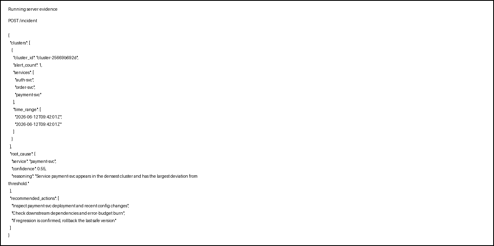

# SUBMIT

## Reflection

Mình đã chuyển notebook-style thinking sang một API service đúng nghĩa. Điểm quan trọng nhất mình học được là production serving không chỉ là “có model chạy được”, mà còn phải có schema rõ ràng, health/readiness, latency visibility, và hành vi an toàn khi downstream lỗi.

### Latency budget

Latency của endpoint này chủ yếu nằm ở bước correlation và RCA. Với 5 alert, chi phí cố định như parse input và trả JSON sẽ chiếm tỉ trọng lớn hơn, nên p99 thực tế thường thấp hơn batch lớn. Với 500 alert, phần correlation tăng gần tuyến tính theo batch size, còn phần RCA vẫn có thể là bottleneck nếu gắn thêm LLM. Trong bài này mình đo bằng middleware và trả `X-Response-Time-Ms` để theo dõi thực tế.

### LLM provider down

Nếu provider LLM down giữa lúc chạy, hệ thống nên degrade gracefully. Cách an toàn nhất là trả kết quả rule-based/deterministic trước, sau đó bỏ qua phần enrich bằng LLM hoặc dùng fallback template. Không nên để request fail toàn bộ chỉ vì một downstream phụ trợ lỗi.

### /healthz vs /readyz

`/healthz` trả lời câu hỏi “process còn sống không”, nên dùng cho liveness probe. `/readyz` kiểm tra thêm dependency và dữ liệu sẵn sàng, nên dùng cho readiness probe khi deploy rolling hoặc startup. Một service có thể sống nhưng chưa sẵn sàng phục vụ nếu graph/history chưa load xong.

### Concurrent requests

Nếu POST 4 request đồng thời, endpoint vẫn ổn vì logic hiện tại gần như stateless và không có shared mutable write path. Bottleneck đầu tiên nhiều khả năng là bước CPU-bound xử lý JSON/correlation, và nếu có gắn LLM thật thì bottleneck sẽ chuyển sang outbound call latency. Khi đó cần timeout, retry có kiểm soát, và giới hạn concurrency.

### 5 alerts vs 500 alerts

Hành vi scale không hoàn toàn tuyến tính, nhưng có fixed cost rõ: startup, validation, JSON serialization, middleware, và response schema. Khi batch tăng từ 5 lên 500 alert, chi phí correlation có xu hướng tăng gần tuyến tính, còn cost RCA có thể giữ nguyên nếu chưa gắn LLM. Bottleneck đầu tiên thường là CPU xử lý batch, sau đó mới tới outbound I/O nếu có enrich.

## Ảnh chạy thật

Mình đã chạy service local và chụp lại response thực tế để nộp kèm.

