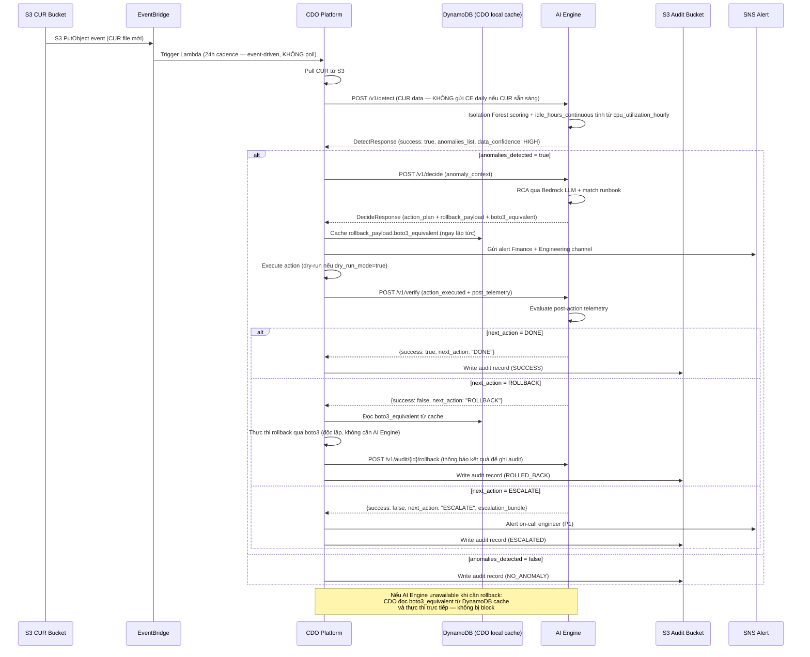

# AI API Contract — Task Force 2 (FinOps Watch)

<!-- Owner: Nhóm AI — TF2 FinOps Watch
     Signed by: AI Lead + CDO Lead (CDO-01) + CDO Lead (CDO-02) + Reviewer Panel
     Date signed: 2026-06-25 (W11 T5)
     Version: v1.4.0
     Changelog từ v1.3.0 (CR-v3.2 — Production Hardening 2026-06-25):
       [P13] §3.2 — Idempotency hot path: DynamoDB conditional write + TTL (sync deployment-contract §Appendix C)
       [P14] §3.4 — Bucket primary: `company-cdo-{account_id}-telemetry` (tf2-cdo deprecated)
       [P15] §5.1 — CUR schema sync telemetry §7; business_context + CUR-CE mismatch fields
       [P16] §5.1 — business_context.traffic_volume required (telemetry §11.2)
     Changelog từ v1.2.0:
       [P9]  §3.4 — S3 Bucket Naming Convention: Globally unique pattern `tf2-cdo{NN}-telemetry-{region}`
               → Fix xung đột `BucketAlreadyExists` khi CDO-01 và CDO-02 chạy IaC song song
       [P10] §3.4 — IAM Access Pattern: chuẩn hóa quyền đọc S3 theo 2 mode triển khai (per-CDO vs shared skeleton)
               → Thêm Option B: Cross-Account STS AssumeRole cho Zero Trust nâng cao
       [P11] §5.1 — `s3_bucket_uri` pattern update: bắt buộc tuân thủ naming convention `tf2-cdo{NN}-telemetry-{region}`
       [P12] §5.7 — Callback (AI→CDO): AI Engine POST kết quả DetectResponse về `callback_url` sau khi xử lý xong (optional)
               → Không thay đổi luồng sync chính — callback là bổ sung, không thay thế
     Changelog từ v1.1.0:
       [P1] §5.1 — aws_cost_explorer_daily hạ từ required → optional/fallback (Đề xuất CDO-P5)
       [P2] §5.3 — post_telemetry_window.aws_cost_explorer_daily hạ required tương tự (Đề xuất CDO-P5)
       [P3] §5.6 — Rollback độc lập: CDO tự thực thi qua boto3, AI ghi audit (Đề xuất CDO-P1)
       [P4] §3.1 — Tách clock skew: 300s cho Request Timestamp, 36h cho Data Timestamp (Đề xuất CDO-P2)
       [P5] §3.3 — Error Budget Lock theo môi trường: prod 1%, staging 10%, dev/sandbox OFF (Đề xuất CDO-P3)
       [P6] §5.1 — idle_hours_continuous → AI Engine tính từ cpu_utilization_hourly (Đề xuất CDO-P4)
       [P7] §5.1 — Thêm data_confidence (HIGH/LOW) khi CE fallback
       [P8] §5.2 — Thêm rollback_payload.boto3_equivalent cho CDO offline rollback
    Quyết định kiến trúc (consolidated 2026-06-25):
      ✓ Giữ `POST /v1/detect` đồng bộ (P99 < 300ms) — đây là luồng chính
      ✓ Giữ `GET /v1/status/{id}` cho remediation audit — KHÔNG dùng cho detect polling
      ✓ Callback (AI→CDO) là **optional, bổ sung**: chỉ kích hoạt khi CDO gửi `callback_url`
      ✗ Từ chối: thay thế hoàn toàn sync bằng async callback + xóa `/v1/status` (ai-api-contract-v1.2.0-patch.md) — defer sang v2.0 nếu detect trở thành long-running
     🔒 FREEZE sau khi cả hai bên ký — Formal Change Request bắt buộc cho mọi sửa đổi tiếp theo -->

---

## Mục lục

1. [Mục đích & Phạm vi](#1-mục-đích--phạm-vi)
2. [Luồng tích hợp tổng thể](#2-luồng-tích-hợp-tổng-thể)
3. [Quy tắc chung & Bảo mật](#3-quy-tắc-chung--bảo-mật)
   - 3.1 Clock Skew — Tách biệt hai cơ chế kiểm tra thời gian
   - 3.2 Quy tắc Idempotency chi tiết
   - 3.3 Error Budget Lock — Phân tầng theo môi trường
   - 3.4 **[v1.3.0]** S3 Bucket Naming Convention & IAM Access Pattern
4. [Cross-Cutting Headers](#4-cross-cutting-headers)
5. [Đặc tả API Endpoints](#5-đặc-tả-api-endpoints)
   - 5.1 `POST /v1/detect` — Phát hiện Bất thường (Đồng bộ)
   - 5.2 `POST /v1/decide` — Lập Kế hoạch Can thiệp
   - 5.3 `POST /v1/verify` — Xác thực Kết quả
   - 5.4 `GET /health` — Health Check
   - 5.5 `GET /v1/status/{id}` — Kiểm tra Trạng thái Tiến trình
   - 5.6 `POST /v1/audit/{audit_id}/rollback` — Kích hoạt Rollback
   - 5.7 **[v1.3.0]** Callback (AI→CDO): AI Engine POST kết quả về `callback_url` (Optional)
6. [Anomaly Types — Enum Reference](#6-anomaly-types--enum-reference)
7. [Containment Actions — Enum Reference](#7-containment-actions--enum-reference)
8. [SLO & Xử lý Lỗi](#8-slo--xử-lý-lỗi)
9. [Sequence Diagram — Luồng Hoàn Chỉnh](#9-sequence-diagram--luồng-hoàn-chỉnh)
10. [Tài liệu liên quan](#10-tài-liệu-liên-quan)
11. [Lịch sử hợp nhất tài liệu](#11-lịch-sử-hợp-nhất-tài-liệu)

---

## 1. Mục đích & Phạm vi

Tài liệu này định nghĩa **toàn bộ Giao diện lập trình ứng dụng (API)** mà **Nhóm AI expose** cho **Nhóm CDO consume** trong hệ thống TF2 FinOps Watch.

Cam kết kỹ thuật này đảm bảo chu trình phát hiện → lập kế hoạch → can thiệp → xác thực hoạt động nhất quán, an toàn và có thể kiểm toán.

> [!NOTE]
> **Thiết kế Đồng bộ (Sync Detection)**: API `/v1/detect` xử lý đồng bộ và trả về kết quả trực tiếp trong phản hồi. CDO không cần polling. Thời gian xử lý mục tiêu P99 < 300ms (validate + cache idempotency + model scoring). Gọi Bedrock LLM cho RCA được thực hiện ở bước `/v1/decide`, không phải `/v1/detect`.

```
CUR Data (CDO Pull từ S3 — EventBridge trigger, KHÔNG poll)
        │
        ▼
POST /v1/detect ──────────────────► DetectResponse (anomalies_list trực tiếp)
        │
        │ (nếu anomalies_detected = true)
        ▼
POST /v1/decide ──────────────────► RCA + Action Plan + AWS CLI payload + Rollback payload
        │
        │ CDO thực thi action (dry-run hoặc thật)
        ▼
POST /v1/verify ──────────────────► Đánh giá hiệu quả → DONE / RETRY / ROLLBACK / ESCALATE
```

**Phạm vi:**
- Phát hiện 5 loại bất thường chi phí: `runaway_usage`, `idle_resource`, `untagged_spend`, `sudden_spike`, `gradual_drift`
- Containment an toàn: chỉ trên môi trường `dev`, `staging`, `sandbox`, `ml-research`
- Hard Boundary: **KHÔNG BAO GIỜ** terminate production, xóa data, chỉnh IAM

---

## 2. Luồng tích hợp tổng thể

```
┌─────────────────────────────────────────────────────────────────────┐
│                        CDO Platform                                 │
│                                                                     │
│  S3 Event (CUR file mới) → EventBridge                             │
│       │ (trigger 1 lần/ngày — KHÔNG Lambda poll)                   │
│       ▼                                                             │
│  [Pull CUR từ S3] ──► POST /v1/detect (CUR data) ─────────────────►│──┐
│                                                                     │  │
│  ◄─────────────────────── DetectResponse (anomalies_list) ─────────│◄─┘
│       │                                                             │
│       │ (if anomalies_detected = true)                              │
│       ▼                                                             │
│  POST /v1/decide ─────────────────────────────────────────────────►│──┐
│                                                                     │  │
│  ◄─────────────────── DecideResponse (action_plan + payloads) ─────│◄─┘
│       │                                                             │
│       │ (CDO cache rollback_payload vào DynamoDB local)             │
│       │ (Execute action — dry-run or real)                          │
│       ▼                                                             │
│  [CDO Executes AWS CLI] ──► POST /v1/verify ──────────────────────►│──┐
│                                                                     │  │
│  ◄─────── VerifyResponse (next_action: DONE/RETRY/ROLLBACK/ESC) ───│◄─┘
│                                                                     │
│  [Rollback path — CDO tự thực thi boto3, gọi /rollback để log] ────│
│  [Write Audit Trail to S3] ◄── all steps logged                    │
└─────────────────────────────────────────────────────────────────────┘
                                  │
                          AI Engine (Fargate/Lambda)
                          Private Subnet — Internal ALB
```

---

## 3. Quy tắc chung & Bảo mật

| Thuộc tính | Quy định |
|---|---|
| **Base Path** | `/v1/` |
| **Protocol** | HTTPS (TLS 1.2+) only |
| **Xác thực** | **AWS IAM SigV4** — không dùng static API key |
| **Cross-account** | STS `assume-role` kèm Session Tag `tenant_id` |
| **Network** | AI Engine chạy trong **Private Subnet**, sau **Internal ALB** — cấm public internet |
| **Content-Type** | `application/json` cho tất cả request/response |
| **Idempotency** | Header `X-Idempotency-Key` bắt buộc cho `/v1/detect`, `/v1/decide`, `/v1/verify` |
| **Rate Limit** | Tối đa **100 requests/phút** per tenant |
| **Integrity** | `X-Payload-SHA256` (SHA256 của request body) bắt buộc |
| **Multi-tenant** | Phân tách dữ liệu hoàn toàn qua `X-Tenant-Id` |

### 3.1 Clock Skew — Tách biệt hai cơ chế kiểm tra thời gian

> [!IMPORTANT]
> **v1.2.0 — Thay đổi từ v1.1.0:** Tách clock skew thành hai lớp độc lập để phù hợp với độ trễ tự nhiên 8–24h của AWS CUR.

| Lớp | Đối tượng kiểm tra | Ngưỡng | Lý do |
|---|---|---|---|
| **Request Timestamp** | `X-Request-Timestamp` trong header | ≤ **300 giây** (5 phút) | Bảo mật SigV4 — ngăn replay attack |
| **Data Timestamp** | `line_item_usage_start_date` trong CUR payload | ≤ **36 giờ** | CUR AWS có độ trễ tự nhiên 8–24h kể từ khi tài nguyên phát sinh chi phí đến khi file ghi lên S3 |

Request bị reject chỉ khi **Request Timestamp** lệch > 300 giây. Data Timestamp lệch đến 36 giờ là bình thường và được chấp nhận hoàn toàn.

### 3.2 Quy tắc Idempotency chi tiết

> [!IMPORTANT]
> **v3.2.0 (telemetry-contract.md):** Idempotency hot path dùng **DynamoDB conditional write + TTL 24h** thay vì S3 PutObject — latency ~5–15ms vs ~50–200ms, đáp ứng P99 `/v1/detect` < 300ms.

`X-Idempotency-Key` lưu tại DynamoDB table `finops-idempotency-{env}`:

| Attribute | Value |
|---|---|
| **Partition key** | `idempotency_key` |
| **TTL** | `ttl_expiry` (Unix epoch, auto-delete 24h) |
| **Write** | `ConditionExpression: attribute_not_exists(idempotency_key)` → status `IN_PROGRESS` |
| **Complete** | Update `status = COMPLETED`, cache `response_body` + `payload_sha256` |

S3 path `s3://company-cdo-{account_id}-telemetry/idempotency/{cdo_namespace}/` chỉ dùng **audit trail** (optional), không phải hot path.

Xử lý theo 3 trường hợp:

| Trạng thái Key | Payload | Hành vi |
|---|---|---|
| Chưa tồn tại | Bất kỳ | Xử lý bình thường |
| **Đang xử lý** (`IN_PROGRESS`) | Bất kỳ | `409 Conflict` + tiến trình hiện tại |
| **Đã hoàn thành** + payload **khớp** SHA256 | Khớp | `200 OK` + kết quả đã cache |
| **Đã hoàn thành** + payload **khác** SHA256 | Không khớp | `400 ERR_IDEMPOTENCY_MISMATCH` |

### 3.3 Error Budget Lock — Phân tầng theo môi trường

> [!IMPORTANT]
> **v1.2.0 — Thay đổi từ v1.1.0:** Ngưỡng khóa tự động được phân tầng theo môi trường. Không áp dụng cứng 1% cho mọi tenant.

| Môi trường | Ngưỡng Rollback Rate (30 ngày) | Hành vi khi vượt ngưỡng |
|---|---|---|
| `prod`, `prod-core`, `prod-payments` | **1%** | Chuyển `LOCKED_MODE` — mọi `/v1/decide` chỉ trả `dry_run_mode: true` |
| `staging` | **10%** | Chuyển `LOCKED_MODE` với cảnh báo |
| `dev`, `sandbox`, `ml-research`, `data-analytics` | **Không áp dụng** | Không bao giờ tự động khóa |

- CDO nhận `X-Containment-Status: LOCKED` trong response header khi bị khóa
- Unlock `LOCKED_MODE` ở `prod` yêu cầu thủ công từ AI Team Lead
- Unlock ở `staging` có thể tự động reset sau 24h nếu rollback rate về dưới ngưỡng

---

### 3.4 **[v1.3.0]** S3 Bucket Naming Convention & IAM Access Pattern

> [!IMPORTANT]
> **S3 Bucket Name là globally unique** trên toàn AWS. CDO-01 và CDO-02 chạy IaC song song sẽ gặp lỗi `BucketAlreadyExists` nếu không chuẩn hóa tên bucket.

#### Convention bắt buộc (v3.2.0)

**Primary — per AWS account (globally unique):**

```
s3://company-cdo-{account_id}-telemetry/
```

| Placeholder | Giá trị | Ví dụ |
|---|---|---|
| `{account_id}` | 12-digit AWS account ID | `200000000010` |

**Ví dụ bucket name hợp lệ:**

```
CDO-01 (account 200000000010): s3://company-cdo-200000000010-telemetry/
CDO-02 (account 200000000012): s3://company-cdo-200000000012-telemetry/
```

**Fallback — cùng account, nhiều CDO team:** dùng **namespace prefix** trong bucket chung:

```
s3://company-cdo-200000000010-telemetry/idempotency/cdo-01/
s3://company-cdo-200000000010-telemetry/idempotency/cdo-02/
s3://company-cdo-200000000010-telemetry/cur/cdo-01/{YYYY-MM-DD}.json.gz
```

**Legacy pattern (v1.3.0, deprecated):**

```
s3://tf2-cdo{NN}-telemetry-{region}/   ← chỉ dùng nếu đã deploy trước v3.2.0
```

**Regex validation (enforce trong JSON Schema tại `s3_bucket_uri`):**

```
^s3://company-cdo-[0-9]{12}-telemetry/.+\\.json\\.gz$
```

#### IAM Access Pattern — 2 mode triển khai

> [!NOTE]
> Theo `deployment-contract.md` **Key Principle**, mặc định **mỗi CDO tự deploy AI Engine** trong account/platform của mình, nên AI Engine **chỉ cần** đọc bucket của chính CDO đó.
>
> Tuy nhiên, trong giai đoạn **bootstrap skeleton** hoặc nếu có một instance dùng chung để demo, cần mô tả rõ cách đọc nhiều bucket.

**Mode 1 (Default / per-CDO deploy):**

- AI Engine IAM role chỉ cần quyền đọc đúng 1 bucket `company-cdo-{account_id}-telemetry`.
- Blast radius nhỏ nhất, không cần wildcard.

**Mode 2 (Shared skeleton / multi-CDO read): Option A — Wildcard IAM Policy (đơn giản cho capstone)**

```json
{
  "Version": "2012-10-17",
  "Statement": [
    {
      "Sid": "AllowAIReadAllCDOBuckets",
      "Effect": "Allow",
      "Action": ["s3:GetObject", "s3:ListBucket"],
      "Resource": [
        "arn:aws:s3:::company-cdo-*-telemetry",
        "arn:aws:s3:::company-cdo-*-telemetry/*"
      ]
    }
  ]
}
```

**Mode 2 (Shared skeleton / multi-CDO read): Option B — Cross-Account STS AssumeRole (Zero Trust nâng cao)**

Mỗi CDO tạo IAM Role cho phép assume từ skeleton/AI Engine role. ExternalId dùng `X-Tenant-Id` để giảm nguy cơ confused-deputy.

```json
{
  "Version": "2012-10-17",
  "Statement": [{
    "Effect": "Allow",
    "Principal": { "AWS": "arn:aws:iam::{AI_ENGINE_ACCOUNT_ID}:role/finops-ai-engine-role" },
    "Action": "sts:AssumeRole",
    "Condition": { "StringEquals": { "sts:ExternalId": "{tenant_id_from_X-Tenant-Id_header}" } }
  }]
}
```

---

## 4. Cross-Cutting Headers

Áp dụng cho **mọi request** (ngoại trừ `/health`):

| Header | Type | Bắt buộc | Mô tả |
|---|---|---|---|
| `Content-Type` | string | ✓ | Cố định: `application/json` |
| `Accept` | string | ✓ | Cố định: `application/json` |
| `X-Tenant-Id` | string (UUID v4) | ✓ | Định danh Tenant — cô lập dữ liệu + phân quyền |
| `Authorization` | string | ✓ | AWS IAM SigV4 Signature |
| `X-Idempotency-Key` | string | ✓ | Format: `{tenant_id}:{billing_period_date}:{batch_type}` — chống double-process |
| `X-Payload-SHA256` | string | ✓ | SHA256 hex của request body — verify integrity |
| `X-Request-Timestamp` | string (RFC3339 UTC) | ✓ | Thời điểm CDO tạo request. Reject nếu skew > 300s (xem §3.1) |
| `X-Correlation-Id` | string (UUID v4) | optional | Trace ID E2E. AI Engine tự sinh nếu thiếu |
| `X-Dry-Run-Mode` | string | ✓ | `"true"` hoặc `"false"` — phải nhất quán với body |

---

## 5. Đặc tả API Endpoints

### 5.1 POST /v1/detect — Phát hiện Bất thường Chi phí (Đồng bộ)

Nhận dữ liệu telemetry CUR + CloudWatch, xử lý đồng bộ qua mô hình Isolation Forest và trả về danh sách bất thường trực tiếp trong phản hồi.

> [!NOTE]
> **v1.2.0 — Thay đổi từ v1.1.0 (Đề xuất CDO-P5):**
> - `aws_cost_explorer_daily` hạ từ `required` xuống `optional` — **chỉ bắt buộc khi `telemetry_delay_event = true`** (CUR chưa finalized, CE làm fallback).
> - Với cadence 24h và CUR pipeline sẵn sàng, CDO **không cần** pull CE API thêm. `aws_cur_line_items` là nguồn sự thật duy nhất.
> - Lý do kỹ thuật: CE daily là subset aggregate của CUR. Khi CUR đủ, CE không bổ sung thông tin mà chỉ tăng payload size và thêm bước CDO phải tính trước `cost_ratio_to_7d_avg`, `day_of_week`, `is_weekend`.

> [!NOTE]
> **v1.2.0 — Thay đổi từ v1.1.0 (Đề xuất CDO-P4):**
> - `idle_hours_continuous` **không còn do CDO tính** trước khi gửi.
> - CDO gửi `cpu_utilization_hourly` (mảng raw 24 phần tử theo giờ). AI Engine tự tính chuỗi con liên tục idle.
> - Lý do: Logic tìm chuỗi con liên tục thuộc về tầng phân tích — không nên đặt trong Lambda Orchestrator của CDO.

#### A. Request Headers

Theo [Cross-Cutting Headers §4](#4-cross-cutting-headers) + `X-Dry-Run-Mode` bắt buộc.

#### B. Request Body

**Mô tả trường dữ liệu yêu cầu (Fields Description)**:

| Trường (Field) | Kiểu dữ liệu (Type) | Bắt buộc (Required) | Mô tả (Description) |
|---|---|---|---|
| `data_source_type` | string (Enum) | ✓ | Kiểu nạp dữ liệu: `RAW_JSON` (gửi data trực tiếp ≤10MB) hoặc `S3_POINTER` (gửi URI S3) |
| `is_ad_hoc` | boolean | optional | `true` = quét khẩn cấp ngoài lịch, bỏ qua idempotency. Mặc định: `false` |
| `telemetry_delay_event` | boolean | optional | `true` = CUR chưa finalized (delay > 36h), CDO fallback sang CE. AI Engine sẽ hạ confidence xuống `alert-only`. Mặc định: `false` |
| `missing_resources` | array (of string) | **conditional** | **Bắt buộc khi `telemetry_delay_event = true`**. `line_item_product_code` có trong CE nhưng chưa có trong CUR |
| `current_ce_cost_gap_usd` | number | **conditional** | **Bắt buộc khi `telemetry_delay_event = true`**. Tổng USD gap của `missing_resources` |
| `comparison_window` | object | **conditional** | **Bắt buộc khi `telemetry_delay_event = true`**. `{start_date, end_date}` — xem telemetry-contract.md §6.2 |
| `callback_url` | string (HTTPS URL) | optional | **[v1.3.0]** Nếu có, AI Engine sẽ POST bản sao `DetectResponse` về URL này sau khi xử lý xong (bổ sung luồng sync, không thay thế). Xem §5.7 |
| `aws_cost_explorer_daily` | array (of objects) | **conditional** | **Bắt buộc chỉ khi `telemetry_delay_event = true`**. 30-day CE fallback. Schema theo telemetry-contract.md §6 |
| `aws_cur_line_items` | array (of objects) | conditional | Dữ liệu CUR resource-level — bắt buộc khi `data_source_type = RAW_JSON` và `telemetry_delay_event = false` |
| `s3_bucket_uri` | string | conditional | URI S3 file CUR nén — bắt buộc khi `data_source_type = S3_POINTER`. Pattern: `company-cdo-{account_id}-telemetry` — xem §3.4 |
| `business_context` | object | ✓ | **Bắt buộc mỗi batch**. `linked_account_id` + `traffic_volume` + `traffic_source` — xem telemetry-contract.md §11.2 |
| `resource_utilization_metrics` | array (of objects) | optional | Dữ liệu hiệu năng CloudWatch. **v1.2.0: Gửi `cpu_utilization_hourly` thay vì `idle_hours_continuous`** |

**Lược đồ Schema Yêu cầu**:

```json
{
  "$schema": "http://json-schema.org/draft-07/schema#",
  "title": "DetectRequest",
  "type": "object",
  "properties": {
    "data_source_type": {
      "type": "string",
      "enum": ["RAW_JSON", "S3_POINTER"],
      "description": "Kiểu nạp dữ liệu CUR"
    },
    "is_ad_hoc": {
      "type": "boolean",
      "default": false
    },
    "telemetry_delay_event": {
      "type": "boolean",
      "default": false,
      "description": "true nếu CUR chưa finalized (delay > 36h) — AI Engine giảm confidence, chỉ alert-only"
    },
    "missing_resources": {
      "type": "array",
      "items": { "type": "string" },
      "description": "Bắt buộc khi telemetry_delay_event=true. service_code có trong CE nhưng chưa có trong CUR"
    },
    "current_ce_cost_gap_usd": {
      "type": "number",
      "minimum": 0,
      "description": "Bắt buộc khi telemetry_delay_event=true. Tổng USD gap của missing_resources"
    },
    "comparison_window": {
      "type": "object",
      "properties": {
        "start_date": { "type": "string", "format": "date" },
        "end_date":   { "type": "string", "format": "date" }
      },
      "required": ["start_date", "end_date"]
    },
    "callback_url": {
      "type": "string",
      "format": "uri",
      "pattern": "^https://",
      "description": "[v1.3.0] Optional. Nếu có, AI Engine POST DetectResponse về URL này sau khi xử lý xong (fire-and-forget). CDO vẫn nhận response sync đầy đủ. Xem §5.7."
    },
    "aws_cost_explorer_daily": {
      "type": "array",
      "description": "Dữ liệu CE API — chỉ gửi khi telemetry_delay_event = true. Schema theo telemetry-contract.md §6",
      "items": {
        "type": "object",
        "properties": {
          "date":                   { "type": "string", "format": "date" },
          "linked_account_id":      { "type": "string", "pattern": "^[0-9]{12}$" },
          "linked_account_name":    { "type": "string" },
          "service_code":           { "type": "string", "description": "e.g. AmazonEC2, AmazonRDS" },
          "service":                { "type": "string", "description": "Tên hiển thị CE" },
          "region":                 { "type": ["string", "null"], "description": "null hoặc 'global' cho global services" },
          "unblended_cost":         { "type": "number", "minimum": 0 },
          "is_estimated":           { "type": "boolean", "description": "Map trực tiếp từ CE Estimated field" }
        },
        "required": ["date", "linked_account_id", "linked_account_name", "service_code", "service", "unblended_cost", "is_estimated"]
      }
    },
    "aws_cur_line_items": {
      "type": "array",
      "description": "Dữ liệu CUR resource-level. Schema theo telemetry-contract.md §7",
      "items": {
        "type": "object",
        "properties": {
          "bill_billing_period_start_date":    { "type": "string", "format": "date-time" },
          "bill_payer_account_id":             { "type": "string", "pattern": "^[0-9]{12}$" },
          "line_item_usage_start_date":        { "type": "string", "format": "date-time" },
          "line_item_usage_end_date":          { "type": "string", "format": "date-time" },
          "line_item_usage_account_id":        { "type": "string", "pattern": "^[0-9]{12}$" },
          "line_item_usage_account_name":      { "type": "string" },
          "line_item_line_item_type":          { "type": "string" },
          "line_item_product_code":            { "type": "string" },
          "line_item_usage_type":              { "type": "string" },
          "line_item_operation":               { "type": "string" },
          "line_item_resource_id":             { "type": ["string", "null"] },
          "line_item_usage_amount":            { "type": "number", "minimum": 0 },
          "pricing_unit":                      { "type": "string" },
          "line_item_unblended_rate":          { "type": "number", "minimum": 0 },
          "line_item_unblended_cost":          { "type": "number", "minimum": 0 },
          "line_item_currency_code":           { "type": "string", "default": "USD" },
          "product_product_name":              { "type": "string" },
          "product_region_code":               { "type": ["string", "null"] },
          "product_instance_type":             { "type": ["string", "null"] },
          "usage_density_24h":                 { "type": "number", "minimum": 0, "maximum": 1 },
          "resource_tags_user_environment":    { "type": "string", "enum": ["prod", "prod-core", "prod-payments", "staging", "dev", "sandbox", "ml-research", "data-analytics"] },
          "resource_tags_user_team":           { "type": ["string", "null"] },
          "resource_tags_user_owner":          { "type": ["string", "null"] },
          "resource_tags_user_cost_center":    { "type": ["string", "null"] }
        },
        "required": [
          "line_item_usage_start_date", "line_item_usage_account_id",
          "line_item_product_code", "line_item_usage_type",
          "line_item_usage_amount", "pricing_unit", "line_item_unblended_cost",
          "resource_tags_user_environment"
        ]
      }
    },
    "s3_bucket_uri": {
      "type": "string",
      "pattern": "^s3://company-cdo-[0-9]{12}-telemetry/.+\\.json\\.gz$",
      "description": "URI S3 file CUR nén — bắt buộc khi S3_POINTER. Pattern: company-cdo-{account_id}-telemetry"
    },
    "business_context": {
      "type": "object",
      "description": "Bắt buộc mỗi batch. Schema theo telemetry-contract.md §11 + §11.2",
      "properties": {
        "linked_account_id": { "type": "string", "pattern": "^[0-9]{12}$", "description": "Account scope cho traffic_volume" },
        "traffic_volume":   { "type": "number", "minimum": 0 },
        "traffic_source":   { "type": "string", "enum": ["ALB", "CloudFront", "ApiGateway", "Synthetic", "Mixed"] },
        "active_users":     { "type": "integer", "minimum": 0 },
        "orders_count":     { "type": "integer", "minimum": 0 },
        "campaign_flag":    { "type": "boolean" },
        "load_test_flag":   { "type": "boolean" },
        "migration_flag":   { "type": "boolean" }
      },
      "required": ["linked_account_id", "traffic_volume", "traffic_source", "campaign_flag", "load_test_flag", "migration_flag"]
    },
    "resource_utilization_metrics": {
      "type": "array",
      "description": "Dữ liệu hiệu năng CloudWatch. v1.2.0: CDO gửi cpu_utilization_hourly thô, AI Engine tự tính idle_hours_continuous",
      "items": {
        "type": "object",
        "properties": {
          "resource_id":              { "type": "string" },
          "cpu_percent":              { "type": "number", "minimum": 0, "maximum": 100, "description": "CPU trung bình cả ngày" },
          "cpu_utilization_hourly":   {
            "type": "array",
            "description": "Mảng 24 phần tử — CPU% trung bình theo từng giờ UTC (index 0 = 00:00, index 23 = 23:00). AI Engine tính idle_hours_continuous từ mảng này",
            "items": { "type": "number", "minimum": 0, "maximum": 100 },
            "minItems": 24,
            "maxItems": 24
          },
          "memory_mib":               { "type": "number", "minimum": 0 },
          "network_in_bytes":         { "type": "number", "minimum": 0 },
          "network_out_bytes":        { "type": "number", "minimum": 0 },
          "disk_io_ops":              { "type": "number", "minimum": 0 },
          "database_connections":     { "type": ["integer", "null"], "minimum": 0 },
          "gpu_utilization":          { "type": ["number", "null"], "minimum": 0, "maximum": 100 }
        },
        "required": ["resource_id"]
      }
    }
  },
  "required": ["data_source_type", "business_context"],
  "if": {
    "properties": { "telemetry_delay_event": { "const": true } }
  },
  "then": {
    "required": ["data_source_type", "business_context", "aws_cost_explorer_daily", "missing_resources", "current_ce_cost_gap_usd", "comparison_window"],
    "description": "Fallback CE mode: CUR chưa về, dùng CE daily"
  },
  "else": {
    "if": { "properties": { "data_source_type": { "const": "RAW_JSON" } } },
    "then": { "required": ["data_source_type", "business_context", "aws_cur_line_items"] },
    "else": { "required": ["data_source_type", "business_context", "s3_bucket_uri"] }
  },
  "additionalProperties": false
}
```

**Payload Yêu cầu Mẫu — Trường hợp thường (CUR sẵn sàng)**:

```json
{
  "data_source_type": "RAW_JSON",
  "is_ad_hoc": false,
  "telemetry_delay_event": false,
  "business_context": {
    "linked_account_id": "200000000012",
    "traffic_volume": 1250000,
    "traffic_source": "ALB",
    "campaign_flag": false,
    "load_test_flag": false,
    "migration_flag": false
  },
  "aws_cur_line_items": [
    {
      "bill_billing_period_start_date": "2026-06-01T00:00:00Z",
      "line_item_usage_start_date": "2026-06-23T00:00:00Z",
      "line_item_usage_end_date": "2026-06-24T00:00:00Z",
      "line_item_usage_account_id": "200000000012",
      "line_item_usage_account_name": "ml-research",
      "line_item_product_code": "AmazonEC2",
      "line_item_usage_type": "BoxUsage:p3.2xlarge",
      "line_item_operation": "RunInstances",
      "line_item_resource_id": "i-0fbgpu00000004",
      "line_item_usage_amount": 24.0,
      "pricing_unit": "Hrs",
      "line_item_unblended_rate": 3.06,
      "line_item_unblended_cost": 73.44,
      "usage_density_24h": 1.0,
      "resource_tags_user_environment": "ml-research",
      "resource_tags_user_team": "squad-ml-core",
      "resource_tags_user_owner": "dev@company.com",
      "resource_tags_user_cost_center": "CC-9001"
    }
  ],
  "resource_utilization_metrics": [
    {
      "resource_id": "i-0fbgpu00000004",
      "cpu_percent": 92.5,
      "cpu_utilization_hourly": [91,93,90,92,94,91,93,90,92,94,91,93,90,92,94,91,93,90,92,94,91,93,90,92],
      "memory_mib": 61440,
      "network_in_bytes": 1048576,
      "network_out_bytes": 2048576,
      "disk_io_ops": 120,
      "database_connections": null,
      "gpu_utilization": 88.0
    }
  ]
}
```

**Payload Yêu cầu Mẫu — Trường hợp fallback (CUR delay > 36h)**:

```json
{
  "data_source_type": "RAW_JSON",
  "is_ad_hoc": false,
  "telemetry_delay_event": true,
  "missing_resources": ["AmazonRDS", "AmazonDynamoDB"],
  "current_ce_cost_gap_usd": 3550.0,
  "comparison_window": {
    "start_date": "2026-06-23",
    "end_date": "2026-06-23"
  },
  "business_context": {
    "linked_account_id": "200000000012",
    "traffic_volume": 980000,
    "traffic_source": "ALB",
    "campaign_flag": false,
    "load_test_flag": false,
    "migration_flag": false
  },
  "aws_cost_explorer_daily": [
    {
      "date": "2026-06-23",
      "linked_account_id": "200000000012",
      "linked_account_name": "ml-research",
      "service_code": "AmazonEC2",
      "service": "Amazon Elastic Compute Cloud - Compute",
      "region": "ap-southeast-1",
      "unblended_cost": 427.50,
      "is_estimated": true
    }
  ]
}
```

#### C. Response Body

**Mô tả trường dữ liệu phản hồi (Fields Description)**:

| Trường (Field) | Kiểu dữ liệu (Type) | Bắt buộc (Required) | Mô tả (Description) |
|---|---|---|---|
| `success` | boolean | ✓ | Chỉ thị việc xử lý thành công |
| `correlation_id` | string (UUID v4) | ✓ | Trace ID sinh ra cho phiên phân tích và tracking |
| `anomalies_detected` | boolean | ✓ | `true` nếu phát hiện bất thường chi phí |
| `anomalies_list` | array (of objects) | ✓ | Danh sách các bất thường phát hiện được |
| `data_confidence` | string (Enum) | ✓ | `HIGH` (CUR đầy đủ) hoặc `LOW` (CE fallback, `telemetry_delay_event = true`) |
| `error_message` | string | optional | Chi tiết lỗi khi `success = false` |

**Lược đồ Schema Phản hồi**:

```json
{
  "$schema": "http://json-schema.org/draft-07/schema#",
  "title": "DetectResponse",
  "type": "object",
  "properties": {
    "success":            { "type": "boolean" },
    "correlation_id":     { "type": "string", "format": "uuid" },
    "anomalies_detected": { "type": "boolean" },
    "data_confidence":    { "type": "string", "enum": ["HIGH", "LOW"] },
    "anomalies_list": {
      "type": "array",
      "items": {
        "type": "object",
        "properties": {
          "anomaly_id":             { "type": "string", "pattern": "^ANM-[0-9]{4}-[0-9]{4}[A-Z]$" },
          "anomaly_type":           { "type": "string", "enum": ["runaway_usage", "idle_resource", "untagged_spend", "sudden_spike", "gradual_drift"] },
          "severity":               { "type": "string", "enum": ["HIGH", "MEDIUM", "LOW"] },
          "confidence_score":       { "type": "number", "minimum": 0.0, "maximum": 1.0 },
          "resource_id":            { "type": "string" },
          "environment":            { "type": "string" },
          "responsible_team":       { "type": ["string", "null"] },
          "unblended_cost_24h_usd": { "type": "number", "minimum": 0 },
          "cost_ratio_to_7d_avg":   { "type": "number", "minimum": 0 },
          "ai_model_used":          { "type": "string" },
          "alert_routing": {
            "type": "object",
            "properties": {
              "finance":     { "type": "boolean" },
              "engineering": { "type": "boolean" }
            },
            "required": ["finance", "engineering"]
          }
        },
        "required": [
          "anomaly_id", "anomaly_type", "severity", "confidence_score",
          "resource_id", "environment", "responsible_team",
          "unblended_cost_24h_usd", "cost_ratio_to_7d_avg",
          "ai_model_used", "alert_routing"
        ]
      }
    },
    "error_message": { "type": "string" }
  },
  "required": ["success", "correlation_id", "anomalies_detected", "data_confidence", "anomalies_list"],
  "additionalProperties": false
}
```

**Payload Response Mẫu**:

```json
{
  "success": true,
  "correlation_id": "9b1deb4d-3b7d-4bad-9bdd-2b0d7b3dcb6d",
  "anomalies_detected": true,
  "data_confidence": "HIGH",
  "anomalies_list": [
    {
      "anomaly_id": "ANM-2026-0623A",
      "anomaly_type": "runaway_usage",
      "severity": "HIGH",
      "confidence_score": 0.94,
      "resource_id": "i-0fbgpu00000004",
      "environment": "ml-research",
      "responsible_team": "squad-ml-core",
      "unblended_cost_24h_usd": 73.44,
      "cost_ratio_to_7d_avg": 4.97,
      "ai_model_used": "isolation-forest-v2",
      "alert_routing": {
        "finance": true,
        "engineering": true
      }
    }
  ]
}
```

---

### 5.2 POST /v1/decide — Lập Kế hoạch Can thiệp

Nhận thông tin bất thường từ `/v1/detect`, thực hiện Root Cause Analysis (RCA) qua Bedrock Nova LLM, và trả về kế hoạch hành động kèm AWS CLI payload + rollback command + dữ liệu dashboard tách riêng cho Finance và Engineering.

#### A. Request Headers

Theo [Cross-Cutting Headers §4](#4-cross-cutting-headers). `X-Correlation-Id` **bắt buộc** — phải khớp với `correlation_id` từ `/v1/detect`.

#### B. Request Body

**Mô tả trường dữ liệu yêu cầu (Fields Description)**:

| Trường (Field) | Kiểu dữ liệu (Type) | Bắt buộc (Required) | Mô tả (Description) |
|---|---|---|---|
| `correlation_id` | string (UUID v4) | ✓ | Trace ID từ `/v1/detect` — bắt buộc phải khớp |
| `idempotency_key` | string | ✓ | Khóa chống trùng lặp |
| `dry_run_mode` | boolean | ✓ | `true` = chỉ sinh log/audit, không thực thi thật |
| `anomaly_context` | object | ✓ | Ngữ cảnh bất thường cần lập kế hoạch |
| `anomaly_context.anomaly_id` | string | ✓ | ID bất thường từ `anomalies_list[].anomaly_id` |
| `anomaly_context.anomaly_type` | string (Enum) | ✓ | Loại bất thường — xem §6 |
| `anomaly_context.resource_id` | string | ✓ | ARN tài nguyên |
| `anomaly_context.environment` | string | ✓ | Môi trường tài nguyên |
| `anomaly_context.unblended_cost_24h_usd` | number | ✓ | Chi phí 24h |
| `anomaly_context.cost_ratio_to_7d_avg` | number | ✓ | Hệ số tăng |
| `anomaly_context.responsible_team` | string\|null | ✓ | Squad chịu trách nhiệm |
| `anomaly_context.cost_center_code` | string\|null | optional | Mã trung tâm chi phí |

**Lược đồ Schema Yêu cầu**:

```json
{
  "$schema": "http://json-schema.org/draft-07/schema#",
  "title": "DecideRequest",
  "type": "object",
  "properties": {
    "correlation_id":  { "type": "string", "format": "uuid" },
    "idempotency_key": { "type": "string", "pattern": "^[a-f0-9-]{36}:[0-9]{4}-[0-9]{2}-[0-9]{2}:[a-z0-9-]+$" },
    "dry_run_mode":    { "type": "boolean" },
    "anomaly_context": {
      "type": "object",
      "properties": {
        "anomaly_id":             { "type": "string" },
        "anomaly_type":           { "type": "string", "enum": ["runaway_usage", "idle_resource", "untagged_spend", "sudden_spike", "gradual_drift"] },
        "resource_id":            { "type": "string" },
        "environment":            { "type": "string", "enum": ["prod", "prod-core", "prod-payments", "staging", "dev", "sandbox", "ml-research", "data-analytics"] },
        "unblended_cost_24h_usd": { "type": "number", "minimum": 0 },
        "cost_ratio_to_7d_avg":   { "type": "number", "minimum": 0 },
        "responsible_team":       { "type": ["string", "null"] },
        "cost_center_code":       { "type": ["string", "null"] }
      },
      "required": ["anomaly_id", "anomaly_type", "resource_id", "environment", "unblended_cost_24h_usd", "cost_ratio_to_7d_avg", "responsible_team"]
    }
  },
  "required": ["correlation_id", "idempotency_key", "dry_run_mode", "anomaly_context"],
  "additionalProperties": false
}
```

**Payload Request Mẫu**:

```json
{
  "correlation_id": "9b1deb4d-3b7d-4bad-9bdd-2b0d7b3dcb6d",
  "idempotency_key": "a1b2c3d4-e5f6-7890-abcd-ef1234567890:2026-06-23:daily-batch",
  "dry_run_mode": true,
  "anomaly_context": {
    "anomaly_id": "ANM-2026-0623A",
    "anomaly_type": "runaway_usage",
    "resource_id": "i-0fbgpu00000004",
    "environment": "ml-research",
    "unblended_cost_24h_usd": 73.44,
    "cost_ratio_to_7d_avg": 4.97,
    "responsible_team": "squad-ml-core",
    "cost_center_code": "CC-9001"
  }
}
```

#### C. Response Body

**Mô tả trường dữ liệu phản hồi (Fields Description)**:

| Trường (Field) | Kiểu dữ liệu (Type) | Bắt buộc (Required) | Mô tả (Description) |
|---|---|---|---|
| `matched_runbook` | string | ✓ | Tên Runbook khớp từ thư viện |
| `action_plan` | array (of objects) | ✓ | Kế hoạch hành động tuần tự |
| `applied_payload` | object | ✓ | Lệnh AWS CLI thực thi can thiệp |
| `rollback_payload` | object | ✓ | Lệnh AWS CLI rollback — **CDO phải cache vào DynamoDB local ngay khi nhận** |
| `finance_dashboard_data` | object | ✓ | Dữ liệu cho Finance Dashboard & CFO |
| `engineering_dashboard_data` | object | ✓ | Dữ liệu cho Engineering Console & Slack alert |
| `correlation_id` | string (UUID v4) | ✓ | Trace ID — dùng lại cho `/v1/verify` |
| `dry_run_mode` | boolean | ✓ | Echo lại giá trị từ request |

**Lược đồ Schema Phản hồi**:

```json
{
  "$schema": "http://json-schema.org/draft-07/schema#",
  "title": "DecideResponse",
  "type": "object",
  "properties": {
    "matched_runbook": { "type": "string" },
    "action_plan": {
      "type": "array",
      "items": {
        "type": "object",
        "properties": {
          "step":   { "type": "integer", "minimum": 1 },
          "action": { "type": "string", "enum": ["tag-for-review", "time-gated-countdown", "auto-shutdown", "quota-cap"] },
          "target": { "type": "string" },
          "params": { "type": "object" }
        },
        "required": ["step", "action", "target"]
      }
    },
    "applied_payload": {
      "type": "object",
      "properties": {
        "action_type":     { "type": "string", "enum": ["inject_aws_tag", "stop_instance", "stop_sagemaker_notebook", "restrict_quota"] },
        "aws_cli_command": { "type": "string" }
      },
      "required": ["action_type", "aws_cli_command"]
    },
    "rollback_payload": {
      "type": "object",
      "description": "CDO cache vào DynamoDB local ngay sau khi nhận. Dùng để rollback độc lập qua boto3 mà không cần gọi lại AI Engine.",
      "properties": {
        "action_type":               { "type": "string", "enum": ["remove_aws_tag", "start_instance", "start_sagemaker_notebook", "restore_quota"] },
        "aws_cli_rollback_command":  { "type": "string" },
        "original_resource_id":      { "type": "string" },
        "boto3_equivalent": {
          "type": "object",
          "description": "CDO dùng field này để thực thi rollback qua boto3 trực tiếp khi không kết nối được AI Engine",
          "properties": {
            "service":    { "type": "string", "description": "e.g. ec2, rds, sagemaker" },
            "method":     { "type": "string", "description": "e.g. start_instances, delete_tags" },
            "parameters": { "type": "object" }
          },
          "required": ["service", "method", "parameters"]
        }
      },
      "required": ["action_type", "aws_cli_rollback_command", "original_resource_id", "boto3_equivalent"]
    },
    "finance_dashboard_data": {
      "type": "object",
      "properties": {
        "target_recipient":  { "type": "string" },
        "metrics": {
          "type": "object",
          "properties": {
            "unblended_cost_24h_usd":      { "type": "number" },
            "cost_ratio_to_7d_avg":        { "type": "number" },
            "projected_monthly_waste_usd": { "type": "number" }
          },
          "required": ["unblended_cost_24h_usd", "cost_ratio_to_7d_avg", "projected_monthly_waste_usd"]
        },
        "allocation": {
          "type": "object",
          "properties": {
            "responsible_team": { "type": "string" },
            "cost_center_code": { "type": "string" }
          },
          "required": ["responsible_team", "cost_center_code"]
        },
        "executive_summary": { "type": "string" }
      },
      "required": ["target_recipient", "metrics", "allocation", "executive_summary"]
    },
    "engineering_dashboard_data": {
      "type": "object",
      "properties": {
        "target_recipient": { "type": "string" },
        "technical_context": {
          "type": "object",
          "properties": {
            "aws_service":       { "type": "string" },
            "usage_type":        { "type": "string" },
            "pricing_unit":      { "type": "string" },
            "usage_amount_24h":  { "type": "number" },
            "usage_density_24h": { "type": "number" }
          },
          "required": ["aws_service", "usage_type", "pricing_unit", "usage_amount_24h", "usage_density_24h"]
        },
        "root_cause_analysis": {
          "type": "object",
          "properties": {
            "primary_driver_feature":  { "type": "string" },
            "technical_reason":        { "type": "string" },
            "missing_mandatory_tags":  { "type": "array", "items": { "type": "string" } }
          },
          "required": ["primary_driver_feature", "technical_reason"]
        },
        "slack_routing": {
          "type": "object",
          "properties": {
            "channel_name":        { "type": "string" },
            "webhook_url_pointer": { "type": "string" }
          },
          "required": ["channel_name"]
        }
      },
      "required": ["target_recipient", "technical_context", "root_cause_analysis", "slack_routing"]
    },
    "correlation_id": { "type": "string", "format": "uuid" },
    "dry_run_mode":   { "type": "boolean" }
  },
  "required": ["matched_runbook", "action_plan", "applied_payload", "rollback_payload", "finance_dashboard_data", "engineering_dashboard_data", "correlation_id", "dry_run_mode"],
  "additionalProperties": false
}
```

**Payload Response Mẫu**:

```json
{
  "matched_runbook": "RunawayMLClusterContainmentRunbook",
  "action_plan": [
    {
      "step": 1,
      "action": "tag-for-review",
      "target": "i-0fbgpu00000004",
      "params": {}
    },
    {
      "step": 2,
      "action": "time-gated-countdown",
      "target": "i-0fbgpu00000004",
      "params": { "time_lock_seconds": 14400, "fallback_action": "auto-shutdown" }
    }
  ],
  "applied_payload": {
    "action_type": "inject_aws_tag",
    "aws_cli_command": "aws ec2 create-tags --resources i-0fbgpu00000004 --tags Key=finops:review,Value=pending Key=finops:anomaly-id,Value=ANM-2026-0623A --region ap-southeast-1"
  },
  "rollback_payload": {
    "action_type": "remove_aws_tag",
    "aws_cli_rollback_command": "aws ec2 delete-tags --resources i-0fbgpu00000004 --tags Key=finops:review Key=finops:anomaly-id --region ap-southeast-1",
    "original_resource_id": "i-0fbgpu00000004",
    "boto3_equivalent": {
      "service": "ec2",
      "method": "delete_tags",
      "parameters": {
        "Resources": ["i-0fbgpu00000004"],
        "Tags": [{"Key": "finops:review"}, {"Key": "finops:anomaly-id"}]
      }
    }
  },
  "finance_dashboard_data": {
    "target_recipient": "Finance Team & CFO Dashboard",
    "metrics": {
      "unblended_cost_24h_usd": 73.44,
      "cost_ratio_to_7d_avg": 4.97,
      "projected_monthly_waste_usd": 2203.20
    },
    "allocation": {
      "responsible_team": "squad-ml-core",
      "cost_center_code": "CC-9001"
    },
    "executive_summary": "GPU instance i-0fbgpu00000004 thuộc squad-ml-core chạy liên tục 24/7 trong 3 ngày không có training job, phát sinh $73.44/ngày (~5x baseline). Ước tính lãng phí tháng này $2,203. Hành động gắn thẻ cảnh báo đã được khởi động (dry-run)."
  },
  "engineering_dashboard_data": {
    "target_recipient": "Engineering Console & Slack #finops-alert-engineering",
    "technical_context": {
      "aws_service": "AmazonEC2",
      "usage_type": "BoxUsage:p3.2xlarge",
      "pricing_unit": "Hrs",
      "usage_amount_24h": 24.0,
      "usage_density_24h": 1.0
    },
    "root_cause_analysis": {
      "primary_driver_feature": "usage_density_24h",
      "technical_reason": "p3.2xlarge chạy 100% thời gian 24h liên tục (usage_density_24h=1.0). Không có training job nào trong log 3 ngày qua. Nghi ngờ dev quên tắt sau khi experiment hoàn tất.",
      "missing_mandatory_tags": []
    },
    "slack_routing": {
      "channel_name": "#finops-alert-engineering",
      "webhook_url_pointer": "ssm:/finops/slack/engineering-webhook"
    }
  },
  "correlation_id": "9b1deb4d-3b7d-4bad-9bdd-2b0d7b3dcb6d",
  "dry_run_mode": true
}
```

---

### 5.3 POST /v1/verify — Xác thực Kết quả Can thiệp

CDO gửi báo cáo thực thi + dữ liệu telemetry post-action. AI Engine đánh giá hiệu quả và chỉ dẫn bước tiếp theo.

> [!NOTE]
> **v1.2.0 — Thay đổi từ v1.1.0 (Đề xuất CDO-P5):**
> `post_telemetry_window.aws_cost_explorer_daily` hạ từ `required` xuống `optional` — áp dụng cùng logic với §5.1. CDO chỉ gửi CE daily khi `telemetry_delay_event = true`.

#### A. Request Headers

Theo [Cross-Cutting Headers §4](#4-cross-cutting-headers). `X-Correlation-Id` **bắt buộc**.

#### B. Request Body

**Mô tả trường dữ liệu yêu cầu (Fields Description)**:

| Trường (Field) | Kiểu dữ liệu (Type) | Bắt buộc (Required) | Mô tả (Description) |
|---|---|---|---|
| `correlation_id` | string (UUID v4) | ✓ | Trace ID — phải khớp xuyên suốt 3 bước |
| `idempotency_key` | string | ✓ | Khóa chống trùng lặp |
| `dry_run_mode` | boolean | ✓ | Phải nhất quán với bước `/v1/decide` |
| `action_executed` | object | ✓ | Chi tiết hành động CDO đã thực thi |
| `action_executed.action` | string (Enum) | ✓ | Loại hành động đã chạy — xem §7 |
| `action_executed.target` | string | ✓ | ARN tài nguyên bị tác động |
| `action_executed.status` | string (Enum) | ✓ | `COMPLETED` hoặc `FAILED` |
| `action_executed.execution_time_seconds` | integer | optional | Thời gian thực thi tính bằng giây |
| `post_telemetry_window` | object | ✓ | Telemetry sau can thiệp — cùng cấu trúc §5.1 |

**Lược đồ Schema Yêu cầu**:

```json
{
  "$schema": "http://json-schema.org/draft-07/schema#",
  "title": "VerifyRequest",
  "type": "object",
  "properties": {
    "correlation_id":  { "type": "string", "format": "uuid" },
    "idempotency_key": { "type": "string", "pattern": "^[a-f0-9-]{36}:[0-9]{4}-[0-9]{2}-[0-9]{2}:[a-z0-9-]+$" },
    "dry_run_mode":    { "type": "boolean" },
    "action_executed": {
      "type": "object",
      "properties": {
        "action":                 { "type": "string", "enum": ["tag-for-review", "time-gated-countdown", "auto-shutdown", "quota-cap"] },
        "target":                 { "type": "string" },
        "status":                 { "type": "string", "enum": ["COMPLETED", "FAILED"] },
        "execution_time_seconds": { "type": "integer", "minimum": 0 }
      },
      "required": ["action", "target", "status"]
    },
    "post_telemetry_window": {
      "type": "object",
      "description": "Telemetry sau can thiệp. Áp dụng cùng required logic với /v1/detect — CUR là nguồn ưu tiên, CE chỉ khi delay",
      "properties": {
        "data_source_type":        { "type": "string", "enum": ["RAW_JSON", "S3_POINTER"] },
        "telemetry_delay_event":   { "type": "boolean", "default": false },
        "aws_cost_explorer_daily": { "type": "array" },
        "aws_cur_line_items":      { "type": "array" },
        "s3_bucket_uri":           { "type": "string" }
      },
      "required": ["data_source_type"]
    }
  },
  "required": ["correlation_id", "idempotency_key", "dry_run_mode", "action_executed", "post_telemetry_window"],
  "additionalProperties": false
}
```

**Payload Request Mẫu**:

```json
{
  "correlation_id": "9b1deb4d-3b7d-4bad-9bdd-2b0d7b3dcb6d",
  "idempotency_key": "b2c3d4e5-f6a7-8901-bcde-f12345678901:2026-06-24:verify",
  "dry_run_mode": true,
  "action_executed": {
    "action": "tag-for-review",
    "target": "i-0fbgpu00000004",
    "status": "COMPLETED",
    "execution_time_seconds": 3
  },
  "post_telemetry_window": {
    "data_source_type": "RAW_JSON",
    "telemetry_delay_event": false,
    "aws_cur_line_items": []
  }
}
```

#### C. Response Body

**Mô tả trường dữ liệu phản hồi (Fields Description)**:

| Trường (Field) | Kiểu dữ liệu (Type) | Bắt buộc (Required) | Mô tả (Description) |
|---|---|---|---|
| `success` | boolean | ✓ | Chỉ số chi phí đã quay về baseline |
| `regression_detected` | boolean | ✓ | Phát hiện chi phí tăng do side effect của action |
| `next_action` | string (Enum) | ✓ | Chỉ dẫn tiếp theo: `DONE`, `RETRY`, `ROLLBACK`, `ESCALATE` |
| `escalation_bundle` | object | conditional | Bắt buộc khi `next_action = ESCALATE` |

**Lược đồ Schema Phản hồi**:

```json
{
  "$schema": "http://json-schema.org/draft-07/schema#",
  "title": "VerifyResponse",
  "type": "object",
  "properties": {
    "success":            { "type": "boolean" },
    "regression_detected": { "type": "boolean" },
    "next_action": {
      "type": "string",
      "enum": ["DONE", "RETRY", "ROLLBACK", "ESCALATE"]
    },
    "escalation_bundle": {
      "type": "object",
      "properties": {
        "reason":  { "type": "string" },
        "logs":    { "type": "array", "items": { "type": "string" } },
        "metrics": {
          "type": "object",
          "properties": {
            "unblended_cost_24h_usd": { "type": "number" },
            "cost_ratio_to_7d_avg":   { "type": "number" },
            "usage_density_24h":      { "type": "number" }
          },
          "required": ["unblended_cost_24h_usd", "cost_ratio_to_7d_avg", "usage_density_24h"]
        }
      },
      "required": ["reason"]
    }
  },
  "required": ["success", "regression_detected", "next_action"],
  "additionalProperties": false
}
```

**Payload Response Mẫu (DONE)**:

```json
{
  "success": true,
  "regression_detected": false,
  "next_action": "DONE"
}
```

**Payload Response Mẫu (ESCALATE)**:

```json
{
  "success": false,
  "regression_detected": true,
  "next_action": "ESCALATE",
  "escalation_bundle": {
    "reason": "Sau khi gắn tag, instance vẫn tiếp tục chạy và cost không giảm. Không có owner phản hồi sau 4h countdown. Yêu cầu kỹ sư on-call quyết định shutdown thủ công.",
    "logs": [
      "2026-06-23T22:05:00Z [WARN] tag-for-review applied but cost_ratio_to_7d_avg still 4.97",
      "2026-06-23T22:05:00Z [WARN] No owner response within countdown window"
    ],
    "metrics": {
      "unblended_cost_24h_usd": 73.44,
      "cost_ratio_to_7d_avg": 4.97,
      "usage_density_24h": 1.0
    }
  }
}
```

---

### 5.4 GET /health — Health Check

ALB và ECS Fargate gọi định kỳ mỗi 30 giây. **Không yêu cầu xác thực.**

#### A. Response Body

**Mô tả trường dữ liệu phản hồi (Fields Description)**:

| Trường (Field) | Kiểu dữ liệu (Type) | Bắt buộc (Required) | Mô tả (Description) |
|---|---|---|---|
| `status` | string | ✓ | `healthy`, `degraded`, `unhealthy` |
| `timestamp` | string (RFC3339 UTC) | ✓ | Thời điểm server chạy health check |
| `services` | object | ✓ | Trạng thái chi tiết các dependencies |
| `services.s3_audit_bucket` | string (Enum) | ✓ | `connected` hoặc `disconnected` |
| `services.bedrock_api` | string (Enum) | ✓ | `accessible` hoặc `inaccessible` |
| `services.s3_cur_bucket` | string (Enum) | ✓ | `reachable` hoặc `unreachable` |

**Lược đồ Schema Phản hồi**:

```json
{
  "$schema": "http://json-schema.org/draft-07/schema#",
  "title": "HealthResponse",
  "type": "object",
  "properties": {
    "status":    { "type": "string", "enum": ["healthy", "degraded", "unhealthy"] },
    "timestamp": { "type": "string", "format": "date-time" },
    "services": {
      "type": "object",
      "properties": {
        "s3_audit_bucket": { "type": "string", "enum": ["connected", "disconnected"] },
        "bedrock_api":     { "type": "string", "enum": ["accessible", "inaccessible"] },
        "s3_cur_bucket":   { "type": "string", "enum": ["reachable", "unreachable"] }
      },
      "required": ["s3_audit_bucket", "bedrock_api", "s3_cur_bucket"]
    }
  },
  "required": ["status", "timestamp", "services"],
  "additionalProperties": false
}
```

**Payload Response Mẫu**:

```json
{
  "status": "healthy",
  "timestamp": "2026-06-25T10:00:00Z",
  "services": {
    "s3_audit_bucket": "connected",
    "bedrock_api": "accessible",
    "s3_cur_bucket": "reachable"
  }
}
```

---

### 5.5 GET /v1/status/{id} — Kiểm tra Trạng thái Tiến trình

CDO sử dụng endpoint này để kiểm tra trạng thái remediation theo `audit_id` / `anomaly_id` (format: `ANM-YYYY-MMDD[A-Z]`).

#### Response Body

**Mô tả trường dữ liệu phản hồi (Fields Description)**:

| Trường (Field) | Kiểu dữ liệu (Type) | Bắt buộc (Required) | Mô tả (Description) |
|---|---|---|---|
| `audit_id` | string | ✓ | Định danh phiên kiểm toán (`ANM-YYYY-MMDD[A-Z]`) |
| `status` | string (Enum) | ✓ | `PENDING_APPROVAL`, `IN_PROGRESS`, `SUCCESS`, `ROLLED_BACK`, `ESCALATED` |
| `containment_locked` | boolean | ✓ | `true` nếu tenant đang bị khóa (chỉ dry-run) |
| `error_budget_remaining_pct` | number | ✓ | Tỷ lệ error budget còn lại (0.0 → 100.0) |
| `actions_log` | array (of objects) | ✓ | Nhật ký lịch sử các bước thực hiện |

**Lược đồ Schema Phản hồi**:

```json
{
  "$schema": "http://json-schema.org/draft-07/schema#",
  "title": "RemediationStatusResponse",
  "type": "object",
  "properties": {
    "audit_id": { "type": "string", "pattern": "^ANM-[0-9]{4}-[0-9]{4}[A-Z]$" },
    "status": {
      "type": "string",
      "enum": ["PENDING_APPROVAL", "IN_PROGRESS", "SUCCESS", "ROLLED_BACK", "ESCALATED"]
    },
    "containment_locked":          { "type": "boolean" },
    "error_budget_remaining_pct":  { "type": "number", "minimum": 0, "maximum": 100 },
    "actions_log": {
      "type": "array",
      "items": {
        "type": "object",
        "properties": {
          "timestamp": { "type": "string", "format": "date-time" },
          "action":    { "type": "string", "enum": ["tag-for-review", "time-gated-countdown", "auto-shutdown", "quota-cap"] },
          "status":    { "type": "string" },
          "actor":     { "type": "string" }
        },
        "required": ["timestamp", "action", "status", "actor"]
      }
    }
  },
  "required": ["audit_id", "status", "containment_locked", "error_budget_remaining_pct", "actions_log"],
  "additionalProperties": false
}
```

**Payload Response Mẫu**:

```json
{
  "audit_id": "ANM-2026-0623A",
  "status": "PENDING_APPROVAL",
  "containment_locked": false,
  "error_budget_remaining_pct": 97.3,
  "actions_log": [
    {
      "timestamp": "2026-06-23T17:05:46Z",
      "action": "tag-for-review",
      "status": "DRY_RUN_COMPLETED",
      "actor": "finops-ai-engine-role"
    }
  ]
}
```

**Response Header khi bị lock**:
```
X-Containment-Status: LOCKED
X-Lock-Reason: error_budget_exceeded_threshold
X-Lock-Since: 2026-06-20T08:00:00Z
```

---

### 5.6 POST /v1/audit/{audit_id}/rollback — Kích hoạt Rollback

> [!IMPORTANT]
> **v1.2.0 — Thay đổi từ v1.1.0 (Đề xuất CDO-P1 — Rollback độc lập):**
>
> **Kiến trúc mới — CDO thực thi rollback độc lập qua boto3:**
> 1. Khi `/v1/decide` trả về, CDO **lập tức cache `rollback_payload.boto3_equivalent` vào DynamoDB local** (`s3://company-cdo-telemetry/rollback-cache/{anomaly_id}`).
> 2. Khi kỹ sư bấm Rollback (hoặc `next_action = ROLLBACK`), CDO **tự thực thi boto3** từ cache — không phụ thuộc kết nối AI Engine.
> 3. Sau khi rollback hoàn tất, CDO gọi `POST /v1/audit/{audit_id}/rollback` để **AI Engine ghi audit trail và cập nhật feedback loop**.
>
> **Lý do:** Tách biệt khả năng rollback khỏi availability của AI Engine. Khi AI Engine gặp sự cố mạng/container, CDO vẫn có thể hoàn tác tức thì.

Endpoint này nhận thông báo từ CDO sau khi CDO đã tự thực thi rollback. AI Engine cập nhật audit trail và error budget.

#### A. Request Body

**Mô tả trường dữ liệu yêu cầu (Fields Description)**:

| Trường (Field) | Kiểu dữ liệu (Type) | Bắt buộc (Required) | Mô tả (Description) |
|---|---|---|---|
| `reason` | string | ✓ | Lý do rollback (vd: False Positive, engineer override) |
| `rolled_back_by` | string (email) | ✓ | Email định danh kỹ sư kích hoạt |
| `rollback_executed_at` | string (RFC3339) | ✓ | Thời điểm CDO thực thi boto3 rollback thành công |
| `rollback_status` | string (Enum) | ✓ | `SUCCESS` hoặc `FAILED` — kết quả boto3 execution của CDO |
| `boto3_result` | object | optional | Raw result từ boto3 để AI Engine ghi log chi tiết |

**Lược đồ Schema Yêu cầu**:

```json
{
  "$schema": "http://json-schema.org/draft-07/schema#",
  "title": "RollbackRequest",
  "type": "object",
  "properties": {
    "reason":               { "type": "string" },
    "rolled_back_by":       { "type": "string", "format": "email" },
    "rollback_executed_at": { "type": "string", "format": "date-time" },
    "rollback_status":      { "type": "string", "enum": ["SUCCESS", "FAILED"] },
    "boto3_result":         { "type": "object" }
  },
  "required": ["reason", "rolled_back_by", "rollback_executed_at", "rollback_status"],
  "additionalProperties": false
}
```

**Payload Request Mẫu**:

```json
{
  "reason": "False positive — instance đang dùng cho experiment được Finance approve tuần này",
  "rolled_back_by": "engineer@company.com",
  "rollback_executed_at": "2026-06-23T18:30:00Z",
  "rollback_status": "SUCCESS",
  "boto3_result": {
    "ResponseMetadata": { "HTTPStatusCode": 200 }
  }
}
```

#### B. Response Body

**Mô tả trường dữ liệu phản hồi (Fields Description)**:

| Trường (Field) | Kiểu dữ liệu (Type) | Bắt buộc (Required) | Mô tả (Description) |
|---|---|---|---|
| `audit_recorded` | boolean | ✓ | Xác nhận AI Engine đã ghi audit trail thành công |
| `false_positive_count_updated` | boolean | ✓ | Xác nhận đã cập nhật FP count cho feedback loop |
| `new_error_budget_burned_pct` | number | ✓ | Tỷ lệ hao hụt Error Budget sau hành động này |
| `containment_locked` | boolean | ✓ | Lock tự động có bị kích hoạt không |
| `message` | string | ✓ | Thông báo từ hệ thống |

**Lược đồ Schema Phản hồi**:

```json
{
  "$schema": "http://json-schema.org/draft-07/schema#",
  "title": "RollbackResponse",
  "type": "object",
  "properties": {
    "audit_recorded":              { "type": "boolean" },
    "false_positive_count_updated": { "type": "boolean" },
    "new_error_budget_burned_pct": { "type": "number", "minimum": 0 },
    "containment_locked":          { "type": "boolean" },
    "message":                     { "type": "string" }
  },
  "required": ["audit_recorded", "false_positive_count_updated", "new_error_budget_burned_pct", "containment_locked", "message"],
  "additionalProperties": false
}
```

**Payload Response Mẫu**:

```json
{
  "audit_recorded": true,
  "false_positive_count_updated": true,
  "new_error_budget_burned_pct": 0.8,
  "containment_locked": false,
  "message": "Audit trail đã ghi. FP count cập nhật cho feedback loop. Error budget prod còn 99.2% — chưa vượt ngưỡng 1%."
}
```

---

### 5.7 **[v1.3.0]** Callback (AI→CDO): AI Engine POST kết quả về `callback_url` (Optional)

> [!NOTE]
> Đây là **chiều ngược lại** so với các endpoint `/v1/*` (CDO → AI). Callback không yêu cầu mở thêm endpoint trên AI Engine; thay vào đó **CDO cung cấp `callback_url`** trong request `/v1/detect`, và AI Engine sẽ gọi HTTP POST đến URL đó.
>
> **Callback là bổ sung, không thay thế**: CDO vẫn nhận `200 OK` + `DetectResponse` sync (P99 < 300ms). Callback chỉ là “bản sao” gửi sau khi AI Engine hoàn tất hậu xử lý (audit/feature store).

#### A. Kích hoạt

- CDO set `callback_url` trong `DetectRequest`.
- (Optional) CDO set `callback_token` để AI Engine echo lại trong header callback (giúp CDO verify).

#### B. AI Engine → callback_url (HTTP POST)

**Headers AI Engine gửi:**

| Header | Bắt buộc | Mô tả |
|---|---:|---|
| `Content-Type` | ✓ | `application/json` |
| `X-Correlation-Id` | ✓ | Khớp `correlation_id` của detect |
| `X-Callback-Token` | optional | Echo từ request nếu CDO gửi `callback_token` |

**Body:** `DetectResponse` (y hệt schema §5.1 Response).

#### C. Retry Policy

| Attempt | Delay | Điều kiện retry |
|---:|---:|---|
| 1 | 0s | non-200 hoặc timeout > 5s |
| 2 | 30s | như trên |
| 3 | 120s | như trên |
| Stop | — | Sau 3 lần → log `CALLBACK_EXHAUSTED` |

> Callback fail **không ảnh hưởng** đến sync detect result.

## 6. Anomaly Types — Enum Reference

| Enum Value | Tên | Mô tả | Signal chính | Severity mặc định |
|---|---|---|---|---|
| `runaway_usage` | Runaway Usage | Tài nguyên tính toán chạy 24/7, không giảm tải | `usage_density_24h ≥ 0.95` kéo dài > 1 ngày | HIGH |
| `idle_resource` | Idle Resource | Tài nguyên được provision nhưng utilization ~0 | `cpu_utilization_hourly` có chuỗi con liên tục < 5% dài > 72h (AI Engine tính từ mảng raw) | MEDIUM |
| `untagged_spend` | Untagged Spend | Chi phí lớn từ tài nguyên không có tag `team` | `resource_tags_user_team = null` + `unblended_cost > threshold` | MEDIUM |
| `sudden_spike` | Sudden Spike | Chi phí tăng đột biến trong thời gian ngắn | `cost_ratio_to_7d_avg > 3.0` trong 1 ngày | HIGH |
| `gradual_drift` | Gradual Drift | Chi phí tăng từ từ qua nhiều tuần | Trend slope > 5%/tuần trong 4 tuần liên tiếp | LOW |

---

## 7. Containment Actions — Enum Reference

| Enum Value | Mô tả | Môi trường được phép | Hard Boundary |
|---|---|---|---|
| `tag-for-review` | Gắn tag `finops:review=pending` lên resource | Tất cả | Không có — luôn an toàn |
| `time-gated-countdown` | Gắn tag + thông báo owner, countdown 4h trước khi auto-shutdown | dev, staging, sandbox, ml-research | Không được dùng trên prod |
| `auto-shutdown` | Stop EC2/RDS/SageMaker instance | dev, sandbox, ml-research, staging | **CỨNG**: Không trên prod. Trên staging: yêu cầu Confidence ≥ 0.90 & Grounding Check |
| `quota-cap` | Giảm Service Quota để ngăn spawn thêm resource | dev, sandbox, data-analytics | Chỉ dev, sandbox, data-analytics |

> ⛔ **Hard Boundary:** `auto-shutdown` và `quota-cap` có điều kiện `resource_tags_user_environment NOT IN ('prod', 'prod-core', 'prod-payments')` được enforce ở cả AI Engine **và** IAM Permission Boundary của CDO (xem deployment-contract.md §4.3).

---

## 8. SLO & Xử lý Lỗi

### 8.1 Service Level Objectives

| Metric | Target | Đo bằng |
|---|---|---|
| **P99 Latency** `/v1/detect` | < 300 ms | Bao gồm validate schema, model scoring, ghi cache idempotency |
| **P99 Latency** `/v1/decide` | < 500 ms | CloudWatch `p99(Duration)` — bao gồm Bedrock LLM call |
| **P99 Latency** `/v1/verify` | < 500 ms | CloudWatch `p99(Duration)` |
| **Availability** | 99.5% | ALB `HealthyHostCount > 0` per 5 phút |
| **Error Rate (5xx)** | < 0.5% | `5xxErrorRate` trên tổng request |
| **LLM Inference** (Bedrock) | < 30 giây | AI Engine hard timeout 45s |
| **Detection Precision** | ≥ 80% | Backtest 3 tháng |
| **False Positive Rate** | ≤ 10% | Backtest 3 tháng |

### 8.2 Error Handling

| HTTP Code | Internal Code | Kịch bản | Hành động CDO |
|---|---|---|---|
| `400` | `ERR_INVALID_SCHEMA` | Body sai schema, thiếu field bắt buộc | Kiểm tra log, fix client — **KHÔNG** retry |
| `400` | `ERR_IDEMPOTENCY_MISMATCH` | Trùng `X-Idempotency-Key` nhưng body khác | Fix logic tạo key — **KHÔNG** retry |
| `400` | `ERR_REPLAY_DETECTED` | `X-Request-Timestamp` lệch > 300s (Replay Attack) | CDO đồng bộ NTP và retry |
| `401` | `ERR_AUTH_FAILED` | SigV4 sai hoặc token hết hạn | Làm mới credentials, retry 1 lần |
| `403` | `ERR_CROSS_TENANT_DENIED` | `anomaly_id` không thuộc `X-Tenant-Id` | Cảnh báo bảo mật, chặn luồng ngay |
| `404` | `ERR_ANOMALY_NOT_FOUND` | `anomaly_id` không tồn tại | Kiểm tra đầu vào — KHÔNG retry |
| `409` | `ERR_DUP_IDEMPOTENCY` | Key đang xử lý (`IN_PROGRESS`) | Polling `GET /v1/status/{id}` |
| `422` | `ERR_CONTAINMENT_NOT_SUPPORTED` | Anomaly type không hỗ trợ auto-contain | Alert SRE kiểm tra thủ công |
| `429` | `ERR_RATE_LIMITED` | Vượt 100 req/phút per tenant | Exponential backoff: 1s→2s→4s→8s→16s |
| `500` | `ERR_LLM_TIMEOUT` | Bedrock > 45s hard timeout | AI ghi `FAILED`. CDO chuyển Fallback Rule-Based |
| `503` | `ERR_SERVICE_DOWN` | AI Engine sập hoặc Bedrock throttle >60% | Kích hoạt Fallback tĩnh nội bộ CDO. Rollback thực thi độc lập qua boto3 cache (§5.6) |

---

## 9. Sequence Diagram — Luồng Hoàn Chỉnh



---

