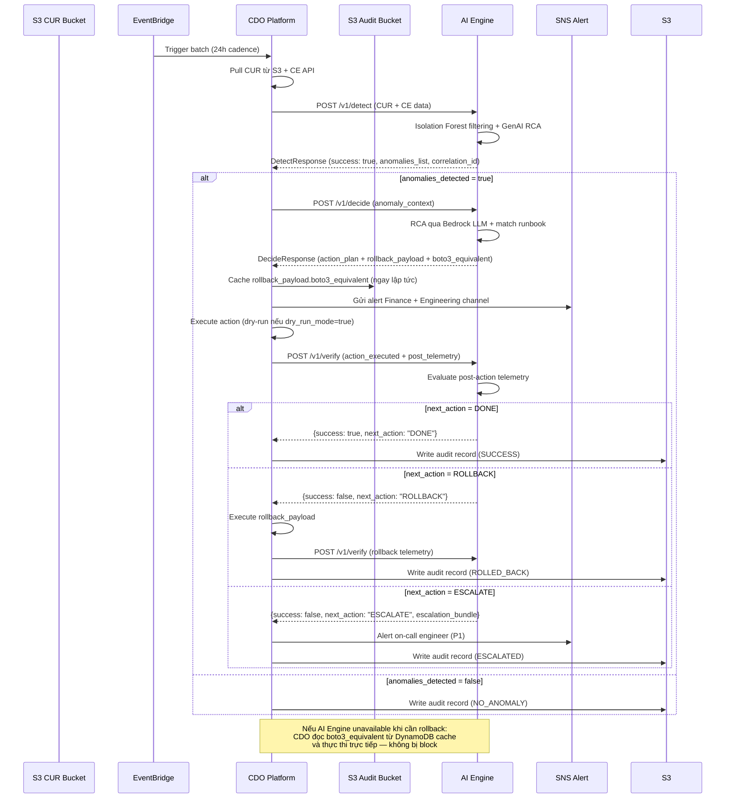

# AI API Contract — Task Force 2 (FinOps Watch)

<!-- Owner: Nhóm AI — TF2 FinOps Watch
     Signed by: AI Lead + CDO Lead (CDO-01) + CDO Lead (CDO-02) + Reviewer Panel
     Date signed: 2026-06-25 (W11 T5)
     Version: v1.5.0
     Changelog từ v1.4.0 (CR-v1.5 — Audit Fixes + Sync Batch Strategy 2026-06-26):
       [P17] §3.2/§4 — Idempotency key suffix bắt buộc: `:detect`, `:decide`, `:verify` (contracts_audit_report §1)
       [P18] §5.5 — Tách `audit_id` (UUID v4) vs `anomaly_id` (ANM-...) — đồng bộ telemetry-contract §16 (audit §3)
       [P19] §5.1 — `resource_tags_user_environment` cho phép `null` / `"unknown"` — untagged_spend (audit §6)
       [P20] §3.3 — LOCKED mode: CDO chặn ở application code, không sửa IAM/SG runtime (audit §2)
       [P21] §2/§5.1 — Batch lớn: `S3_POINTER` + DynamoDB feature store hot path + Step Functions orchestration
     Changelog từ v1.3.0 (CR-v3.2 — Production Hardening 2026-06-25):
       [P13] §3.2 — Idempotency hot path: DynamoDB conditional write + TTL (sync deployment-contract §Appendix C)
       [P14] §3.4 — Bucket primary: `company-cdo-{account_id}-telemetry` (tf2-cdo deprecated)
       [P15] §5.1 — CUR schema sync telemetry §7; business_context + CUR-CE mismatch fields
       [P16] §5.1 — business_context.traffic_volume required (telemetry §11.2)
     Changelog từ v1.2.0:
       [P9]  §3.4 — S3 Bucket Naming Convention: Globally unique pattern `tf2-cdo{NN}-telemetry-{region}`
               → Fix xung đột `BucketAlreadyExists` khi CDO-01 và CDO-02 chạy IaC song song
       [P10] §3.4 — IAM Access Pattern: chuẩn hóa quyền đọc S3 theo 2 mode triển khai (per-CDO vs shared skeleton)
               → Thêm Option B: Cross-Account STS AssumeRole cho Zero Trust nâng cao
       [P11] §5.1 — `s3_bucket_uri` pattern update: bắt buộc tuân thủ naming convention `tf2-cdo{NN}-telemetry-{region}`
       [P12] §5.7 — Callback (AI→CDO): AI Engine POST kết quả DetectResponse về `callback_url` sau khi xử lý xong (optional)
               → Không thay đổi luồng sync chính — callback là bổ sung, không thay thế
     Changelog từ v1.1.0:
       [P1] §5.1 — aws_cost_explorer_daily hạ từ required → optional/fallback (Đề xuất CDO-P5)
       [P2] §5.3 — post_telemetry_window.aws_cost_explorer_daily hạ required tương tự (Đề xuất CDO-P5)
       [P3] §5.6 — Rollback độc lập: CDO tự thực thi qua boto3, AI ghi audit (Đề xuất CDO-P1)
       [P4] §3.1 — Tách clock skew: 300s cho Request Timestamp, 36h cho Data Timestamp (Đề xuất CDO-P2)
       [P5] §3.3 — Error Budget Lock theo môi trường: prod 1%, staging 10%, dev/sandbox OFF (Đề xuất CDO-P3)
       [P6] §5.1 — idle_hours_continuous → AI Engine tính từ cpu_utilization_hourly (Đề xuất CDO-P4)
       [P7] §5.1 — Thêm data_confidence (HIGH/LOW) khi CE fallback
       [P8] §5.2 — Thêm rollback_payload.boto3_equivalent cho CDO offline rollback
    Quyết định kiến trúc (consolidated 2026-06-26):
      ✓ Giữ `POST /v1/detect` **đồng bộ** (`200 OK` + `DetectResponse`) — P99 < 300ms cố định
      ✓ Giữ `GET /v1/status/{anomaly_id}` cho remediation audit — KHÔNG dùng cho detect polling
      ✓ Callback (AI→CDO) **optional, bổ sung** — chỉ khi CDO gửi `callback_url`
      ✓ Batch lớn: `S3_POINTER` + feature store DynamoDB + CDO Step Functions (không async API)
      ✗ Từ chối: thay sync bằng async 202 + callback bắt buộc (ai-api-contract-v1.2.0-patch.md)
     🔒 FREEZE sau khi cả hai bên ký — Formal Change Request bắt buộc cho mọi sửa đổi tiếp theo -->

---

## Mục lục

- [AI API Contract — Task Force 2 (FinOps Watch)](#ai-api-contract--task-force-2-finops-watch)
  - [Mục lục](#mục-lục)
  - [1. Mục đích \& Phạm vi](#1-mục-đích--phạm-vi)
  - [2. Luồng tích hợp tổng thể](#2-luồng-tích-hợp-tổng-thể)
  - [3. Quy tắc chung \& Bảo mật](#3-quy-tắc-chung--bảo-mật)
    - [3.1 Clock Skew — Tách biệt hai cơ chế kiểm tra thời gian](#31-clock-skew--tách-biệt-hai-cơ-chế-kiểm-tra-thời-gian)
    - [3.2 Error Budget Lock (Khóa tự động)](#32-error-budget-lock-khóa-tự-động)
  - [4. Cross-Cutting Headers](#4-cross-cutting-headers)
  - [5. Đặc tả API Endpoints](#5-đặc-tả-api-endpoints)
    - [5.1 POST /v1/detect — Phát hiện Bất thường Chi phí (Đồng bộ)](#51-post-v1detect--phát-hiện-bất-thường-chi-phí-đồng-bộ)
      - [A. Request Headers](#a-request-headers)
      - [B. Request Body](#b-request-body)
      - [C. Response Body](#c-response-body)
    - [5.2 POST /v1/decide — Lập Kế hoạch Can thiệp](#52-post-v1decide--lập-kế-hoạch-can-thiệp)
      - [A. Request Headers](#a-request-headers-1)
      - [B. Request Body](#b-request-body-1)
      - [C. Response Body](#c-response-body-1)
    - [5.3 POST /v1/verify — Xác thực Kết quả Can thiệp](#53-post-v1verify--xác-thực-kết-quả-can-thiệp)
      - [A. Request Headers](#a-request-headers-2)
      - [B. Request Body](#b-request-body-2)
      - [C. Response Body](#c-response-body-2)
    - [5.4 GET /health — Health Check](#54-get-health--health-check)
      - [A. Response Body](#a-response-body)
    - [5.5 GET /v1/status/{id} — Kiểm tra Trạng thái Tiến trình Tự chữa lành](#55-get-v1statusid--kiểm-tra-trạng-thái-tiến-trình-tự-chữa-lành)
      - [Response Body (`{id}` là `anomaly_id` / `audit_id`)](#response-body-id-là-anomaly_id--audit_id)
    - [5.6 POST /v1/audit/{audit\_id}/rollback — Thông báo Rollback thủ công](#56-post-v1auditaudit_idrollback--thông-báo-rollback-thủ-công)
      - [A. Request Body](#a-request-body)
      - [B. Response Body](#b-response-body)
  - [6. Anomaly Types — Enum Reference](#6-anomaly-types--enum-reference)
  - [7. Containment Actions — Enum Reference](#7-containment-actions--enum-reference)
  - [8. SLO \& Xử lý Lỗi](#8-slo--xử-lý-lỗi)
    - [8.1 Service Level Objectives](#81-service-level-objectives)
    - [8.2 Error Handling](#82-error-handling)
  - [9. Sequence Diagram — Luồng Hoàn Chỉnh](#9-sequence-diagram--luồng-hoàn-chỉnh)

---

## 1. Mục đích & Phạm vi

Tài liệu này định nghĩa **toàn bộ Giao diện lập trình ứng dụng (API)** mà **Nhóm AI expose** cho **Nhóm CDO consume** trong hệ thống TF2 FinOps Watch.

Cam kết kỹ thuật này đảm bảo chu trình phát hiện → lập kế hoạch → can thiệp → xác thực hoạt động nhất quán, an toàn và có thể kiểm toán.

> [!NOTE]
> **Thiết kế Đồng bộ (Sync Detection) — SLO cố định**: `POST /v1/detect` xử lý đồng bộ, trả `200 OK` + `DetectResponse` trong **P99 < 300ms**. Scoring Isolation Forest chạy trong request; **Bedrock LLM chỉ ở `/v1/decide`**. Tham chiếu pattern TF4 Foresight Lens: sync `POST /v1/detect`, payload nhỏ, algorithm nhẹ — [TF4 slides](http://xbrain-w7-slides-dinh-2026.s3-website-us-west-2.amazonaws.com/tf4/index.html).

> [!IMPORTANT]
> **Batch CUR lớn — giải pháp không cần async API:**
> 1. **CDO gửi `S3_POINTER`** (body ~1KB), không embed full CUR trong JSON.
> 2. **AI Engine** đọc feature vector từ DynamoDB `finops-feature-store-{env}` (materialize offline khi CUR land S3), scoring hot path < 300ms.
> 3. **CDO orchestration**: EventBridge → **Step Functions** → task gọi sync `/v1/detect` (timeout 5 phút ở orchestrator, không phải async API). Lambda trigger chỉ start Step Function rồi thoát.

```
CUR file → S3 → EventBridge → Step Functions
                                  │
                                  ▼
                         POST /v1/detect (S3_POINTER) ──► 200 DetectResponse
                                  │
                                  ▼ (nếu anomalies_detected)
                         POST /v1/decide ──► RCA + action plan (sync)
```

```
CUR Data (CDO — S3_POINTER, không embed full file)
        │
        ▼
POST /v1/detect ──────────────────► 200 OK DetectResponse (anomalies_list)
        │
        │ (nếu anomalies_detected = true)
        ▼
POST /v1/decide ──────────────────► RCA + Action Plan + AWS CLI payload + Rollback payload
        │
        │ CDO thực thi action (dry-run hoặc thật)
        ▼
POST /v1/verify ──────────────────► Đánh giá hiệu quả → DONE / RETRY / ROLLBACK / ESCALATE
```

**Phạm vi:**
- Phát hiện 5 loại bất thường chi phí: `runaway_usage`, `idle_resource`, `untagged_spend`, `sudden_spike`, `gradual_drift`
- Containment an toàn: chỉ trên môi trường `dev`, `staging`, `sandbox`, `ml-research`
- Hard Boundary: **KHÔNG BAO GIỜ** terminate production, xóa data, chỉnh IAM

---

## 2. Luồng tích hợp tổng thể

```
┌─────────────────────────────────────────────────────────────────────┐
│                        CDO Platform                                 │
│                                                                     │
│  S3 Event (CUR file mới) → EventBridge → Step Functions              │
│       │ (trigger 1 lần/ngày — Lambda chỉ start SFN, KHÔNG chờ AI)  │
│       ▼                                                             │
│  [SFN Task] POST /v1/detect (S3_POINTER) ──────────────────────────►│──┐
│                                                                     │  │
│  ◄─────────────────────── 200 DetectResponse (anomalies_list) ─────│◄─┘
│       │                                                             │
│       │ (if anomalies_detected = true)                              │
│       ▼                                                             │
│  POST /v1/decide ─────────────────────────────────────────────────►│──┐
│                                                                     │  │
│  ◄─────────────────── DecideResponse (action_plan + payloads) ─────│◄─┘
│       │                                                             │
│       │ (CDO cache rollback_payload vào DynamoDB local)             │
│       │ (Execute action — dry-run or real)                          │
│       ▼                                                             │
│  [CDO Executes AWS CLI] ──► POST /v1/verify ──────────────────────►│──┐
│                                                                     │  │
│  ◄─────── VerifyResponse (next_action: DONE/RETRY/ROLLBACK/ESC) ───│◄─┘
│                                                                     │
│  [Write Audit Trail to S3] ◄── all steps logged              │
└─────────────────────────────────────────────────────────────────────┘
                                  │
                          AI Engine (Fargate/Lambda)
                          Private Subnet — Internal ALB
```

---

## 3. Quy tắc chung & Bảo mật

| Thuộc tính | Quy định |
|---|---|
| **Base Path** | `/v1/` |
| **Protocol** | HTTPS (TLS 1.2+) only |
| **Xác thực** | **AWS IAM SigV4** — không dùng static API key |
| **Cross-account** | STS `assume-role` kèm Session Tag `tenant_id` |
| **Network** | AI Engine chạy trong **Private Subnet**, sau **Internal ALB** — cấm public internet |
| **Content-Type** | `application/json` cho tất cả request/response |
| **Idempotency** | Header `X-Idempotency-Key` bắt buộc cho `/v1/detect`, `/v1/decide`, `/v1/verify`. **Mỗi bước phải dùng suffix riêng** — xem §3.2 |
| **Rate Limit** | Tối đa **100 requests/phút** per tenant |
| **Integrity** | `X-Payload-SHA256` (SHA256 của request body) bắt buộc |
| **Clock Skew** | Request bị reject nếu `X-Request-Timestamp` lệch > 300 giây so với server |
| **Data Timestamp** | Dữ liệu chi phí CUR thô (source_timestamp) được phép trễ tối đa 36 giờ so với hiện tại |
| **Multi-tenant** | Phân tách dữ liệu hoàn toàn qua `X-Tenant-Id` |

### 3.1 Clock Skew — Tách biệt hai cơ chế kiểm tra thời gian

`X-Idempotency-Key` lưu tại bảng DynamoDB `finops-idempotency-{env}` (PK = `idempotency_key`, TTL = 24 giờ) sử dụng **conditional write** (`attribute_not_exists`) để đảm bảo P99 latency < 300ms. Xử lý theo 3 trường hợp:

| Trạng thái Key | Payload | Hành vi |
|---|---|---|
| Chưa tồn tại | Bất kỳ | Xử lý bình thường |
| **Đang xử lý** (`IN_PROGRESS`) | Bất kỳ | `409 Conflict` + tiến trình hiện tại |
| **Đã hoàn thành** + payload **khớp** SHA256 | Khớp | `200 OK` + kết quả đã cache |
| **Đã hoàn thành** + payload **khác** SHA256 | Không khớp | `400 ERR_IDEMPOTENCY_MISMATCH` |

### 3.2 Error Budget Lock (Khóa tự động)

Hệ thống sẽ tự động chuyển Tenant sang `LOCKED_MODE` (ngừng các hành động can thiệp tự động) dựa trên tỷ lệ hoàn tác (Undo/Rollback Rate) trong cửa sổ 30 ngày theo từng môi trường:
- **Production**: Ngưỡng > 1%
- **Staging**: Ngưỡng > 10%
- **Dev/Sandbox/ML-Research**: Không áp dụng khóa tự động (Unlimited)

Khi bị LOCKED:
- Mọi `/v1/decide` → chỉ trả về `dry_run_mode: true`, không có action thật
- CDO nhận `X-Containment-Status: LOCKED` trong response header
- Unlock yêu cầu thủ công từ AI Team Lead

---

## 4. Cross-Cutting Headers

Áp dụng cho **mọi request** (ngoại trừ `/health`):

| Header | Type | Bắt buộc | Mô tả |
|---|---|---|---|
| `Content-Type` | string | ✓ | Cố định: `application/json` |
| `Accept` | string | ✓ | Cố định: `application/json` |
| `X-Tenant-Id` | string (UUID v4) | ✓ | Định danh Tenant — cô lập dữ liệu + phân quyền |
| `Authorization` | string | ✓ | AWS IAM SigV4 Signature |
| `X-Idempotency-Key` | string | ✓ | Format: `{tenant_id}:{billing_period_date}:{batch_type}` — chống double-process (Duy nhất theo chu kỳ chi phí) |
| `X-Payload-SHA256` | string | ✓ | SHA256 hex của request body — verify integrity |
| `X-Request-Timestamp` | string (RFC3339 UTC) | ✓ | Thời điểm CDO tạo request. Reject nếu skew > 300s (xem §3.1) |
| `X-Correlation-Id` | string (UUID v4) | optional | Trace ID E2E. AI Engine tự sinh nếu thiếu |
| `X-Dry-Run-Mode` | string | ✓ | `"true"` hoặc `"false"` — phải nhất quán với body |

---

## 5. Đặc tả API Endpoints

### 5.1 POST /v1/detect — Phát hiện Bất thường Chi phí (Đồng bộ)

Nhận dữ liệu telemetry CUR + Cost Explorer + CloudWatch, xử lý đồng bộ dữ liệu qua mô hình Isolation Forest + Bedrock Nova LLM và trả về danh sách bất thường trực tiếp trong phản hồi.

#### A. Request Headers

Theo [Cross-Cutting Headers §4](#4-cross-cutting-headers) + `X-Dry-Run-Mode` bắt buộc.

#### B. Request Body

**Mô tả trường dữ liệu yêu cầu (Fields Description)**:

| Trường (Field) | Kiểu dữ liệu (Type) | Bắt buộc (Required) | Mô tả (Description) |
|---|---|---|---|
| `data_source_type` | string (Enum) | ✓ | Kiểu nạp dữ liệu: `RAW_JSON` (gửi data trực tiếp ≤10MB) hoặc `S3_POINTER` (gửi URI S3) |
| `is_ad_hoc` | boolean | optional | `true` = quét khẩn cấp ngoài lịch, bỏ qua idempotency. Mặc định: `false` |
| `telemetry_delay_event` | boolean | optional | `true` = CUR chưa finalized (delay > 36h), CDO fallback sang CE. AI Engine sẽ hạ confidence xuống `alert-only`. Mặc định: `false` |
| `missing_resources` | array (of string) | **conditional** | **Bắt buộc khi `telemetry_delay_event = true`**. `line_item_product_code` có trong CE nhưng chưa có trong CUR |
| `current_ce_cost_gap_usd` | number | **conditional** | **Bắt buộc khi `telemetry_delay_event = true`**. Tổng USD gap của `missing_resources` |
| `comparison_window` | object | **conditional** | **Bắt buộc khi `telemetry_delay_event = true`**. `{start_date, end_date}` — xem telemetry-contract.md §6.2 |
| `callback_url` | string (HTTPS URL) | optional | Nếu có, AI Engine POST bản sao `DetectResponse` sau khi trả 200 (fire-and-forget audit). Xem §5.7 |
| `callback_token` | string | optional | Echo trong header `X-Callback-Token` khi callback |
| `aws_cost_explorer_daily` | array (of objects) | **conditional** | **Bắt buộc chỉ khi `telemetry_delay_event = true`**. 30-day CE fallback. Schema theo telemetry-contract.md §6 |
| `aws_cur_line_items` | array (of objects) | conditional | Dữ liệu CUR resource-level — bắt buộc khi `data_source_type = RAW_JSON` và `telemetry_delay_event = false` |
| `s3_bucket_uri` | string | conditional | URI S3 file CUR nén — bắt buộc khi `data_source_type = S3_POINTER`. Pattern: `company-cdo-{account_id}-telemetry` — xem §3.4 |
| `business_context` | object | ✓ | **Bắt buộc mỗi batch**. `linked_account_id` + `traffic_volume` + `traffic_source` — xem telemetry-contract.md §11.2 |
| `resource_utilization_metrics` | array (of objects) | optional | Dữ liệu hiệu năng CloudWatch. **v1.2.0: Gửi `cpu_utilization_hourly` thay vì `idle_hours_continuous`** |

**Lược đồ Schema Yêu cầu**:

```json
{
  "$schema": "http://json-schema.org/draft-07/schema#",
  "title": "DetectRequest",
  "type": "object",
  "properties": {
    "data_source_type": {
      "type": "string",
      "enum": ["RAW_JSON", "S3_POINTER"],
      "description": "Kiểu nạp dữ liệu CUR"
    },
    "is_ad_hoc": {
      "type": "boolean",
      "default": false
    },
    "telemetry_delay_event": {
      "type": "boolean",
      "default": false,
      "description": "true nếu CUR chưa finalized (delay > 36h) — AI Engine giảm confidence, chỉ alert-only"
    },
    "missing_resources": {
      "type": "array",
      "items": { "type": "string" },
      "description": "Bắt buộc khi telemetry_delay_event=true. service_code có trong CE nhưng chưa có trong CUR"
    },
    "current_ce_cost_gap_usd": {
      "type": "number",
      "minimum": 0,
      "description": "Bắt buộc khi telemetry_delay_event=true. Tổng USD gap của missing_resources"
    },
    "comparison_window": {
      "type": "object",
      "properties": {
        "start_date": { "type": "string", "format": "date" },
        "end_date":   { "type": "string", "format": "date" }
      },
      "required": ["start_date", "end_date"]
    },
    "callback_url": {
      "type": "string",
      "format": "uri",
      "pattern": "^https://",
      "description": "[v1.3.0] Optional. Bản sao DetectResponse gửi sau 200 OK (audit). Không thay sync response."
    },
    "callback_token": {
      "type": "string",
      "description": "[v1.5.0] Optional. Echo trong header X-Callback-Token khi AI Engine callback."
    },
    "aws_cost_explorer_daily": {
      "type": "array",
      "description": "Dữ liệu CE API — chỉ gửi khi telemetry_delay_event = true. Schema theo telemetry-contract.md §6",
      "items": {
        "type": "object",
        "properties": {
          "date":                   { "type": "string", "format": "date" },
          "linked_account_id":      { "type": "string", "pattern": "^[0-9]{12}$" },
          "linked_account_name":    { "type": "string" },
          "service_code":           { "type": "string", "description": "e.g. AmazonEC2, AmazonRDS" },
          "service":                { "type": "string", "description": "Tên hiển thị CE" },
          "region":                 { "type": ["string", "null"], "description": "null hoặc 'global' cho global services" },
          "unblended_cost":         { "type": "number", "minimum": 0 },
          "is_estimated":           { "type": "boolean", "description": "Map trực tiếp từ CE Estimated field" }
        },
        "required": ["date", "linked_account_id", "linked_account_name", "service_code", "service", "unblended_cost", "is_estimated"]
      }
    },
    "aws_cur_line_items": {
      "type": "array",
      "description": "Dữ liệu CUR resource-level. Schema theo telemetry-contract.md §7",
      "items": {
        "type": "object",
        "properties": {
          "bill_billing_period_start_date":    { "type": "string", "format": "date-time" },
          "bill_payer_account_id":             { "type": "string", "pattern": "^[0-9]{12}$" },
          "line_item_usage_start_date":        { "type": "string", "format": "date-time" },
          "line_item_usage_end_date":          { "type": "string", "format": "date-time" },
          "line_item_usage_account_id":        { "type": "string", "pattern": "^[0-9]{12}$" },
          "line_item_usage_account_name":      { "type": "string" },
          "line_item_line_item_type":          { "type": "string" },
          "line_item_product_code":            { "type": "string" },
          "line_item_usage_type":              { "type": "string" },
          "line_item_operation":               { "type": "string" },
          "line_item_resource_id":             { "type": ["string", "null"] },
          "line_item_usage_amount":            { "type": "number", "minimum": 0 },
          "pricing_unit":                      { "type": "string" },
          "line_item_unblended_rate":          { "type": "number", "minimum": 0 },
          "line_item_unblended_cost":          { "type": "number", "minimum": 0 },
          "line_item_currency_code":           { "type": "string", "default": "USD" },
          "product_product_name":              { "type": "string" },
          "product_region_code":               { "type": ["string", "null"] },
          "product_instance_type":             { "type": ["string", "null"] },
          "usage_density_24h":                 { "type": "number", "minimum": 0, "maximum": 1 },
          "resource_tags_user_environment":    { "type": ["string", "null"], "enum": ["prod", "prod-core", "prod-payments", "staging", "dev", "sandbox", "ml-research", "data-analytics", "unknown", null], "description": "null hoặc unknown khi resource chưa tag — phục vụ untagged_spend detection" },
          "resource_tags_user_team":           { "type": ["string", "null"] },
          "resource_tags_user_owner":          { "type": ["string", "null"] },
          "resource_tags_user_cost_center":    { "type": ["string", "null"] }
        },
        "required": [
          "line_item_usage_start_date", "line_item_usage_account_id",
          "line_item_product_code", "line_item_usage_type",
          "line_item_usage_amount", "pricing_unit", "line_item_unblended_cost"
        ]
      }
    },
    "s3_bucket_uri": {
      "type": "string",
      "pattern": "^s3://tf2-cdo[0-9]{2}-telemetry-[a-z0-9-]+/.+\\.json\\.gz$",
      "description": "URI S3 file CUR nén — bắt buộc khi S3_POINTER (Format: s3://tf2-cdo<XX>-telemetry-<region>/...)"
    },
    "resource_utilization_metrics": {
      "type": "array",
      "description": "Dữ liệu hiệu năng CloudWatch. v1.2.0: CDO gửi cpu_utilization_hourly thô, AI Engine tự tính idle_hours_continuous",
      "items": {
        "type": "object",
        "properties": {
          "resource_id":           { "type": "string" },
          "cpu_percent":           { "type": "number", "minimum": 0, "maximum": 100 },
          "memory_mib":            { "type": "number", "minimum": 0 },
          "network_in_bytes":      { "type": "number", "minimum": 0 },
          "network_out_bytes":     { "type": "number", "minimum": 0 },
          "disk_io_ops":           { "type": "number", "minimum": 0 },
          "database_connections":  { "type": ["integer", "null"], "minimum": 0 },
          "gpu_utilization":       { "type": ["number", "null"], "minimum": 0, "maximum": 100 },
          "hourly_cpu_percent":    { "type": "array", "items": { "type": "number", "minimum": 0, "maximum": 100 }, "maxItems": 24, "description": "Mảng CPUUtilization trung bình theo từng giờ" }
        },
        "required": ["resource_id"]
      }
    }
  },
  "required": ["data_source_type", "business_context"],
  "if": {
    "properties": { "telemetry_delay_event": { "const": true } }
  },
  "then": {
    "required": ["data_source_type", "business_context", "aws_cost_explorer_daily", "missing_resources", "current_ce_cost_gap_usd", "comparison_window"],
    "description": "Fallback CE mode: CUR chưa về, dùng CE daily"
  },
  "else": {
    "if": { "properties": { "data_source_type": { "const": "RAW_JSON" } } },
    "then": { "required": ["data_source_type", "business_context", "aws_cur_line_items"] },
    "else": { "required": ["data_source_type", "business_context", "s3_bucket_uri"] }
  },
  "additionalProperties": false
}
```

**Payload Yêu cầu Mẫu — Daily batch (CUR sẵn sàng, khuyến nghị `S3_POINTER`)**:

```json
{
  "data_source_type": "S3_POINTER",
  "is_ad_hoc": false,
  "telemetry_delay_event": false,
  "callback_url": "https://internal-alb.cdo-platform.local/v1/callbacks/detect",
  "callback_token": "cdo-callback-secret-abc123",
  "s3_bucket_uri": "s3://company-cdo-200000000012-telemetry/cur/cdo-02/2026-06-23.json.gz",
  "business_context": {
    "linked_account_id": "200000000012",
    "traffic_volume": 1250000,
    "traffic_source": "ALB",
    "campaign_flag": false,
    "load_test_flag": false,
    "migration_flag": false
  },
  "resource_utilization_metrics": [
    {
      "resource_id": "i-0fbgpu00000004",
      "cpu_percent": 92.5,
      "cpu_utilization_hourly": [91,93,90,92,94,91,93,90,92,94,91,93,90,92,94,91,93,90,92,94,91,93,90,92],
      "memory_mib": 61440,
      "network_in_bytes": 1048576,
      "network_out_bytes": 2048576,
      "disk_io_ops": 120,
      "database_connections": null,
      "gpu_utilization": 90.0,
      "hourly_cpu_percent": [95.0, 94.5, 96.0, 95.5]
    }
  ]
}
```

**Payload Yêu cầu Mẫu — Ad-hoc nhỏ (`RAW_JSON` ≤ 10MB)**:

```json
{
  "data_source_type": "RAW_JSON",
  "is_ad_hoc": true,
  "telemetry_delay_event": false,
  "business_context": {
    "linked_account_id": "200000000012",
    "traffic_volume": 1250000,
    "traffic_source": "ALB",
    "campaign_flag": false,
    "load_test_flag": false,
    "migration_flag": false
  },
  "aws_cur_line_items": [
    {
      "line_item_usage_start_date": "2026-06-23T00:00:00Z",
      "line_item_usage_account_id": "200000000012",
      "line_item_product_code": "AmazonEC2",
      "line_item_usage_type": "BoxUsage:p3.2xlarge",
      "line_item_usage_amount": 24.0,
      "pricing_unit": "Hrs",
      "line_item_unblended_cost": 73.44,
      "resource_tags_user_environment": "ml-research"
    }
  ]
}
```

**Payload Yêu cầu Mẫu — Trường hợp fallback (CUR delay > 36h)**:

```json
{
  "data_source_type": "RAW_JSON",
  "is_ad_hoc": false,
  "telemetry_delay_event": true,
  "callback_url": "https://internal-alb.cdo-platform.local/v1/callbacks/detect",
  "missing_resources": ["AmazonRDS", "AmazonDynamoDB"],
  "current_ce_cost_gap_usd": 3550.0,
  "comparison_window": {
    "start_date": "2026-06-23",
    "end_date": "2026-06-23"
  },
  "business_context": {
    "linked_account_id": "200000000012",
    "traffic_volume": 980000,
    "traffic_source": "ALB",
    "campaign_flag": false,
    "load_test_flag": false,
    "migration_flag": false
  },
  "aws_cost_explorer_daily": [
    {
      "date": "2026-06-23",
      "linked_account_id": "200000000012",
      "linked_account_name": "ml-research",
      "service_code": "AmazonEC2",
      "service": "Amazon Elastic Compute Cloud - Compute",
      "region": "ap-southeast-1",
      "unblended_cost": 427.50,
      "is_estimated": true
    }
  ]
}
```

#### C. Response Body (HTTP 200 OK)

**Mô tả trường dữ liệu phản hồi (Fields Description)**:

| Trường (Field) | Kiểu dữ liệu (Type) | Bắt buộc (Required) | Mô tả (Description) |
|---|---|---|---|
| `success` | boolean | ✓ | Chỉ thị việc xử lý thành công |
| `correlation_id` | string (UUID v4) | ✓ | Trace ID sinh ra cho phiên phân tích và tracking |
| `anomalies_detected` | boolean | ✓ | `true` nếu phát hiện bất thường chi phí, ngược lại `false` |
| `anomalies_list` | array (of objects) | ✓ | Danh sách các dị thường phát hiện được |
| `error_message` | string | optional | Chi tiết lỗi hệ thống khi success = false |

```json
{
  "$schema": "http://json-schema.org/draft-07/schema#",
  "title": "DetectResponse",
  "type": "object",
  "properties": {
    "success": { "type": "boolean" },
    "correlation_id": { "type": "string", "format": "uuid" },
    "anomalies_detected": { "type": "boolean" },
    "anomalies_list": {
      "type": "array",
      "items": {
        "type": "object",
        "properties": {
          "anomaly_id":              { "type": "string", "pattern": "^ANM-[0-9]{4}-[0-9]{4}[A-Z]$" },
          "anomaly_type":            { "type": "string", "enum": ["runaway_usage", "idle_resource", "untagged_spend", "sudden_spike", "gradual_drift"] },
          "severity":                { "type": "string", "enum": ["HIGH", "MEDIUM", "LOW"] },
          "confidence_score":        { "type": "number", "minimum": 0.0, "maximum": 1.0 },
          "resource_id":             { "type": "string" },
          "environment":             { "type": "string" },
          "responsible_team":        { "type": ["string", "null"] },
          "unblended_cost_24h_usd":  { "type": "number", "minimum": 0 },
          "cost_ratio_to_7d_avg":    { "type": "number", "minimum": 0 },
          "ai_model_used":           { "type": "string" },
          "alert_routing": {
            "type": "object",
            "properties": {
              "finance":     { "type": "boolean" },
              "engineering": { "type": "boolean" }
            },
            "required": ["finance", "engineering"]
          }
        },
        "required": [
          "anomaly_id",
          "anomaly_type",
          "severity",
          "confidence_score",
          "resource_id",
          "environment",
          "responsible_team",
          "unblended_cost_24h_usd",
          "cost_ratio_to_7d_avg",
          "ai_model_used",
          "alert_routing"
        ]
      }
    },
    "error_message": { "type": "string" }
  },
  "required": ["success", "correlation_id", "anomalies_detected", "anomalies_list"],
  "additionalProperties": false
}
```

**Payload Response Mẫu**:

```json
{
  "success": true,
  "correlation_id": "9b1deb4d-3b7d-4bad-9bdd-2b0d7b3dcb6d",
  "anomalies_detected": true,
  "anomalies_list": [
    {
      "anomaly_id": "ANM-2026-0623A",
      "anomaly_type": "runaway_usage",
      "severity": "HIGH",
      "confidence_score": 0.94,
      "resource_id": "i-0abcd1234efgh5678",
      "environment": "ml-research",
      "responsible_team": "squad-ml-core",
      "unblended_cost_24h_usd": 427.50,
      "cost_ratio_to_7d_avg": 18.2,
      "ai_model_used": "amazon.nova-pro-v1:0",
      "alert_routing": {
        "finance": true,
        "engineering": true
      }
    }
  ]
}
```

---

### 5.2 POST /v1/decide — Lập Kế hoạch Can thiệp

Nhận thông tin bất thường từ phản hồi đồng bộ `/v1/detect` sau khi phát hiện hoàn tất, thực hiện Root Cause Analysis (RCA), và trả về kế hoạch hành động kèm AWS CLI payload + rollback command + dữ liệu dashboard tách riêng cho Finance và Engineering.

#### A. Request Headers

Theo [Cross-Cutting Headers §4](#4-cross-cutting-headers). `X-Correlation-Id` **bắt buộc** — phải khớp với `correlation_id` từ `/v1/detect`.

#### B. Request Body

**Mô tả trường dữ liệu yêu cầu (Fields Description)**:

| Trường (Field) | Kiểu dữ liệu (Type) | Bắt buộc (Required) | Mô tả (Description) |
|---|---|---|---|
| `correlation_id` | string (UUID v4) | ✓ | Trace ID từ `/v1/detect` — bắt buộc phải khớp |
| `idempotency_key` | string | ✓ | Khóa chống trùng lặp (Format: tenant_id:billing_period_date:batch_type) |
| `dry_run_mode` | boolean | ✓ | `true` = chỉ sinh log/audit, không thực thi thật |
| `anomaly_context` | object | ✓ | Ngữ cảnh bất thường cần lập kế hoạch |
| `anomaly_context.anomaly_id` | string | ✓ | ID bất thường từ `anomalies_list[].anomaly_id` |
| `anomaly_context.anomaly_type` | string (Enum) | ✓ | Loại bất thường — xem §6 |
| `anomaly_context.resource_id` | string | ✓ | ARN tài nguyên |
| `anomaly_context.environment` | string | ✓ | Môi trường tài nguyên |
| `anomaly_context.unblended_cost_24h_usd` | number | ✓ | Chi phí 24h |
| `anomaly_context.cost_ratio_to_7d_avg` | number | ✓ | Hệ số tăng |
| `anomaly_context.responsible_team` | string\|null | ✓ | Squad chịu trách nhiệm |
| `anomaly_context.cost_center_code` | string\|null | optional | Mã trung tâm chi phí |

**Lược đồ Schema Yêu cầu**:

```json
{
  "$schema": "http://json-schema.org/draft-07/schema#",
  "title": "DecideRequest",
  "type": "object",
  "properties": {
    "correlation_id":  { "type": "string", "format": "uuid" },
    "idempotency_key": { "type": "string", "pattern": "^[a-f0-9-]{36}:[0-9]{4}-[0-9]{2}-[0-9]{2}:[a-z0-9-]+$" },
    "dry_run_mode":    { "type": "boolean" },
    "anomaly_context": {
      "type": "object",
      "properties": {
        "anomaly_id":             { "type": "string" },
        "anomaly_type":           { "type": "string", "enum": ["runaway_usage", "idle_resource", "untagged_spend", "sudden_spike", "gradual_drift"] },
        "resource_id":            { "type": "string" },
        "environment":            { "type": "string", "enum": ["prod", "prod-core", "prod-payments", "staging", "dev", "sandbox", "ml-research", "data-analytics"] },
        "unblended_cost_24h_usd": { "type": "number", "minimum": 0 },
        "cost_ratio_to_7d_avg":   { "type": "number", "minimum": 0 },
        "responsible_team":       { "type": ["string", "null"] },
        "cost_center_code":       { "type": ["string", "null"] }
      },
      "required": ["anomaly_id", "anomaly_type", "resource_id", "environment", "unblended_cost_24h_usd", "cost_ratio_to_7d_avg", "responsible_team"]
    }
  },
  "required": ["correlation_id", "idempotency_key", "dry_run_mode", "anomaly_context"],
  "additionalProperties": false
}
```

**Payload Request Mẫu**:

```json
{
  "correlation_id": "9b1deb4d-3b7d-4bad-9bdd-2b0d7b3dcb6d",
  "idempotency_key": "a1b2c3d4-e5f6-7890-abcd-ef1234567890:2026-06-23:decide",
  "dry_run_mode": true,
  "anomaly_context": {
    "anomaly_id": "ANM-2026-0623A",
    "anomaly_type": "runaway_usage",
    "resource_id": "i-0fbgpu00000004",
    "environment": "ml-research",
    "unblended_cost_24h_usd": 73.44,
    "cost_ratio_to_7d_avg": 4.97,
    "responsible_team": "squad-ml-core",
    "cost_center_code": "CC-9001"
  }
}
```

#### C. Response Body

**Mô tả trường dữ liệu phản hồi (Fields Description)**:

| Trường (Field) | Kiểu dữ liệu (Type) | Bắt buộc (Required) | Mô tả (Description) |
|---|---|---|---|
| `matched_runbook` | string | ✓ | Tên Runbook khớp từ thư viện |
| `action_plan` | array (of objects) | ✓ | Kế hoạch hành động tuần tự |
| `applied_payload` | object | ✓ | Lệnh AWS CLI thực thi can thiệp |
| `rollback_payload` | object | ✓ | Lệnh AWS CLI rollback — **CDO phải cache vào DynamoDB local ngay khi nhận** |
| `finance_dashboard_data` | object | ✓ | Dữ liệu cho Finance Dashboard & CFO |
| `engineering_dashboard_data` | object | ✓ | Dữ liệu cho Engineering Console & Slack alert |
| `correlation_id` | string (UUID v4) | ✓ | Trace ID — dùng lại cho `/v1/verify` |
| `dry_run_mode` | boolean | ✓ | Echo lại giá trị từ request |

**Lược đồ Schema Phản hồi**:

```json
{
  "$schema": "http://json-schema.org/draft-07/schema#",
  "title": "DecideResponse",
  "type": "object",
  "properties": {
    "matched_runbook": { "type": "string" },
    "action_plan": {
      "type": "array",
      "items": {
        "type": "object",
        "properties": {
          "step":   { "type": "integer", "minimum": 1 },
          "action": { "type": "string", "enum": ["tag-for-review", "time-gated-countdown", "auto-shutdown", "quota-cap"] },
          "target": { "type": "string" },
          "params": { "type": "object" }
        },
        "required": ["step", "action", "target"]
      }
    },
    "applied_payload": {
      "type": "object",
      "properties": {
        "action_type":     { "type": "string", "enum": ["inject_aws_tag", "stop_instance", "stop_sagemaker_notebook", "restrict_quota"] },
        "aws_cli_command": { "type": "string" }
      },
      "required": ["action_type", "aws_cli_command"]
    },
    "rollback_payload": {
      "type": "object",
      "description": "CDO cache vào DynamoDB local ngay sau khi nhận. Dùng để rollback độc lập qua boto3 mà không cần gọi lại AI Engine.",
      "properties": {
        "action_type":               { "type": "string", "enum": ["remove_aws_tag", "start_instance", "start_sagemaker_notebook", "restore_quota"] },
        "aws_cli_rollback_command":  { "type": "string" },
        "original_resource_id":      { "type": "string" },
        "boto3_equivalent": {
          "type": "object",
          "description": "CDO dùng field này để thực thi rollback qua boto3 trực tiếp khi không kết nối được AI Engine",
          "properties": {
            "service":    { "type": "string", "description": "e.g. ec2, rds, sagemaker" },
            "method":     { "type": "string", "description": "e.g. start_instances, delete_tags" },
            "parameters": { "type": "object" }
          },
          "required": ["service", "method", "parameters"]
        }
      },
      "required": ["action_type", "aws_cli_rollback_command", "original_resource_id", "boto3_equivalent"]
    },
    "finance_dashboard_data": {
      "type": "object",
      "properties": {
        "target_recipient":  { "type": "string" },
        "metrics": {
          "type": "object",
          "properties": {
            "unblended_cost_24h_usd":      { "type": "number" },
            "cost_ratio_to_7d_avg":        { "type": "number" },
            "projected_monthly_waste_usd": { "type": "number" }
          },
          "required": ["unblended_cost_24h_usd", "cost_ratio_to_7d_avg", "projected_monthly_waste_usd"]
        },
        "allocation": {
          "type": "object",
          "properties": {
            "responsible_team": { "type": "string" },
            "cost_center_code": { "type": "string" }
          },
          "required": ["responsible_team", "cost_center_code"]
        },
        "executive_summary": { "type": "string" }
      },
      "required": ["target_recipient", "metrics", "allocation", "executive_summary"]
    },
    "engineering_dashboard_data": {
      "type": "object",
      "properties": {
        "target_recipient": { "type": "string" },
        "technical_context": {
          "type": "object",
          "properties": {
            "aws_service":       { "type": "string" },
            "usage_type":        { "type": "string" },
            "pricing_unit":      { "type": "string" },
            "usage_amount_24h":  { "type": "number" },
            "usage_density_24h": { "type": "number" }
          },
          "required": ["aws_service", "usage_type", "pricing_unit", "usage_amount_24h", "usage_density_24h"]
        },
        "root_cause_analysis": {
          "type": "object",
          "properties": {
            "primary_driver_feature":  { "type": "string" },
            "technical_reason":        { "type": "string" },
            "missing_mandatory_tags":  { "type": "array", "items": { "type": "string" } }
          },
          "required": ["primary_driver_feature", "technical_reason"]
        },
        "slack_routing": {
          "type": "object",
          "properties": {
            "channel_name":        { "type": "string" },
            "webhook_url_pointer": { "type": "string" }
          },
          "required": ["channel_name"]
        }
      },
      "required": ["target_recipient", "technical_context", "root_cause_analysis", "slack_routing"]
    },
    "correlation_id": { "type": "string", "format": "uuid" },
    "dry_run_mode":   { "type": "boolean" }
  },
  "required": ["matched_runbook", "action_plan", "applied_payload", "rollback_payload", "finance_dashboard_data", "engineering_dashboard_data", "correlation_id", "dry_run_mode"],
  "additionalProperties": false
}
```

**Payload Response Mẫu**:

```json
{
  "matched_runbook": "RunawayMLClusterContainmentRunbook",
  "action_plan": [
    {
      "step": 1,
      "action": "tag-for-review",
      "target": "i-0fbgpu00000004",
      "params": {}
    },
    {
      "step": 2,
      "action": "time-gated-countdown",
      "target": "i-0fbgpu00000004",
      "params": { "time_lock_seconds": 14400, "fallback_action": "auto-shutdown" }
    }
  ],
  "applied_payload": {
    "action_type": "inject_aws_tag",
    "aws_cli_command": "aws ec2 create-tags --resources i-0fbgpu00000004 --tags Key=finops:review,Value=pending Key=finops:anomaly-id,Value=ANM-2026-0623A --region ap-southeast-1"
  },
  "rollback_payload": {
    "action_type": "remove_aws_tag",
    "aws_cli_rollback_command": "aws ec2 delete-tags --resources i-0fbgpu00000004 --tags Key=finops:review Key=finops:anomaly-id --region ap-southeast-1",
    "original_resource_id": "i-0fbgpu00000004",
    "boto3_equivalent": {
      "service": "ec2",
      "method": "delete_tags",
      "parameters": {
        "Resources": ["i-0fbgpu00000004"],
        "Tags": [{"Key": "finops:review"}, {"Key": "finops:anomaly-id"}]
      }
    }
  },
  "finance_dashboard_data": {
    "target_recipient": "Finance Team & CFO Dashboard",
    "metrics": {
      "unblended_cost_24h_usd": 73.44,
      "cost_ratio_to_7d_avg": 4.97,
      "projected_monthly_waste_usd": 2203.20
    },
    "allocation": {
      "responsible_team": "squad-ml-core",
      "cost_center_code": "CC-9001"
    },
    "executive_summary": "GPU instance i-0fbgpu00000004 thuộc squad-ml-core chạy liên tục 24/7 trong 3 ngày không có training job, phát sinh $73.44/ngày (~5x baseline). Ước tính lãng phí tháng này $2,203. Hành động gắn thẻ cảnh báo đã được khởi động (dry-run)."
  },
  "engineering_dashboard_data": {
    "target_recipient": "Engineering Console & Slack #finops-alert-engineering",
    "technical_context": {
      "aws_service": "AmazonEC2",
      "usage_type": "BoxUsage:p3.2xlarge",
      "pricing_unit": "Hrs",
      "usage_amount_24h": 24.0,
      "usage_density_24h": 1.0
    },
    "root_cause_analysis": {
      "primary_driver_feature": "usage_density_24h",
      "technical_reason": "p3.2xlarge chạy 100% thời gian 24h liên tục (usage_density_24h=1.0). Không có training job nào trong log 3 ngày qua. Nghi ngờ dev quên tắt sau khi experiment hoàn tất.",
      "missing_mandatory_tags": []
    },
    "slack_routing": {
      "channel_name": "#finops-alert-engineering",
      "webhook_url_pointer": "ssm:/finops/slack/engineering-webhook"
    }
  },
  "correlation_id": "9b1deb4d-3b7d-4bad-9bdd-2b0d7b3dcb6d",
  "dry_run_mode": true
}
```

---

### 5.3 POST /v1/verify — Xác thực Kết quả Can thiệp

CDO gửi báo cáo thực thi + dữ liệu telemetry post-action. AI Engine đánh giá hiệu quả và chỉ dẫn bước tiếp theo.

> [!NOTE]
> **v1.2.0 — Thay đổi từ v1.1.0 (Đề xuất CDO-P5):**
> `post_telemetry_window.aws_cost_explorer_daily` hạ từ `required` xuống `optional` — áp dụng cùng logic với §5.1. CDO chỉ gửi CE daily khi `telemetry_delay_event = true`.

#### A. Request Headers

Theo [Cross-Cutting Headers §4](#4-cross-cutting-headers). `X-Correlation-Id` **bắt buộc**.

#### B. Request Body

**Mô tả trường dữ liệu yêu cầu (Fields Description)**:

| Trường (Field) | Kiểu dữ liệu (Type) | Bắt buộc (Required) | Mô tả (Description) |
|---|---|---|---|
| `correlation_id` | string (UUID v4) | ✓ | Trace ID — phải khớp xuyên suốt 3 bước |
| `idempotency_key` | string | ✓ | Khóa chống trùng lặp (Format: tenant_id:billing_period_date:batch_type) |
| `dry_run_mode` | boolean | ✓ | Phải nhất quán với bước `/v1/decide` |
| `action_executed` | object | ✓ | Chi tiết hành động CDO đã thực thi |
| `action_executed.action` | string (Enum) | ✓ | Loại hành động đã chạy — xem §7 |
| `action_executed.target` | string | ✓ | ARN tài nguyên bị tác động |
| `action_executed.status` | string (Enum) | ✓ | `COMPLETED` hoặc `FAILED` |
| `action_executed.execution_time_seconds` | integer | optional | Thời gian thực thi tính bằng giây |
| `post_telemetry_window` | object | ✓ | Telemetry sau can thiệp — cùng cấu trúc §5.1 |

**Lược đồ Schema Yêu cầu**:

```json
{
  "$schema": "http://json-schema.org/draft-07/schema#",
  "title": "VerifyRequest",
  "type": "object",
  "properties": {
    "correlation_id":  { "type": "string", "format": "uuid" },
    "idempotency_key": { "type": "string", "pattern": "^[a-f0-9-]{36}:[0-9]{4}-[0-9]{2}-[0-9]{2}:[a-z0-9-]+$" },
    "dry_run_mode":    { "type": "boolean" },
    "action_executed": {
      "type": "object",
      "properties": {
        "action":                 { "type": "string", "enum": ["tag-for-review", "time-gated-countdown", "auto-shutdown", "quota-cap"] },
        "target":                 { "type": "string" },
        "status":                 { "type": "string", "enum": ["COMPLETED", "FAILED"] },
        "execution_time_seconds": { "type": "integer", "minimum": 0 }
      },
      "required": ["action", "target", "status"]
    },
    "post_telemetry_window": {
      "type": "object",
      "description": "Telemetry sau can thiệp. Áp dụng cùng required logic với /v1/detect — CUR là nguồn ưu tiên, CE chỉ khi delay",
      "properties": {
        "data_source_type":        { "type": "string", "enum": ["RAW_JSON", "S3_POINTER"] },
        "telemetry_delay_event":   { "type": "boolean", "default": false },
        "aws_cost_explorer_daily": { "type": "array" },
        "aws_cur_line_items":      { "type": "array" },
        "s3_bucket_uri":           { "type": "string" }
      },
      "required": ["data_source_type"]
    }
  },
  "required": ["correlation_id", "idempotency_key", "dry_run_mode", "action_executed", "post_telemetry_window"],
  "additionalProperties": false
}
```

**Payload Request Mẫu**:

```json
{
  "correlation_id": "9b1deb4d-3b7d-4bad-9bdd-2b0d7b3dcb6d",
  "idempotency_key": "b2c3d4e5-f6a7-8901-bcde-f12345678901:2026-06-24:verify",
  "dry_run_mode": true,
  "action_executed": {
    "action": "tag-for-review",
    "target": "i-0fbgpu00000004",
    "status": "COMPLETED",
    "execution_time_seconds": 3
  },
  "post_telemetry_window": {
    "data_source_type": "RAW_JSON",
    "telemetry_delay_event": false,
    "aws_cur_line_items": []
  }
}
```

#### C. Response Body

**Mô tả trường dữ liệu phản hồi (Fields Description)**:

| Trường (Field) | Kiểu dữ liệu (Type) | Bắt buộc (Required) | Mô tả (Description) |
|---|---|---|---|
| `success` | boolean | ✓ | Chỉ số chi phí đã quay về baseline |
| `regression_detected` | boolean | ✓ | Phát hiện chi phí tăng do side effect của action |
| `next_action` | string (Enum) | ✓ | Chỉ dẫn tiếp theo: `DONE`, `RETRY`, `ROLLBACK`, `ESCALATE` |
| `escalation_bundle` | object | conditional | Bắt buộc khi `next_action = ESCALATE` |

**Lược đồ Schema Phản hồi**:

```json
{
  "$schema": "http://json-schema.org/draft-07/schema#",
  "title": "VerifyResponse",
  "type": "object",
  "properties": {
    "success":            { "type": "boolean" },
    "regression_detected": { "type": "boolean" },
    "next_action": {
      "type": "string",
      "enum": ["DONE", "RETRY", "ROLLBACK", "ESCALATE"]
    },
    "escalation_bundle": {
      "type": "object",
      "properties": {
        "reason":  { "type": "string" },
        "logs":    { "type": "array", "items": { "type": "string" } },
        "metrics": {
          "type": "object",
          "properties": {
            "unblended_cost_24h_usd": { "type": "number" },
            "cost_ratio_to_7d_avg":   { "type": "number" },
            "usage_density_24h":      { "type": "number" }
          },
          "required": ["unblended_cost_24h_usd", "cost_ratio_to_7d_avg", "usage_density_24h"]
        }
      },
      "required": ["reason"]
    }
  },
  "required": ["success", "regression_detected", "next_action"],
  "additionalProperties": false
}
```

**Payload Response Mẫu (DONE)**:

```json
{
  "success": true,
  "regression_detected": false,
  "next_action": "DONE"
}
```

**Payload Response Mẫu (ESCALATE)**:

```json
{
  "success": false,
  "regression_detected": true,
  "next_action": "ESCALATE",
  "escalation_bundle": {
    "reason": "Sau khi gắn tag, instance vẫn tiếp tục chạy và cost không giảm. Không có owner phản hồi sau 4h countdown. Yêu cầu kỹ sư on-call quyết định shutdown thủ công.",
    "logs": [
      "2026-06-23T22:05:00Z [WARN] tag-for-review applied but cost_ratio_to_7d_avg still 4.97",
      "2026-06-23T22:05:00Z [WARN] No owner response within countdown window"
    ],
    "metrics": {
      "unblended_cost_24h_usd": 73.44,
      "cost_ratio_to_7d_avg": 4.97,
      "usage_density_24h": 1.0
    }
  }
}
```

---

### 5.4 GET /health — Health Check

ALB và ECS Fargate gọi định kỳ mỗi 30 giây. **Không yêu cầu xác thực.**

#### A. Response Body

**Mô tả trường dữ liệu phản hồi (Fields Description)**:

| Trường (Field) | Kiểu dữ liệu (Type) | Bắt buộc (Required) | Mô tả (Description) |
|---|---|---|---|
| `status` | string | ✓ | `healthy`, `degraded`, `unhealthy` |
| `timestamp` | string (RFC3339 UTC) | ✓ | Thời điểm server chạy health check |
| `services` | object | ✓ | Trạng thái chi tiết các dependencies |
| `services.s3_audit_bucket` | string (Enum) | ✓ | `connected` hoặc `disconnected` |
| `services.bedrock_api` | string (Enum) | ✓ | `accessible` hoặc `inaccessible` |
| `services.s3_cur_bucket` | string (Enum) | ✓ | `reachable` hoặc `unreachable` |

**Lược đồ Schema Phản hồi**:

```json
{
  "$schema": "http://json-schema.org/draft-07/schema#",
  "title": "HealthResponse",
  "type": "object",
  "properties": {
    "status":    { "type": "string", "enum": ["healthy", "degraded", "unhealthy"] },
    "timestamp": { "type": "string", "format": "date-time" },
    "services": {
      "type": "object",
      "properties": {
        "s3_audit_bucket": { "type": "string", "enum": ["connected", "disconnected"] },
        "bedrock_api": { "type": "string", "enum": ["accessible", "inaccessible"] },
        "s3_cur_bucket": { "type": "string", "enum": ["reachable", "unreachable"] }
      },
      "required": ["s3_audit_bucket", "bedrock_api", "s3_cur_bucket"]
    }
  },
  "required": ["status", "timestamp", "services"],
  "additionalProperties": false
}
```

**Payload Response Mẫu**:

```json
{
  "status": "healthy",
  "timestamp": "2026-06-25T10:00:00Z",
  "services": {
    "s3_audit_bucket": "connected",
    "bedrock_api": "accessible",
    "s3_cur_bucket": "reachable"
  }
}
```

---

### 5.5 GET /v1/status/{id} — Kiểm tra Trạng thái Tiến trình Tự chữa lành

CDO sử dụng endpoint này để thăm dò (poll) trạng thái tiến trình tự chữa lành (Remediation Status) khi `{id}` là `audit_id` / `anomaly_id` (định dạng: `ANM-YYYY-MMDD[A-Z]`).

#### Response Body (`{id}` là `anomaly_id` / `audit_id`)

* **Mô tả trường dữ liệu phản hồi (Fields Description)**:

| Trường (Field) | Kiểu dữ liệu (Type) | Bắt buộc (Required) | Mô tả (Description) |
|---|---|---|---|
| `audit_id` | string | ✓ | Định danh phiên kiểm toán sự cố (`ANM-YYYY-MMDD[A-Z]`) |
| `status` | string (Enum) | ✓ | Trạng thái: `PENDING_APPROVAL`, `IN_PROGRESS`, `SUCCESS`, `ROLLED_BACK`, `ESCALATED` |
| `containment_locked` | boolean | ✓ | `true` nếu tenant hiện tại đang bị khóa tự động can thiệp (chỉ cho phép dry-run) |
| `error_budget_remaining_pct` | number | ✓ | Tỷ lệ error budget còn lại của tenant (0.0 → 100.0) |
| `actions_log` | array (of objects) | ✓ | Nhật ký lịch sử các bước đã thực hiện cho incident này |
| `actions_log[].timestamp` | string (RFC3339) | ✓ | Thời điểm thực hiện |
| `actions_log[].action` | string (Enum) | ✓ | Tác vụ: `tag-for-review`, `time-gated-countdown`, `auto-shutdown`, `quota-cap` |
| `actions_log[].status` | string | ✓ | Kết quả bước (ví dụ: `COMPLETED`, `DRY_RUN_COMPLETED`, `FAILED`) |
| `actions_log[].actor` | string | ✓ | Tác nhân thực thi |

* **Lược đồ Schema Phản hồi (Trường hợp B)**:
```json
{
  "$schema": "http://json-schema.org/draft-07/schema#",
  "title": "RemediationStatusResponse",
  "type": "object",
  "properties": {
    "audit_id":   { "type": "string", "format": "uuid" },
    "anomaly_id": { "type": "string", "pattern": "^ANM-[0-9]{4}-[0-9]{4}[A-Z]$" },
    "status": {
      "type": "string",
      "enum": ["PENDING_APPROVAL", "IN_PROGRESS", "SUCCESS", "ROLLED_BACK", "ESCALATED"]
    },
    "containment_locked":          { "type": "boolean" },
    "error_budget_remaining_pct":  { "type": "number", "minimum": 0, "maximum": 100 },
    "actions_log": {
      "type": "array",
      "items": {
        "type": "object",
        "properties": {
          "timestamp": { "type": "string", "format": "date-time" },
          "action":    { "type": "string", "enum": ["tag-for-review", "time-gated-countdown", "auto-shutdown", "quota-cap"] },
          "status":    { "type": "string" },
          "actor":     { "type": "string" }
        },
        "required": ["timestamp", "action", "status", "actor"]
      }
    }
  },
  "required": ["audit_id", "anomaly_id", "status", "containment_locked", "error_budget_remaining_pct", "actions_log"],
  "additionalProperties": false
}
```

**Payload Response Mẫu**:

```json
{
  "audit_id": "3fa85f64-5717-4562-b3fc-2c963f66afa6",
  "anomaly_id": "ANM-2026-0623A",
  "status": "PENDING_APPROVAL",
  "containment_locked": false,
  "error_budget_remaining_pct": 97.3,
  "actions_log": [
    {
      "timestamp": "2026-06-23T17:05:46Z",
      "action": "tag-for-review",
      "status": "DRY_RUN_COMPLETED",
      "actor": "finops-ai-engine-role"
    }
  ]
}
```

**Response Header khi bị lock**:
```
X-Containment-Status: LOCKED
X-Lock-Reason: error_budget_exceeded_threshold
X-Lock-Since: 2026-06-20T08:00:00Z
```

---

### 5.6 POST /v1/audit/{audit_id}/rollback — Thông báo Rollback thủ công

Sử dụng bởi CDO để thông báo cho AI Engine rằng tài nguyên đã được rollback thành công bởi kỹ sư (do False Positive). Việc này để AI Engine ghi nhận log kiểm toán (audit trail), hỗ trợ feedback loop, đồng thời cập nhật error budget tracking.

#### A. Request Body

**Mô tả trường dữ liệu yêu cầu (Fields Description)**:

| Trường (Field) | Kiểu dữ liệu (Type) | Bắt buộc (Required) | Mô tả (Description) |
|---|---|---|---|
| `reason` | string | ✓ | Lý do rollback (vd: False Positive, engineer override) |
| `rolled_back_by` | string (email) | ✓ | Email định danh kỹ sư kích hoạt |
| `rollback_executed_at` | string (RFC3339) | ✓ | Thời điểm CDO thực thi boto3 rollback thành công |
| `rollback_status` | string (Enum) | ✓ | `SUCCESS` hoặc `FAILED` — kết quả boto3 execution của CDO |
| `boto3_result` | object | optional | Raw result từ boto3 để AI Engine ghi log chi tiết |

**Lược đồ Schema Yêu cầu**:

```json
{
  "$schema": "http://json-schema.org/draft-07/schema#",
  "title": "RollbackRequest",
  "type": "object",
  "properties": {
    "reason":               { "type": "string" },
    "rolled_back_by":       { "type": "string", "format": "email" },
    "rollback_executed_at": { "type": "string", "format": "date-time" },
    "rollback_status":      { "type": "string", "enum": ["SUCCESS", "FAILED"] },
    "boto3_result":         { "type": "object" }
  },
  "required": ["reason", "rolled_back_by", "rollback_executed_at", "rollback_status"],
  "additionalProperties": false
}
```

**Payload Request Mẫu**:

```json
{
  "reason": "False positive — instance đang dùng cho experiment được Finance approve tuần này",
  "rolled_back_by": "engineer@company.com",
  "rollback_executed_at": "2026-06-23T18:30:00Z",
  "rollback_status": "SUCCESS",
  "boto3_result": {
    "ResponseMetadata": { "HTTPStatusCode": 200 }
  }
}
```

#### B. Response Body

**Mô tả trường dữ liệu phản hồi (Fields Description)**:

| Trường (Field) | Kiểu dữ liệu (Type) | Bắt buộc (Required) | Mô tả (Description) |
|---|---|---|---|
| `rollback_recorded` | boolean | ✓ | Xác nhận log rollback đã được ghi nhận thành công |
| `false_positive_count_updated` | boolean | ✓ | Xác nhận đã cập nhật đếm số ca FP cho mô hình AI |
| `new_error_budget_burned_pct` | number | ✓ | Tỷ lệ hao hụt của Error Budget hiện tại sau hành động này |
| `containment_locked` | boolean | ✓ | Chế độ lock tự động hoạt động có bị kích hoạt hay không |
| `message` | string | ✓ | Chi tiết thông báo từ hệ thống |

```json
{
  "$schema": "http://json-schema.org/draft-07/schema#",
  "title": "RollbackResponse",
  "type": "object",
  "properties": {
    "rollback_recorded": { "type": "boolean" },
    "false_positive_count_updated": { "type": "boolean" },
    "new_error_budget_burned_pct": { "type": "number", "minimum": 0 },
    "containment_locked":          { "type": "boolean" },
    "message":                     { "type": "string" }
  },
  "required": ["rollback_recorded", "false_positive_count_updated", "new_error_budget_burned_pct", "containment_locked", "message"],
  "additionalProperties": false
}
```

**Payload Response Mẫu**:

```json
{
  "rollback_recorded": true,
  "false_positive_count_updated": true,
  "new_error_budget_burned_pct": 0.8,
  "containment_locked": false,
  "message": "Audit trail đã ghi. FP count cập nhật cho feedback loop. Error budget prod còn 99.2% — chưa vượt ngưỡng 1%."
}
```

---

### 5.7 **[v1.3.0]** Callback (AI→CDO): bản sao `DetectResponse` (Optional)

> [!NOTE]
> **Bổ sung, không thay thế sync response.** CDO vẫn nhận `200 OK` + `DetectResponse` đầy đủ trong cùng request. Nếu CDO gửi `callback_url`, AI Engine POST bản sao sau khi trả 200 (fire-and-forget audit/feature store).

#### A. Kích hoạt

- CDO set `callback_url` trong `DetectRequest` (optional).
- (Optional) CDO set `callback_token` để AI Engine echo lại trong header callback.

#### B. AI Engine → callback_url (HTTP POST)

**Headers AI Engine gửi:**

| Header | Bắt buộc | Mô tả |
|---|---:|---|
| `Content-Type` | ✓ | `application/json` |
| `X-Correlation-Id` | ✓ | Khớp `correlation_id` của detect |
| `X-Callback-Token` | optional | Echo từ request nếu CDO gửi `callback_token` |

**Body:** `DetectResponse` (schema §5.1.C).

#### C. Retry Policy

| Attempt | Delay | Điều kiện retry |
|---:|---:|---|
| 1 | 0s | non-200 hoặc timeout > 5s |
| 2 | 30s | như trên |
| 3 | 120s | như trên |
| Stop | — | Sau 3 lần → log `CALLBACK_EXHAUSTED` |

> Callback fail **không ảnh hưởng** đến sync detect result — CDO đã có `200 OK` + body đầy đủ.

## 6. Anomaly Types — Enum Reference

| Enum Value | Tên | Mô tả | Signal chính | Severity mặc định |
|---|---|---|---|---|
| `runaway_usage` | Runaway Usage | Tài nguyên tính toán chạy 24/7, không giảm tải | `usage_density_24h ≥ 0.95` kéo dài > 1 ngày | HIGH |
| `idle_resource` | Idle Resource | Tài nguyên được provision nhưng utilization ~0 | `cpu_utilization_hourly` có chuỗi con liên tục < 5% dài > 72h (AI Engine tính từ mảng raw) | MEDIUM |
| `untagged_spend` | Untagged Spend | Chi phí lớn từ tài nguyên không có tag `team` | `resource_tags_user_team = null` + `unblended_cost > threshold` | MEDIUM |
| `sudden_spike` | Sudden Spike | Chi phí tăng đột biến trong thời gian ngắn | `cost_ratio_to_7d_avg > 3.0` trong 1 ngày | HIGH |
| `gradual_drift` | Gradual Drift | Chi phí tăng từ từ qua nhiều tuần | Trend slope > 5%/tuần trong 4 tuần liên tiếp | LOW |

---

## 7. Containment Actions — Enum Reference

| Enum Value | Mô tả | Môi trường được phép | Hard Boundary |
|---|---|---|---|
| `tag-for-review` | Gắn tag `finops:review=pending` lên resource | Tất cả | Không có — luôn an toàn |
| `time-gated-countdown` | Gắn tag + thông báo owner, countdown 4h trước khi auto-shutdown | dev, staging, sandbox, ml-research | Không được dùng trên prod |
| `auto-shutdown` | Stop EC2/RDS/SageMaker instance | dev, sandbox, ml-research, staging | **CỨNG**: Không trên prod. Trên staging: yêu cầu Confidence ≥ 0.90 & Grounding Check |
| `quota-cap` | Giảm Service Quota để ngăn spawn thêm resource | dev, sandbox, data-analytics | Chỉ dev, sandbox, data-analytics. Cảnh báo có thể chặn SRE/Finance dashboard queries |

> ⛔ **Hard Boundary:** `auto-shutdown` và `quota-cap` có điều kiện `resource_tags_user_environment NOT IN ('prod', 'prod-core', 'prod-payments')` được enforce ở cả AI Engine **và** IAM Permission Boundary của CDO. Chính sách IAM Permission Boundary bắt buộc (Deny statement trên CDO execution role):
>
> ```json
> {
>   "Version": "2012-10-17",
>   "Statement": [{
>     "Sid": "DenyContainmentOnProd",
>     "Effect": "Deny",
>     "Action": [
>       "ec2:StopInstances",
>       "ecs:StopTask",
>       "rds:StopDBInstance",
>       "sagemaker:StopNotebookInstance",
>       "servicequotas:RequestServiceQuotaIncrease"
>     ],
>     "Resource": "*",
>     "Condition": {
>       "StringEquals": {
>         "aws:ResourceTag/user:environment": ["prod", "prod-core", "prod-payments"]
>       }
>     }
>   }]
> }
> ```

---

## 8. SLO & Xử lý Lỗi

### 8.1 Service Level Objectives

| Metric | Target | Đo bằng |
|---|---|---|
| **P99 ACK Latency** `/v1/detect` | < 50 ms | Phản hồi phản hồi tức thì (202 processing) |
| **P99 Transaction Latency** `/v1/detect` | < 300 ms | Bao gồm validate schema & ghi cache idempotency |
| **P99 Latency** `/v1/decide` | < 500 ms | CloudWatch `p99(Duration)` |
| **P99 Latency** `/v1/verify` | < 500 ms | CloudWatch `p99(Duration)` |
| **Availability** | 99.5% | ALB `HealthyHostCount > 0` per 5 phút |
| **Error Rate (5xx)** | < 0.5% | `5xxErrorRate` trên tổng request |
| **LLM Inference** (Bedrock) | P99 < 30 s · fallback trigger 10 s · hard timeout 45 s | Circuit breaker: > 10 s liên tiếp → rule-based fallback; > 45 s → `503 ERR_LLM_TIMEOUT` |
| **Detection Precision** | ≥ 80% | Backtest 3 tháng |
| **False Positive Rate** | ≤ 10% | Backtest 3 tháng |

### 8.2 Error Handling

| HTTP Code | Internal Code | Kịch bản | Hành động CDO |
|---|---|---|---|
| `400` | `ERR_INVALID_SCHEMA` | Body sai schema, thiếu field bắt buộc | Kiểm tra log, fix client — **KHÔNG** retry |
| `400` | `ERR_IDEMPOTENCY_MISMATCH` | Trùng `X-Idempotency-Key` nhưng body khác | Fix logic tạo key — **KHÔNG** retry |
| `400` | `ERR_REPLAY_DETECTED` | `X-Request-Timestamp` lệch > 300s (Replay Attack) | CDO đồng bộ NTP và retry |
| `401` | `ERR_AUTH_FAILED` | SigV4 sai hoặc token hết hạn | Làm mới credentials, retry 1 lần |
| `403` | `ERR_CROSS_TENANT_DENIED` | `anomaly_id` không thuộc `X-Tenant-Id` | Cảnh báo bảo mật, chặn luồng ngay |
| `404` | `ERR_ANOMALY_NOT_FOUND` | `anomaly_id` không tồn tại | Kiểm tra đầu vào — KHÔNG retry |
| `409` | `ERR_DUP_IDEMPOTENCY` | Key đang xử lý (`IN_PROGRESS`) | Retry sau 5s với cùng key (sync detect đang chạy) |
| `422` | `ERR_CONTAINMENT_NOT_SUPPORTED` | Anomaly type không hỗ trợ auto-contain | Alert SRE kiểm tra thủ công |
| `429` | `ERR_RATE_LIMITED` | Vượt 100 req/phút per tenant | Exponential backoff: 1s→2s→4s→8s→16s |
| `500` | `ERR_LLM_TIMEOUT` | Bedrock > 45s hard timeout | AI ghi `FAILED`. CDO chuyển Fallback Rule-Based |
| `503` | `ERR_SERVICE_DOWN` | AI Engine sập hoặc Bedrock throttle >60% | Kích hoạt Fallback tĩnh nội bộ CDO. Rollback thực thi độc lập qua boto3 cache (§5.6) |

---

## 9. Sequence Diagram — Luồng Hoàn Chỉnh



