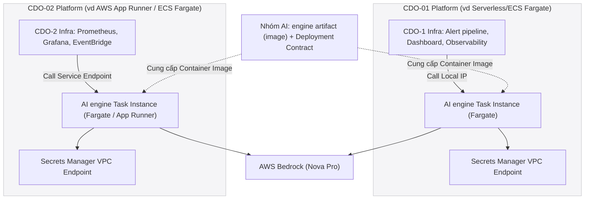

# Deployment Contract — Task Force 2 (FinOps Watch)

<!-- Owner: Nhóm AI — TF2 FinOps Watch
     Signed by: AI Lead + CDO Lead (CDO-01) + CDO Lead (CDO-02) + Reviewer Panel
     Date signed: 2026-06-25 (W11 T5)
     Version: v1.2.0 (đồng bộ ai-api-contract.md v1.2.0 + telemetry-contract.md v3.1.0)
     Changelog từ v1.1.0:
       [D1] §6.2 — CDO IAM: thêm Service Quotas cho quota-cap (Appendix B)
       [D2] §6.3 — Khóa rate_limit_per_tenant: 100 req/min
       [D3] §7   — SQS finops-watch-rollback: audit completion only (không dispatch rollback)
       [D4] §10  — CDO Rollback Cache DynamoDB + boto3 offline execution (CDO-P1)
       [D5] §11  — Error Budget Lock phân tầng theo môi trường (CDO-P3)
     🔒 FREEZE — Không thay đổi nếu không có Formal Change Request được cả hai bên ký -->

---

## Mục lục

1. [Mục đích & Phạm vi](#mục-đích)
2. [Nguyên tắc cốt lõi](#key-principle)
3. [Đặc tả Compute](#compute)
4. [Đặc tả Scaling](#scaling)
5. [Quản lý Secrets & Credentials](#secrets)
6. [Cấu hình Networking & An ninh mạng](#networking)
7. [Deployment Topology Diagram](#deployment-topology-diagram)
8. [Phân định Môi trường triển khai per-CDO](#per-cdo-deployment)
9. [Chiến lược Rollout: Canary](#rollout-strategy-canary)
10. [Cơ chế Rollback (Hoàn tác)](#rollback)
11. [Health Check Specification](#health-check)
12. [Observability & Tracing](#observability)
13. [Failure Modes & Phản ứng Sự cố](#failure-modes--response)
14. [CDO Containment & IAM Boundaries](#cdo-containment--iam-boundaries)
15. [Rate Limiting](#rate-limiting)
16. [Message Queues (SQS)](#message-queues-sqs)
17. [CDO Rollback Cache](#cdo-rollback-cache)
18. [Error Budget Lock — Phân tầng môi trường](#error-budget-lock)
19. [Giải đáp các câu hỏi mở (Resolved Questions)](#resolved-questions)
20. [Appendix B: CDO IAM Policy Mẫu](#appendix-b-cdo-iam-policy-mẫu)

---

## Mục đích

Định nghĩa **AI Engine cần được deploy như thế nào** - bao gồm compute target, scale, secrets, network, và chiến lược rollback. Đây là tài liệu đặc tả kỹ thuật chuẩn hóa để **mỗi nhóm CDO tự động hóa quy trình triển khai AI Engine lên nền tảng của mình** và cấu hình tài nguyên (sizing capacity) chính xác.

---

## Key principle

**Nhóm AI bàn giao engine dưới dạng artifact (Container Image đăng ký trên ECR) kèm bản spec triển khai này. MỖI CDO trong Task Force tự deploy engine lên platform riêng của mình** (ví dụ: CDO-01 dùng Serverless/ECS Fargate, CDO-02 dùng AWS App Runner / ECS Fargate... - mỗi CDO một góc tiếp cận kỹ thuật khác nhau và compete ở cách host, giám sát và tối ưu vận hành). 

Các thông số kỹ thuật bên dưới là **spec tham chiếu tối thiểu CDO phải đáp ứng** (CDO Fargate/App Runner map sang ECS Task / App Runner instance / Lambda - miễn là năng lực xử lý tương đương). Mỗi CDO sở hữu **endpoint riêng**, mỗi instance được cách ly dữ liệu multi-tenant hoàn toàn dựa trên `tenant_id`.

> 💡 **Cơ chế Bootstrap Tạm thời:** Trong ngày T5 W11 đến đầu W12, nhóm AI cung cấp **1 skeleton endpoint dùng chung** để CDO tích hợp trước code path (giao diện mock). W12 mỗi CDO bắt buộc phải deploy instance thật từ artifact của nhóm AI lên platform riêng của mình để đánh giá E2E.

---

## Compute

Triển khai container hóa hoàn toàn dựa trên đặc tả cấu hình tài nguyên:

| Thuộc tính (Aspect) | Cấu hình tham chiếu (Configuration) | Mô tả (Description) |
|---|---|---|
| **Target Compute** | ECS Fargate Task / App Runner Instance / Lambda | Đảm bảo tính cô lập, không dùng shared VM |
| **Cluster Name** | `tf-2-aiops-cluster` | Tên cluster định danh theo Task Force (nếu dùng ECS) |
| **Service Name** | `ai-engine` | Tên dịch vụ đăng ký DNS nội bộ |
| **Image Source** | `200000000012.dkr.ecr.ap-southeast-1.amazonaws.com/tf2/finops-ai-engine` | URI ECR của container image |
| **CPU per task** | 1024 (1 vCPU) | Đảm bảo đủ hiệu năng xử lý DataframeCUR thô |
| **Memory per task** | 2048 MB (2 GB) | Giới hạn bộ nhớ đệm tránh rò rỉ (OOM protection) |

---

## Scaling

Cấu hình tự động co giãn tải (Auto-scaling) đảm bảo tính sẵn sàng và tối ưu hóa chi phí vận hành:

| Thuộc tính (Aspect) | Giá trị đặc tả (Value) | Ghi chú (Notes) |
|---|---|---|
| **Min Replicas** | 2 | Luôn duy trì tối thiểu 2 task trên 2 AZs để đảm bảo High Availability |
| **Max Replicas** | 10 | Giới hạn trên để tránh cháy ngân sách hạ tầng (Budget Guard) |
| **Scale-up Trigger 1** | Target CPU Utilization $\ge 70\%$ | Dựa trên chỉ số CPU sử dụng trung bình |
| **Scale-up Trigger 2** | Target Request Count $\ge 100$ per task | Tránh nghẽn hàng đợi xử lý khi CDO gọi batch |
| **Scale-up Cooldown** | 60 giây | Thời gian chờ giữa các lần tăng số lượng task |
| **Scale-down Cooldown** | 300 giây | Tránh hiện tượng co giãn liên tục gây bất ổn (Thrashing) |
| **Cold Start Mitigation** | Provisioned Concurrency = 2 | Chỉ áp dụng nếu CDO chọn deployment target là AWS Lambda |

---

## Secrets

Quản lý thông tin nhạy cảm tập trung, cấm hardcode credentials trong container:

| Tên biến (Secret Name) | Nguồn cung cấp (Source) | Mô tả (Description) |
|---|---|---|
| `BEDROCK_API_KEY` | AWS Secrets Manager: `tf-2/ai-engine/bedrock` | API Key sơ cua (hoặc Token) nếu gọi qua API Gateway ngoài. Mặc định ưu tiên IAM Role. |
| `AWS_REGION` | Environment Variable | Thiết lập mặc định: `ap-southeast-1` (Singapore) |
| `S3_TELEMETRY_BUCKET` | Environment Variable | Tên S3 bucket lưu trữ idempotency, audit logs, và features |

> 🔒 **Quy tắc an toàn mạng:** Tuyệt đối không sử dụng IAM User static access key. Toàn bộ hạ tầng của CDO phải gán IAM Task Execution Role có gắn Policy cho phép truy cập Bedrock và Secrets Manager. Secrets Manager rotation policy được thiết lập tự động xoay vòng mỗi 30 ngày.

---

## Networking

AI Engine chạy trong Private Subnet, ngăn chặn tấn công từ internet public:

| Thuộc tính (Aspect) | Cấu hình mạng (Configuration) |
|---|---|
| **Subnet Type** | Private Subnets (Isolated/Non-routable to internet) |
| **Load Balancer** | Internal Application Load Balancer (ALB) only. Cấm Internet-facing ALB. |
| **Security Group** | `tf-2-ai-engine-sg` |
| **Ingress Rules** | Chỉ cho phép giao thức HTTPS (port 8080/443) đi từ Security Group của CDO Worker/Platform gọi đến AI Engine |
| **Egress Rules** | Chỉ cho phép đi ra Internet qua NAT Gateway tới Bedrock Endpoint (`bedrock.ap-southeast-1.amazonaws.com`) và các VPC Gateway Endpoints cho Secrets Manager + S3 |
| **DNS Resolution** | Sử dụng Route 53 Private Hosted Zone để phân giải tên miền nội bộ |

---

## Deployment topology diagram

Kiến trúc triển khai song song hai platform độc lập của CDO-01 và CDO-02 cùng chia sẻ một Artifact từ nhóm AI:



---

## Per-CDO deployment

Mỗi CDO thiết lập DNS nội bộ riêng để phân phối request tới instance của mình:

| CDO Platform | Tên miền Endpoint nội bộ (VPC) | Phương thức xác thực |
|---|---|---|
| **CDO-01** (Fargate) | `https://ai-engine.cdo-01.tf-2.internal/` | AWS IAM SigV4 |
| **CDO-02** (App Runner / ECS Fargate) | `https://ai-engine.cdo-02.tf-2.internal/` | AWS IAM SigV4 |
| *(Bootstrap)* Skeleton chung | `https://ai-engine-skeleton.tf-2.internal/` (Chỉ dùng từ T5 đến đầu W12) | AWS IAM SigV4 |

---

## Chiến lược Rollout: Canary

Áp dụng khi triển khai phiên bản mới của AI Engine nhằm kiểm soát rủi ro phát sinh lỗi:

| Bước (Step) | Tỷ lệ Traffic chuyển tiếp | Thời gian theo dõi (Interval) |
|---|---|---|
| 1 | 10% | 5 phút |
| 2 | 50% | 5 phút |
| 3 | 100% (Hoàn tất chuyển đổi) | - |

⛔ **Chỉ số kích hoạt Hủy bỏ (Abort Criteria)** (bất kỳ điều kiện trigger → auto rollback ngay):
- Tỷ lệ lỗi hệ thống (Error rate / 5xx) > 1% trong cửa sổ 5 phút.
- Độ trễ phản hồi P99 (P99 latency) > 800 ms cho các API chính.
- Cảnh báo tốc độ cháy ngân sách nhanh bị kích hoạt (Burn-rate fast alert triggered).
- Phát hiện lỗi liên quan đến mô hình hoặc Bedrock Throttling Rate >= 20%.

---

## Cơ chế Rollback (Hoàn tác)

> [!NOTE]
> **v1.2.0 — Phân tách hai loại rollback:**
> - **AI Engine deployment rollback** (bảng dưới): hoàn tác phiên bản container khi canary fail.
> - **CDO containment rollback** (§CDO Rollback Cache): hoàn tác hành động can thiệp tài nguyên AWS — CDO tự thực thi boto3, không phụ thuộc AI Engine availability.

Quy định phương thức khôi phục trạng thái cũ nhanh nhất khi xảy ra lỗi nghiêm trọng **triển khai AI Engine**:
 
| Thuộc tính (Aspect) | Giá trị đặc tả (Value) |
|---|---|
| **Primary method** | AWS CodeDeploy / ECS Service Update automatic rollback (CDO-01 Fargate & CDO-02 App Runner / Fargate) |
| **Secondary method** | ECS service revert / App Runner previous version redeploy (manual) |
| **Target RTO** | < 60 giây |
| **Auto-trigger** | Yes (khi abort criteria met trong canary rollout) |
 
 ---
 
 ## Health check
 
 ALB/App Runner Health Checking Agent gọi định kỳ để xác định trạng thái sống/chết của container:
 
 | Thuộc tính (Field) | Giá trị đặc tả (Value) |
 |---|---|
 | **Path** | `/health` (Theo đặc tả tại `ai-api-contract.md` §5.4) |
 | **Port** | 8080 |
 | **Interval** | 30 giây |
 | **Healthy threshold** | 2 consecutive 200 (2 lần liên tiếp trả về HTTP code 200) |
 | **Unhealthy threshold** | 3 consecutive non-200 (3 lần liên tiếp trả về HTTP code non-200) |
 
 ---
 
 ## Observability
 
 Đảm bảo giám sát tập trung phục vụ vận hành và xử lý sự cố nhanh:
 
 | Thuộc tính (Aspect) | Cấu hình (Configuration) |
 |---|---|
 | **OTel endpoint** | Collector URL per CDO platform (cấu hình qua biến môi trường `OTEL_EXPORTER_OTLP_ENDPOINT`) |
 | **Log destination** | CloudWatch Logs (retention 14 ngày) |
 | **Metrics** | Prometheus format `/metrics` / CloudWatch (CDO tự chọn phù hợp hạ tầng) |
 | **Traces** | OpenTelemetry → AWS X-Ray (cho cả CDO-01 và CDO-02) |
 
 ---
 
 ## Failure modes & phản ứng sự cố
 
 | Lỗi phát sinh (Failure) | Cơ chế phát hiện (Detection) | Hành động ứng phó (Response) |
 |---|---|---|
 | **Task / Container crash** | ECS Health check / App Runner Health probe | Tự động khởi động lại (Auto-restart task/instance). |
 | **Lỗi mạng diện rộng (Region outage)** | CloudWatch Route53 Health check / DNS Failover alarm | Định tuyến failover sang Secondary Region (Active-Passive). |
 | **Bedrock throttling** | HTTP Code 429 (App-level metric) | Tự động kích hoạt **Exponential Backoff với Jitter**, nếu kéo dài >15s → Rule-based Fallback. |
 | **Rò rỉ bộ nhớ (Memory leak)** | Bộ nhớ container đạt ngưỡng $\ge 90\%$ | Thực hiện khởi động lại luân phiên (Rolling restart). |
 | **AI Engine unavailable khi cần containment rollback** | `POST /v1/audit/{id}/rollback` timeout | CDO đọc `boto3_equivalent` từ DynamoDB cache (§CDO Rollback Cache) và thực thi trực tiếp — không block outage recovery. |

---

## CDO Containment & IAM Boundaries

CDO Containment Worker thực thi AWS CLI/boto3 từ `DecideResponse.applied_payload` và `rollback_payload`. IAM Permission Boundary **phải** enforce hard boundary khớp ai-api-contract.md §7.

| Containment Action | Môi trường được phép | IAM Enforcement |
|---|---|---|
| `tag-for-review` | Tất cả | `ec2:CreateTags`, `rds:AddTagsToResource` |
| `time-gated-countdown` | dev, staging, sandbox, ml-research | Tag + SNS publish |
| `auto-shutdown` | dev, sandbox, ml-research, staging | `ec2:StopInstances`, `rds:StopDBInstance`, `sagemaker:StopNotebookInstance` |
| `quota-cap` | dev, sandbox, data-analytics | `servicequotas:GetServiceQuota`, `servicequotas:RequestServiceQuotaIncrease` |

> ⛔ **Hard Boundary:** `resource_tags_user_environment NOT IN ('prod', 'prod-core', 'prod-payments')` được enforce ở cả AI Engine **và** IAM Condition `StringNotEquals` trên tag `environment` (xem Appendix B).

---

## Rate Limiting

Khóa cứng đồng bộ với ai-api-contract.md §3:

| Parameter | Value | Enforcement |
|---|---|---|
| `rate_limit_per_tenant` | **100 requests/phút** | API Gateway / ALB WAF rate-based rule |
| Burst allowance | 20 requests (1 giây) | Token bucket |
| Response khi vượt | `429 ERR_RATE_LIMITED` | CDO exponential backoff 1s→16s |

---

## Message Queues (SQS)

| Queue Name | Producer | Consumer | Mục đích |
|---|---|---|---|
| `finops-watch-audit` | CDO Platform | AI Engine audit writer | Ghi audit trail bất đồng bộ |
| `finops-watch-rollback` | CDO Platform | CDO audit completion worker | **Audit completion notification only** — KHÔNG dùng để dispatch rollback command |

> [!IMPORTANT]
> **v1.2.0 clarification:** Queue `finops-watch-rollback` nhận sự kiện **sau khi** CDO đã tự thực thi boto3 rollback thành công. Payload chứa `audit_id`, `rollback_status`, `rollback_executed_at` — khớp `POST /v1/audit/{audit_id}/rollback` request body. AI Engine consume để cập nhật feedback loop, không trả lệnh rollback.

---

## CDO Rollback Cache

> **v1.2.0 — Đồng bộ ai-api-contract.md §5.2 + §5.6 (CDO-P1)**

| Thuộc tính | Giá trị |
|---|---|
| **Storage** | DynamoDB table `finops-rollback-cache` (CDO account) + S3 backup `s3://company-cdo-telemetry/rollback-cache/{anomaly_id}` |
| **TTL** | 90 ngày (khớp audit retention) |
| **Write trigger** | Ngay khi nhận `DecideResponse` — cache `rollback_payload.boto3_equivalent` |
| **Read trigger** | `next_action = ROLLBACK` hoặc engineer manual rollback |
| **Execution** | CDO boto3 client gọi `service.method(**parameters)` — không gọi AI Engine |
| **Post-execution** | `POST /v1/audit/{audit_id}/rollback` + publish SQS `finops-watch-rollback` |

**Schema cache item:**

```json
{
  "anomaly_id": "ANM-2026-0623A",
  "correlation_id": "9b1deb4d-3b7d-4bad-9bdd-2b0d7b3dcb6d",
  "boto3_equivalent": {
    "service": "ec2",
    "method": "delete_tags",
    "parameters": {
      "Resources": ["i-0fbgpu00000004"],
      "Tags": [{"Key": "finops:review"}, {"Key": "finops:anomaly-id"}]
    }
  },
  "cached_at": "2026-06-23T17:05:46Z",
  "ttl_epoch": 1750000000
}
```

---

## Error Budget Lock

> **v1.2.0 — Đồng bộ ai-api-contract.md §3.3 (CDO-P3)**

| Môi trường | Ngưỡng Rollback Rate (30 ngày) | Hành vi khi vượt |
|---|---|---|
| `prod`, `prod-core`, `prod-payments` | **1%** | `LOCKED_MODE` — mọi `/v1/decide` chỉ `dry_run_mode: true` |
| `staging` | **10%** | `LOCKED_MODE` + cảnh báo; auto-unlock sau 24h nếu rate về dưới ngưỡng |
| `dev`, `sandbox`, `ml-research`, `data-analytics` | **Không áp dụng** | Không bao giờ tự động khóa |

CDO Platform đọc header `X-Containment-Status: LOCKED` từ AI Engine response và disable real containment execution tại IAM boundary level.

---

## Appendix B: CDO IAM Policy Mẫu

Policy mẫu cho CDO Containment Worker Role. CDO customize per-account nhưng **không được** mở rộng quyền trên prod.

```json
{
  "Version": "2012-10-17",
  "Statement": [
    {
      "Sid": "AllowContainmentOnNonProd",
      "Effect": "Allow",
      "Action": [
        "ec2:CreateTags",
        "ec2:DeleteTags",
        "ec2:StopInstances",
        "ec2:StartInstances",
        "rds:AddTagsToResource",
        "rds:RemoveTagsFromResource",
        "rds:StopDBInstance",
        "rds:StartDBInstance",
        "sagemaker:StopNotebookInstance",
        "sagemaker:StartNotebookInstance"
      ],
      "Resource": "*",
      "Condition": {
        "StringNotEquals": {
          "aws:ResourceTag/environment": ["prod", "prod-core", "prod-payments"]
        }
      }
    },
    {
      "Sid": "AllowQuotaContainment",
      "Effect": "Allow",
      "Action": [
        "servicequotas:GetServiceQuota",
        "servicequotas:RequestServiceQuotaIncrease"
      ],
      "Resource": "*",
      "Condition": {
        "StringEquals": {
          "aws:ResourceTag/environment": ["dev", "sandbox", "data-analytics"]
        }
      }
    },
    {
      "Sid": "AllowAICallSigV4",
      "Effect": "Allow",
      "Action": "execute-api:Invoke",
      "Resource": "arn:aws:execute-api:ap-southeast-1:*:*/v1/*"
    },
    {
      "Sid": "AllowRollbackCacheRW",
      "Effect": "Allow",
      "Action": [
        "dynamodb:PutItem",
        "dynamodb:GetItem",
        "dynamodb:DeleteItem"
      ],
      "Resource": "arn:aws:dynamodb:ap-southeast-1:*:table/finops-rollback-cache"
    }
  ]
}
```

---

## Open questions (Đã làm rõ / Clarified)

- [x] **Q1: Multi-region cho disaster recovery - có trong scope capstone không?**
  - *Giải đáp*: **Không thuộc scope bắt buộc của Capstone**. Tuy nhiên, kiến trúc đa vùng (Multi-region Active-Passive) có thể được CDO triển khai tự do làm điểm nhấn kỹ thuật (Differentiation Angle) để ghi điểm cộng với Panel đánh giá.
- [x] **Q2: Cost cap per task force per ngày - đặt mức nào?**
  - *Giải đáp*: Ngân sách hoạt động cho Bedrock API của toàn bộ Task Force được khống chế ở mức **$50 USD / tháng** (tương đương ~$1.67 USD / ngày). CDO Platform cần cấu hình alarm cảnh báo chi phí ở mức 80% ($1.33 USD / ngày) và ngắt mạch (Circuit Breaker) dừng gọi Bedrock ở mức 100% ($1.67 USD / ngày).
