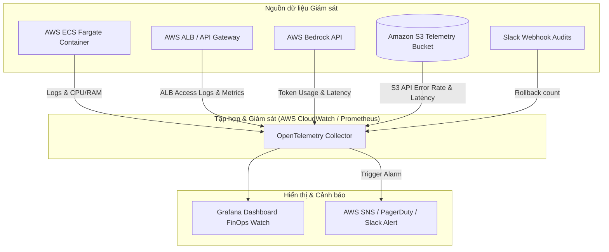

# Nghiên cứu Giám sát Production (Production Monitoring Guide) - FinOps Watch

Tài liệu này nghiên cứu và đặc tả chi tiết các chỉ số (Metrics), Nhật ký (Logs) và Cảnh báo (Alarms) cần thiết để giám sát hệ thống **FinOps Watch** ở môi trường **Production**. Hệ thống giám sát được thiết kế theo cấu trúc 4 tầng từ hạ tầng đến chất lượng AI và giá trị kinh doanh.

---

## Sơ đồ tổng thể hệ thống Giám sát Production (Mermaid)

---

## 1. Chi tiết 4 Tầng Giám sát (Metrics & Indicators)

### TẦNG 1: GIÁM SÁT HẠ TẦNG & CONTAINER (Infrastructure Layer)
*Đảm bảo container của AI Engine luôn sống và có đủ tài nguyên hoạt động.*

*   **CPU Utilization (Đơn vị: %)**: 
    *   *Mục đích*: Giám sát tải CPU của container. 
    *   *Ngưỡng cảnh báo*: CPU > 85% kéo dài hơn 5 phút -> Kích hoạt Auto-scaling thêm task mới.
*   **Memory Utilization (Đơn vị: %)**:
    *   *Mục đích*: Giám sát rò rỉ bộ nhớ (Memory leaks) - lỗi cực kỳ phổ biến trong các Python ML app chạy liên tục.
    *   *Ngưỡng cảnh báo*: Memory > 90% -> Cảnh báo OOM (Out-of-Memory) khẩn cấp để restart task.
*   **Container Restart Count (Đơn vị: Số lần)**:
    *   *Mục đích*: Đếm số lần ECS Task bị crash và khởi động lại.
    *   *Ngưỡng cảnh báo*: > 2 lần restart trong 1 giờ -> Phát báo động đỏ (Critical Alert).

### TẦNG 2: GIÁM SÁT HIỆU NĂNG API (Application & API Layer - RED Method)
*Giám sát chất lượng giao tiếp API giữa CDO Platform (Client) và AI Engine (Server).*

*   **Rate (Invocations) (Đơn vị: Requests/phút)**:
    *   *Mục đích*: Đo lượng lưu lượng gọi API từ CDO. 
    *   *Ý nghĩa*: Đột ngột giảm về 0 vào khung giờ chạy Batch biểu thị CDO Pipeline bị sập.
*   **Errors (HTTP 4xx & 5xx) (Đơn vị: Tỷ lệ % / phút)**:
    *   *Mục đích*: Giám sát lỗi hệ thống.
    *   *Ngưỡng cảnh báo*: Lỗi 5xx > 1% tổng số request -> Cảnh báo Engine lỗi logic code; Lỗi 4xx tăng đột biến -> Lỗi phân quyền AWS SigV4 hoặc CDO truyền sai schema payload.
*   **Duration (Latency) (Đơn vị: Milliseconds)**:
    *   *Mục đích*: Giám sát thời gian phản hồi (p50, p90, p99).
    *   *Ngưỡng cảnh báo*: Latency p99 > 30 giây -> Nguy cơ timeout ở phía ALB/API Gateway. Cần tối ưu thuật toán hoặc tăng tài nguyên container.

### TẦNG 3: GIÁM SÁT CHẤT LƯỢNG MÔ HÌNH AI & LLM (AI/ML Quality Layer)
*Giám sát hiệu suất và chi phí chạy thực tế của mô hình trí tuệ nhân tạo.*

*   **AWS Bedrock Token Consumption (Đơn vị: Số lượng Tokens)**:
    *   *Mục đích*: Đo lượng Input Tokens và Output Tokens tiêu thụ qua Bedrock API.
    *   *Ý nghĩa*: Theo dõi trực tiếp chi phí vận hành AI Engine để tránh tình trạng "FinOps Tool tự làm bùng nổ chi phí".
*   **Model Inference Latency (Đơn vị: Seconds)**:
    *   *Mục đích*: Đo thời gian mô hình Bedrock (Claude) xử lý và trả về kết quả suy luận.
*   **Prediction Drift (Trôi lệch nhận diện) (Đơn vị: Tỷ lệ %)**:
    *   *Mục đích*: Giám sát tỷ lệ anomaly phát hiện được trên tổng số tài nguyên quét.
    *   *Ý nghĩa*: Nếu tỷ lệ anomaly đột ngột tăng lên 80% (trong khi bình thường chỉ < 5%), mô hình có thể đang gặp lỗi nhận diện hàng loạt (False Positives).

### TẦNG 4: GIÁM SÁT VẬN HÀNH & KINH DOANH (Business & FinOps Layer)
*Đo lường giá trị thực tế hệ thống FinOps Watch mang lại cho doanh nghiệp.*

*   **Rollback Rate (Tỷ lệ hoàn tác can thiệp) (Đơn vị: %)**:
    *   *Mục đích*: Đo tỷ lệ kỹ sư bấm nút "Rollback" để bật lại tài nguyên bị tắt nhầm.
    *   *Ý nghĩa*: Đây là SLO của hệ thống. Nếu tỷ lệ Rollback > 1%, hệ thống sẽ tự động kích hoạt **Lockout (Khóa can thiệp)**.
*   **Auto-Containment Lock Status (Đơn vị: Boolean 0/1)**:
    *   *Mục đích*: Giám sát trạng thái Tenant có bị khóa hay không.
    *   *Ý nghĩa*: Nếu bị khóa (LOCKED = 1), gửi thông báo Slack yêu cầu nhóm AI tinh chỉnh lại thuật toán.
*   **Total Cost Saved (Đơn vị: USD)**:
    *   *Mục đích*: Đo tổng số tiền hệ thống đã tiết kiệm được cho công ty.
    *   *Cách tính*: `Số giờ tài nguyên bị tắt x Đơn giá tài nguyên/giờ`.
*   **S3 API Throttling & Client Errors (Đơn vị: Số lần)**:
    *   *Mục đích*: Đảm bảo các hoạt động đọc/ghi audit logs trên Amazon S3 và cache idempotency trên DynamoDB hoạt động mượt mà, không bị lỗi giới hạn cuộc gọi.

---

## 2. Thiết lập Cảnh báo Khẩn cấp ở Production (Alarms Strategy)

| Tên Cảnh báo (CloudWatch Alarm) | Điều kiện Trigger | Mức độ nguy hiểm | Hành động xử lý |
| :--- | :--- | :---: | :--- |
| **FinOpsEngineOOMAlarm** | Memory Utilization > 92% trong 3 phút | 🔴 Critical | Tự động restart container, gửi thông báo Slack cảnh báo Memory leak. |
| **FinOpsEngine5xxSpike** | HTTP 5xx Rate > 2% trong 5 phút | 🔴 Critical | PagerDuty gọi kỹ sư trực On-call (Nhóm AI hoặc CDO tùy lỗi). |
| **SLOErrorBudgetBurned** | Rollback Rate > 1.0% (30-day window) | 🟡 Warning | Tự động khóa Auto-containment của Tenant, chuyển AI Engine về mode Alert-only. |
| **InferenceTimeoutAlarm** | Latency p99 > 45s | 🟡 Warning | Kiểm tra kích thước payload dữ liệu CUR gửi sang, xem xét nâng cấp instance hoặc optimize query. |
| **BedrockQuotaLimit** | Bedrock Throttling Exception > 5 lần/h | 🟡 Warning | Yêu cầu AWS nâng hạn mức Rate Limit (Quota) của Bedrock API. |

---

## 3. Nhật ký kiểm toán Production (Audit Logging Best Practices)

Bên cạnh metrics, hệ thống logging ở Production phải ghi lại các thông tin có cấu trúc dưới dạng JSON (Structured Logging):

1.  **Mỗi request API gửi sang**: Phải log lại `X-Tenant-Id`, `X-Idempotency-Key` và thời gian nhận.
2.  **Mỗi quyết định can thiệp**: Phải log lại:
    *   `resource_id` bị phát hiện bất thường.
    *   `unblended_cost` và xu hướng tăng đột biến.
    *   `suggested_action` (ví dụ: `SCHEDULE_SHUTDOWN`).
    *   Lý do mô hình Bedrock đưa ra quyết định (Reasoning).
3.  **Mỗi hành động Rollback**: Ghi nhận thời gian kỹ sư click nút Rollback trên Slack để phục vụ tính toán SLO.
