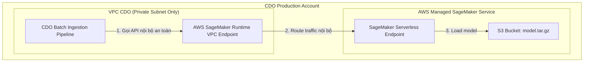

# Hướng dẫn Kỹ thuật: Triển khai AWS SageMaker ở mức Production (FinOps Watch)

Tài liệu này nghiên cứu và phân tích các phương án triển khai (hosting) mô hình AI Engine trên **AWS SageMaker ở môi trường Production**. Mục tiêu là tìm ra kiến trúc tối ưu nhất đáp ứng các yêu cầu về: **Hiệu năng (Performance), Độ sẵn sàng (Availability), Bảo mật (Security) và Tối ưu chi phí (Cost Efficiency)**.

---

## 1. So sánh 4 Phương án Hosting SageMaker ở Production

| Tiêu chí | 1. Serverless Inference | 2. Real-time Inference (Multi-AZ) | 3. Asynchronous Inference | 4. Batch Transform |
| :--- | :--- | :--- | :--- | :--- |
| **Cơ chế hoạt động** | Tự động bật tắt container theo traffic thực tế. | Instance chạy 24/7, tự động scale số lượng instance. | Đưa yêu cầu vào queue (SQS), xử lý lần lượt. | Dựng máy ảo tạm thời để xử lý file lớn trên S3 rồi tắt. |
| **Độ trễ (Latency)** | 🟡 Trung bình (bị trễ Cold Start 3-5s nếu không gọi thường xuyên). | 🟢 Thấp (< 200ms), không có cold start. | 🔴 Cao (phụ thuộc vào độ dài hàng đợi). | 🔴 Rất cao (thời gian khởi động máy ảo ~ 2-3 phút). |
| **Giới hạn Payload** | 🔴 30 MB | 🔴 6 MB | 🟢 1 GB | 🟢 Không giới hạn (xử lý trực tiếp file S3). |
| **Thời gian timeout tối đa** | 🔴 60 giây | 🔴 60 giây | 🟢 15 phút | 🟢 Không giới hạn. |
| **Chi phí chạy nền (Idle Cost)** | 🟢 **$0 / tháng** (Chỉ trả tiền trên thời gian gọi). | 🔴 **Từ ~$100 / tháng** (trả cho instance chạy 24/7). | 🟡 **Từ ~$10 / tháng** (có thể cấu hình scale-to-zero). | 🟢 **$0 / tháng** (Chỉ trả tiền khi job chạy). |
| **Tính phù hợp với FinOps Watch** | ⭐⭐⭐⭐⭐ **(Tối ưu nhất cho Batch)** | ⭐⭐ **(Lãng phí cho Batch)** | ⭐⭐⭐ **(Tốt nếu dữ liệu CUR cực lớn)** | ⭐⭐⭐⭐ **(Tốt cho File-based Pipeline)** |

---

## 2. Thiết kế Kiến trúc Production đề xuất: **Kombination Serverless + Private VPC**

Vì đặc thù của FinOps Watch là **xử lý dữ liệu theo chu kỳ (Batch Cadence 12h/24h)**, dữ liệu CUR chỉ được AWS xuất ra vài lần một ngày. Việc duy trì một Real-time Endpoint chạy 24/7 là cực kỳ lãng phí (đi ngược lại triết lý FinOps).

### Sơ đồ kiến trúc bảo mật Production (Mermaid)



### Các thành phần bảo mật & tin cậy bắt buộc ở Production:

1. **Bảo mật mạng với VPC Endpoint (AWS PrivateLink)**:
   * **Nguyên tắc**: Endpoint của SageMaker tuyệt đối **không được phép expose ra ngoài internet**.
   * **Giải pháp**: Tạo một **Interface VPC Endpoint** cho service `sagemaker.api` và `sagemaker.runtime` nằm hoàn toàn trong Private Subnet của CDO. Mọi yêu cầu gọi từ CDO Pipeline sang AI Engine sẽ đi qua mạng nội bộ của AWS.
2. **Quản lý phân quyền với IAM Roles**:
   * Áp dụng nguyên tắc đặc quyền tối thiểu (Least Privilege).
   * SageMaker Endpoint chỉ được cấp quyền đọc file model từ đúng S3 Bucket được chỉ định và ghi log ra CloudWatch.
3. **Cơ chế dự phòng lỗi (Serverless Concurrency & Provisioned Concurrency)**:
   * Mặc dù Serverless Endpoint bị lỗi cold start ở request đầu tiên, ta có thể cấu hình **Provisioned Concurrency** (ví dụ: giữ 1 instance luôn "ấm" trong các khung giờ CDO Pipeline chạy để triệt tiêu hoàn toàn cold start).

---

## 3. Bản thảo Kịch bản Deploy Production (`production_deploy.py`)

Dưới đây là cách cấu hình deploy lên SageMaker ở mức Production sử dụng Serverless Endpoint với cấu hình RAM lớn và bảo mật VPC:

```python
import boto3
import sagemaker
from sagemaker.model import Model
from sagemaker.serverless import ServerlessInferenceConfig

# Khởi tạo session
sagemaker_session = sagemaker.Session()
role = "arn:aws:iam::123456789012:role/FinOpsSageMakerExecutionRole"
bucket = "finops-watch-production-model-bucket"
model_s3_uri = f"s3://{bucket}/models/model.tar.gz"

# 1. Định nghĩa SageMaker Model
model = Model(
    image_uri=sagemaker.image_uris.retrieve("sklearn", sagemaker_session.boto_region_name, version="1.2-1"),
    model_data=model_s3_uri,
    role=role,
    entry_point="inference.py",
    source_dir="code/", # Thư mục chứa script inference và requirements.txt
    sagemaker_session=sagemaker_session
)

# 2. Cấu hình Serverless cho Production
# Cấp RAM 3GB (3072 MB) để xử lý dữ liệu CUR lớn và tránh tràn bộ nhớ
serverless_config = ServerlessInferenceConfig(
    memory_size_in_mb=3072,
    max_concurrency=10 # Cho phép xử lý song song tối đa 10 luồng từ các Tenant khác nhau
)

# 3. Thực hiện Deploy an toàn trong VPC nội bộ
print("[+] Đang khởi tạo và deploy Production Serverless Endpoint...")
predictor = model.deploy(
    endpoint_name="finops-watch-ai-engine-prod",
    serverless_inference_config=serverless_config,
    # Các tham số bảo mật VPC (Ràng buộc cứng)
    vpc_config={
        'SecurityGroupIds': ['sg-0123456789abcdef0'],
        'Subnets': ['subnet-0123456789abcdef0', 'subnet-0123456789abcdef1']
    }
)
print(f"[+] Deploy thành công! Endpoint ARN: {predictor.endpoint_name}")
```

---

## 4. Khuyến nghị Vận hành & Giám sát ở Production (Production Ops Runbook)

1. **Thiết lập CloudWatch Alarms**:
   * Giám sát metric `ModelSetupTime` (thời gian khởi động container của Serverless) để theo dõi cold start.
   * Giám sát metric `Invocations` và `InvocationsFailed` (5xx errors) để tự động phát hiện lỗi và báo động qua Slack.
2. **Kế hoạch cập nhật mô hình không gây downtime (Zero-Downtime Updates)**:
   * Khi nhóm AI có phiên bản mô hình mới, deploy thành một Endpoint tạm thời để test chất lượng (A/B testing hoặc Shadow testing).
   * Sau khi đạt chuẩn, tiến hành cập nhật endpoint Production bằng cách trỏ Endpoint Config sang Model ID mới. SageMaker sẽ tự động thực hiện cập nhật dưới nền mà không ngắt quãng lưu lượng (Zero-downtime).
