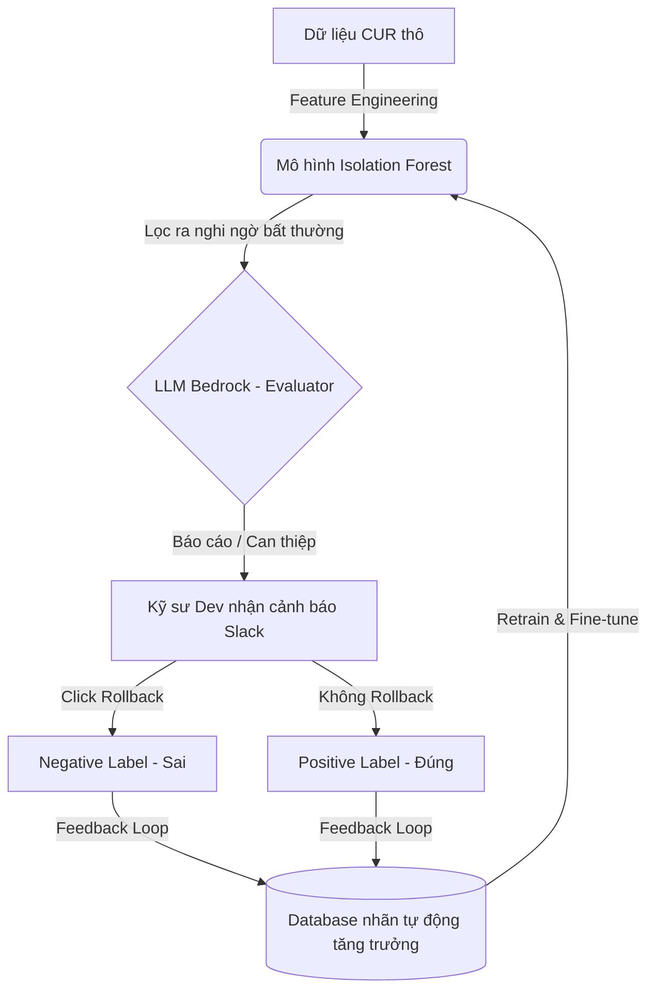

# Chiến lược Cải thiện Hiệu năng Mô hình Không Giám sát (Unsupervised ML Improvement)

Khi triển khai trên Production, mô hình phát hiện bất thường chi phí ban đầu thường **chưa có nhãn (Unlabeled Data)**. Tài liệu này cung cấp các chiến lược ML và kỹ thuật hệ thống giúp cải thiện hiệu năng (giảm False Positives, tăng Precision) và tối ưu hóa các chỉ số vận hành mà không cần nhãn ban đầu.

---

## Sơ đồ vòng lặp phản hồi Active Learning (Mermaid)

---

## 1. 4 Chiến lược cải thiện Hiệu năng Mô hình (Model Performance)

### Chiến lược 1: Xây dựng vòng phản hồi Active Learning (Human-in-the-Loop)
Đây là cách quan trọng nhất để tạo nhãn từ số 0.
*   **Cơ chế**: Tận dụng trực tiếp nút **Rollback** của kỹ sư trên Slack khi hệ thống tự động tắt nhầm tài nguyên.
    *   Nếu kỹ sư click **Rollback**: Ghi nhận record đó là `False Positive (Nhãn 0)`.
    *   Nếu sau 24 giờ kỹ sư **không click Rollback**: Mặc định ghi nhận record đó là `True Positive (Nhãn 1)`.
*   **Kết quả**: Từ dữ liệu không nhãn, hệ thống tự động tích lũy và xây dựng được tập dữ liệu có nhãn chất lượng cao theo thời gian để retrain mô hình.

### Chiến lược 2: LLM làm Trọng tài dán nhãn giả (LLM as a Pseudo-Labeler)
Sự kết hợp giữa ML truyền thống và Generative AI (LLM).
*   **Cơ chế**:
    1.  Mô hình ML truyền thống (như **Isolation Forest**) chạy quét toàn bộ dữ liệu CUR, chấm điểm bất thường (Anomaly Score) và lọc ra top 5% tài nguyên nghi ngờ nhất.
    2.  Thay vì cảnh báo ngay, thông tin của 5% tài nguyên này được gửi sang **AWS Bedrock (Claude 3.5 Sonnet)** kèm theo cấu trúc dữ liệu lịch sử chi tiêu 14 ngày gần nhất của tài nguyên đó.
    3.  Bedrock thực hiện phân tích ngữ cảnh (ví dụ: phát hiện xem hôm nay có phải kỳ release định kỳ hay cuối tháng không) để đóng vai trò "Trọng tài" phê duyệt.
*   **Kết quả**: Triệt tiêu đến 80% False Positives trước khi gửi cảnh báo cho người dùng.

### Chiến lược 3: Thiết lập Ngưỡng can thiệp Động (Dynamic Thresholding)
*   **Cơ chế**: Thay vì sử dụng một tỷ lệ `contamination` cố định (ví dụ: mặc định mặc định coi 1% dữ liệu là lỗi), ta sử dụng kết hợp thống kê:
    *   Chỉ dán nhãn bất thường khi chi tiêu vượt quá ngưỡng $\mu + 3\sigma$ (Trung bình + 3 lần độ lệch chuẩn) của chính tài nguyên đó trong 30 ngày qua.
    *   Chỉ can thiệp nếu số tiền tăng đột biến tuyệt đối vượt quá một ngưỡng chi phí chấp nhận rủi ro (ví dụ: tăng đột biến > $50/ngày đối với tài khoản Dev).

### Chiến lược 4: Feature Engineering (Trích xuất đặc trưng chu kỳ)
Hiệu năng của mô hình không giám sát phụ thuộc hoàn toàn vào chất lượng các đặc trưng (features) đầu vào. Hãy bổ sung các đặc trưng sau:
*   `cost_ratio_vs_30d_mean`: Tỷ lệ chi tiêu hiện tại so với trung bình 30 ngày.
*   `is_weekend` / `is_holiday`: Rất quan trọng vì chi phí Dev thường giảm mạnh vào cuối tuần, nếu cuối tuần tăng cao -> Bất thường.
*   `untagged_spending_ratio`: Tỷ lệ chi tiêu không được gắn tag của linked account (tài nguyên vô danh dễ bị lãng phí).

---

## 2. Các phương pháp cải thiện chỉ số Vận hành (Ops Metrics)

*   **Deploy Shadow Mode (Mô hình chạy ẩn)**:
    *   Khi cập nhật thuật toán mới, deploy mô hình ở dạng **Shadow Endpoint**. Mô hình mới vẫn nhận dữ liệu đầu vào và ghi kết quả bất thường ra log, nhưng **không thực thi** hành động tắt tài nguyên.
    *   CDO Platform so sánh kết quả của Shadow model với Live model để đánh giá độ chính xác trước khi cho chuyển đổi thật.
*   **Áp dụng cơ chế Thử nghiệm (Dry-Run Cadence)**:
    *   Trong 2 tuần đầu tiên triển khai mô hình mới, bắt buộc cấu hình tham số hệ thống ở chế độ **Alert-only** (chỉ gửi cảnh báo Slack, cấm tự động tắt). 
    *   Đo lường phản hồi của kỹ sư trong thời gian này để tinh chỉnh tham số `contamination` của Isolation Forest về mức tối ưu.
