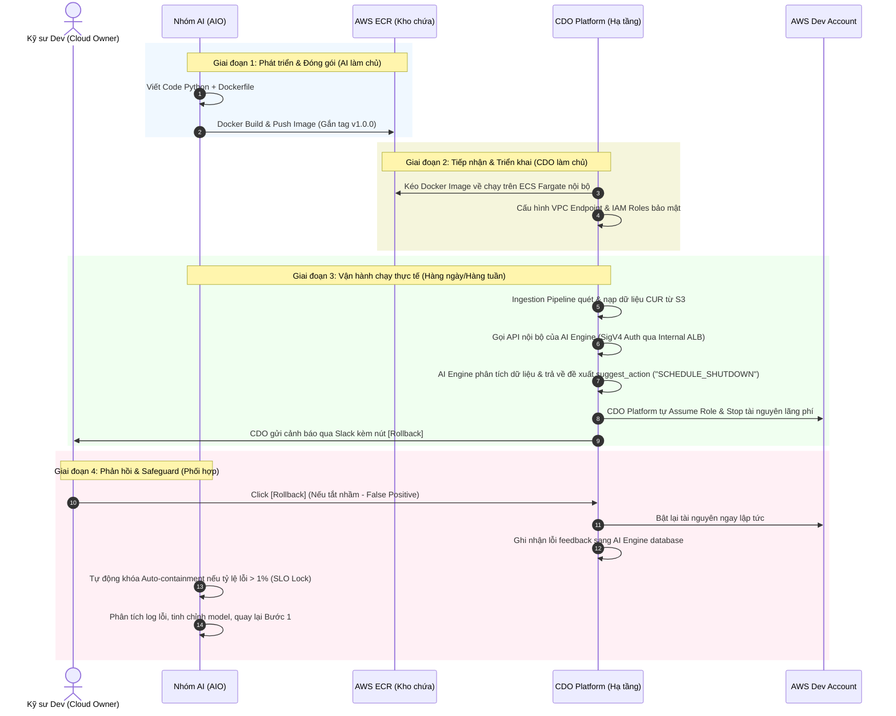

# Quy trình Phối hợp làm việc (Workflow): CDO Platform Host (Platform-Centric)

Tài liệu này đặc tả quy trình phối hợp làm việc đầu-cuối (End-to-End Workflow) giữa **Nhóm AI (AIO)** và **CDO Platform** trong kịch bản **CDO Platform tự chịu trách nhiệm vận hành hạ tầng host AI Engine**.

---

## Sơ đồ quy trình phối hợp E2E (CDO Host)

---

## Chi tiết các Giai đoạn phối hợp (CDO Host)

### GIAI ĐOẠN 1: PHÁT TRIỂN & ĐÓNG GÓI (Nhóm AI làm chủ)
*   **Công việc của AI**:
    1. Thiết kế và tối ưu thuật toán phát hiện bất thường (ví dụ: Isolation Forest, K-Means) trên dữ liệu CUR và Cost Explorer lịch sử.
    2. Viết file `Dockerfile` tối ưu hóa kích thước image (sử dụng multi-stage build, python-slim).
    3. Đóng gói mã nguồn thành Docker Image và thực hiện `docker push` lên kho **Amazon ECR** tập trung của công ty.
    4. Cung cấp API specification (Swagger/OpenAPI) cập nhật cho CDO.

### GIAI ĐOẠN 2: TIẾP NHẬN & TRIỂN KHAI (CDO Platform làm chủ)
*   **Công việc của CDO**:
    1. Xây dựng hạ tầng **AWS ECS Fargate** nằm hoàn toàn trong **VPC Private Subnet** nội bộ.
    2. Cấu hình **IAM Role** cấp quyền tối thiểu cho Container (quyền gọi Bedrock, quyền đọc ghi S3 telemetry bucket cục bộ, cấm hoàn toàn quyền quản trị hạ tầng).
    3. Thiết lập **AWS PrivateLink (VPC Endpoints)** để lưu lượng gọi từ Ingestion Pipeline sang AI Engine không đi ra internet.
    4. Cấu hình xác thực request qua **AWS SigV4** để ngăn chặn các truy cập trái phép.

### GIAI ĐOẠN 3: VẬN HÀNH CHẠY THỰC TẾ (Phối hợp)
1.  **Quét dữ liệu**: Theo chu kỳ (12h hoặc 24h), CDO Platform kích hoạt job quét dữ liệu CUR mới nhất từ S3 bucket.
2.  **Gửi yêu cầu**: CDO Platform gọi API `POST /v1/detect` của AI Engine, truyền theo dữ liệu chi tiêu thô kèm theo Header xác thực `X-Tenant-Id` và `X-Idempotency-Key` (để tránh xử lý trùng lặp).
3.  **Phân tích & Phản hồi**: AI Engine tiền xử lý dữ liệu, suy luận qua model và trả về danh sách các tài nguyên nghi ngờ bất thường kèm đề xuất can thiệp.
    *   *Ví dụ*: `"suggested_action": "SCHEDULE_SHUTDOWN"` cho các tài nguyên Dev chạy không tải liên tục 48h.
4.  **Thực thi can thiệp**:
    *   CDO Platform tiếp nhận đề xuất. 
    *   CDO **tự chịu trách nhiệm** gọi AWS API (thông qua Assume Role nội bộ của CDO) để tắt (Stop) các tài nguyên lãng phí ở tài khoản Dev.
    *   CDO gửi thông báo Alert Slack cho kỹ sư sở hữu tài nguyên đó kèm nút **Rollback**.

### GIAI ĐOẠN 4: PHẢN HỒI & BẢO VỆ SLO (Phối hợp)
1.  **Rollback**: Kỹ sư Dev nếu thấy tài nguyên của mình bị tắt nhầm (False Positive), họ click nút **Rollback** trên Slack. CDO Platform lập tức bật lại tài nguyên.
2.  **Báo cáo lỗi**: CDO Platform gửi yêu cầu `POST /v1/audit/{audit_id}/rollback` đến AI Engine.
3.  **Bảo vệ SLO (1% Error Budget Lock)**: 
    *   AI Engine ghi nhận số vụ Rollback. Nếu tỷ lệ lỗi vượt quá **1%**, AI Engine tự động chuyển trạng thái của tenant đó thành **LOCKED**.
    *   CDO Platform khi thấy tenant bị khóa sẽ ngưng tự động tắt tài nguyên, đưa hệ thống về chế độ an toàn **Dry-run (Chỉ cảnh báo, không can thiệp)**.
4.  **Tinh chỉnh thuật toán**: Nhóm AI lấy dữ liệu các vụ Rollback ra phân tích, tìm nguyên nhân lỗi, cải tiến model và phát hành phiên bản mới (quay lại Giai đoạn 1).

---

## Bảng phân định trách nhiệm RACI Matrix (CDO Host)

| Công việc / Tác vụ | Nhóm AI (AIO) | Nhóm CDO Platform |
| :--- | :---: | :---: |
| Phát triển thuật toán & Code Engine | **A / R** | **I** |
| Đóng gói Docker Image & Push ECR | **A / R** | **I** |
| Triển khai Container trên ECS Fargate | **I** | **A / R** |
| Thiết lập bảo mật mạng & IAM Roles | **C** | **A / R** |
| Nạp & Chuyển đổi dữ liệu CUR sang AI | **I** | **A / R** |
| Ra quyết định Shutdown tài nguyên Dev | **C** (Đề xuất) | **A / R** (Thực thi) |
| Xử lý nút bấm Rollback & Bật lại tài nguyên | **I** | **A / R** |
| Giám sát tỷ lệ lỗi & Khóa SLO Auto-Lock | **A / R** | **I** |
