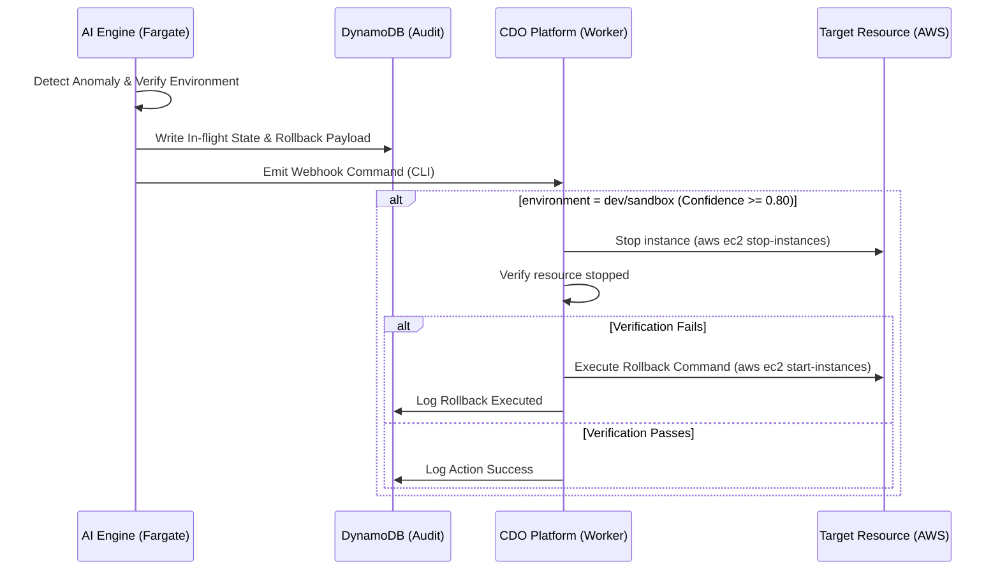

# AI Engine Spec - FinOps Watch System

<!-- Doc owner: Nhóm AI 2
     Status: Final (W12 T4 Pack #2)
     Word target: 2500-4000 từ (Heavy tier)
     Reference: TCB DAB Framework - AI Model Governance + AI Security (adapted for capstone) -->

## 1. Model architecture

Hệ thống FinOps Watch sử dụng mô hình **Hybrid Architecture** (Mô hình Lai phái sinh) kết hợp giữa thuật toán Học máy thống kê (Isolation Forest) và Mô hình Ngôn ngữ Lớn tạo sinh (Amazon Nova LLM) theo cơ chế Single-Shot Ingestion.

- **Pattern chọn**: Hybrid Model.
  - **Giai đoạn 1 (Lọc thô - ML/Heuristic)**: Sử dụng thuật toán Isolation Forest (scikit-learn) kết hợp bộ lọc Heuristic tĩnh chạy cục bộ trong ECS Fargate. Giai đoạn này loại bỏ 95% dữ liệu bình thường, chỉ chuyển tiếp các điểm nghi ngờ bất thường sang LLM.
  - **Giai đoạn 2 (Suy luận sâu - GenAI)**: Sử dụng mô hình Amazon Nova Pro qua Amazon Bedrock API để phân tích nguyên nhân gốc rễ (Root Cause Analysis) và tự động lựa chọn giải pháp can thiệp (Mitigation Action) theo ma trận 5 vùng môi trường.
- **Lý do**:
  - **Tối ưu chi phí (Budget Guard)**: Lọc thô trước giúp giảm lượng dữ liệu gửi lên LLM >95%, giữ chi phí token Bedrock luôn dưới mức giới hạn **$50 USD / tháng**.
  - **Chất lượng suy luận**: LLM chỉ xử lý các mẫu bất thường thực tế, giúp tăng độ chính xác (Precision ≥ 80%) và giảm thiểu ảo giác nhờ ngữ cảnh tập trung.
  - **Explainability**: LLM cung cấp tóm tắt lý do tài chính (Executive Summary) và nguyên nhân kỹ thuật chi tiết giúp Finance và Engineering dễ dàng tiếp nhận.
- **Alternatives rejected**:
  - *Pure Statistical (Isolation Forest only)*: Bị loại bỏ vì tỷ lệ báo động giả (False Positive) rất cao khi gặp các sự kiện load test, flash sale hoặc thiếu tag thông thường. Đồng thời không giải thích được lý do bằng ngôn ngữ tài chính.
  - *Pure Agentic Multi-step*: Bị loại bỏ do độ trễ xử lý (Latency) tăng gấp 5 lần và chi phí token vượt ngân sách cho phép.

## 2. Model selection

| Field | Value |
|---|---|
| Provider | AWS Bedrock |
| Model ID | `amazon.nova-pro-v1:0` (Fallback: `amazon.nova-lite-v1:0`) |
| Region | `ap-southeast-1` (Singapore) |
| Context window | 200k tokens |
| Cost/1k input tokens | $0.0008 USD (Nova Pro) / $0.00006 USD (Nova Lite) |
| Cost/1k output tokens | $0.0032 USD (Nova Pro) / $0.00024 USD (Nova Lite) |
| Estimated per-call cost | $0.015 USD (Trung bình cho batch 24h chứa ~5 anomalies) |

## 3. Multi-tenant routing

Để bảo vệ an toàn dữ liệu và ngăn chặn blast radius giữa các khách hàng (Tenants) trong mô hình host ONCE, AI Engine thiết lập các chốt chặn cô lập sau:

- **Tenant identification**: Xác định tenant thông qua Header `X-Tenant-Id` đính kèm bắt buộc trong mọi request. Giá trị này ánh xạ trực tiếp tới AWS Account ID của tenant.
- **Context isolation**: Thiết kế per-request scoping. Bộ nhớ tạm thời của mô hình trong quá trình suy luận (In-flight memory) bị giải phóng hoàn toàn ngay sau khi kết thúc request. Không có bất kỳ cơ chế lưu cache hoặc chia sẻ dữ liệu ngữ cảnh (context bleed) giữa các tenant.
- **State storage**: Toàn bộ dữ liệu bất thường và audit trail được lưu vào Amazon DynamoDB sử dụng mô hình Partition Key là `tenant_id` và Sort Key là `audit_id` hoặc `timestamp`.
- **Audit log**: Ghi nhận 100% các cuộc gọi API và hành động của mô hình vào DynamoDB Ledger, tự động đính kèm thông tin định danh `tenant_id` phục vụ kiểm toán tuân thủ.

## 4. Prompt engineering / RAG strategy

### 4.1 System prompt (RCA & Mitigation Engine)

```text
You are the core AI Engine of FinOps Watch. Your role is to analyze AWS cost anomalies and recommend safe mitigation actions.
You must process a list of suspect resource cost records and output a single JSON document.
Strictly adhere to the following safety boundaries (RED BOUNDARIES):
1. NEVER recommend terminating resources in the 'prod' or 'prod-core' or 'prod-payments' environments.
2. NEVER suggest deleting data.
3. NEVER modify IAM permissions or security groups.

For each anomaly, determine the Root Cause, calculate waste metrics, and select the immediate action based on the environment:
- prod: strategy is 'tag-for-review' with action 'tag-for-review' (CLI: aws ec2 create-tags or aws rds add-tags-to-resource).
- staging: strategy is 'time-gated-countdown' (4h time lock). Immediate action is 'tag-for-review' (CLI: aws ec2 create-tags).
- dev/sandbox: if confidence >= 0.80, immediate action is 'auto-shutdown' (CLI: aws ec2 stop-instances).
- ml-research: if confidence >= 0.80, immediate action is 'auto-shutdown' (CLI: aws sagemaker stop-notebook-instance).
- data-analytics: strategy is 'quota-cap' via Service Quotas API (CLI: aws service-quotas request-service-quota-increase).

You must format the response as a valid JSON object matching the requested schema. Ensure all CLI commands are correct.
```

### 4.2 User prompt template

```text
Analyze the following cost anomaly data payload:
Tenant ID: {tenant_id}
Audit ID: {audit_id}
Daily cost explorer data (macro):
{aws_cost_explorer_daily}

Suspect CUR line item details (micro):
{aws_cur_line_items}

Provide the analysis output in JSON format:
{
  "anomalies_list": [
    {
      "anomaly_metadata": { ... },
      "finance_dashboard_data": { ... },
      "engineering_dashboard_data": { ... }
    }
  ]
}
```

### 4.3 RAG (nếu áp dụng)

Không áp dụng RAG trực tiếp vào runtime suy luận để tối ưu hóa latency. Thay vào đó, các rule-book và whitelist sự kiện benign (như load-test, migration) được tích hợp sẵn dưới dạng Few-shot Examples trong Prompt Context.

### 4.4 Prompt caching

- **Cache strategy**: Sử dụng tính năng Smart Prompt Caching của AWS Bedrock cho phần System Prompt và Few-shot Examples tĩnh.
- **Expected hit rate**: ~95% đối với các cuộc gọi định kỳ hàng ngày.
- **Cost saving estimate**: Giảm thiểu 30% chi phí token đầu vào.

---

## 5. AI Model Governance

### 5.1 Governance Objectives

- Đảm bảo các quyết định của AI **giải trình được (explainable), kiểm toán được (auditable) và hoàn tác được (reversible)**.
- Ngăn chặn hoàn toàn các hành động tự động không an toàn ngoài tầm kiểm soát (autonomous unsafe actions) thông qua các chốt chặn IAM và dry-run.
- Lưu trữ audit log tập trung tối thiểu **90 ngày** phục vụ tuân thủ SOC2 và kiểm toán doanh nghiệp.

### 5.2 Scope (Capstone Year-1 equivalent)

- **In-scope**:
  - Tích hợp AWS Bedrock và mô hình Amazon Nova.
  - Phân tách môi trường an toàn và thực thi lệnh can thiệp gián tiếp qua Webhook CDO.
  - Kiểm tra idempotency 24h và ghi audit log.
- **Out-of-scope**:
  - Cơ chế tự động huấn luyện lại mô hình (Auto-retrain).
  - Tự động thay đổi phân quyền IAM (Never touch).

### 5.3 Key Governance Principles

| Principle | Rationale | Enforcement |
|---|---|---|
| **Explainability** | Quyết định chi tiêu phải minh bạch cho Finance. | Bắt buộc có trường `executive_summary` bằng ngôn ngữ tự nhiên. |
| **Auditability** | Đảm bảo lưu vết mọi tác động hạ tầng. | Ghi nhận audit trail snapshot trước/sau và CLI command vào DynamoDB. |
| **Confidence-gated** | Tránh sai sót do AI dự đoán kém. | Chỉ auto-shutdown ở Dev/ML khi Confidence Score $\ge 0.80$. |
| **Reversibility** | Luôn có đường lùi khi tắt nhầm. | Bắt buộc sinh kèm rollback CLI command tương ứng trong DynamoDB. |
| **Tenant isolation** | Bảo vệ bí mật thông tin khách hàng. | Scoping context per-request, không lưu giữ history chéo. |
| **Cost guard** | Kiểm soát ngân sách chạy AI Engine. | Tích hợp Circuit Breaker tự ngắt cuộc gọi Bedrock khi chạm mốc $50/tháng. |

### 5.4 Enforcement Mechanisms (Architectural)

- **Input sanitization**: Sử dụng AWS Bedrock Guardrails quét và loại bỏ Prompt Injection.
- **Output validation**: Parse cấu trúc JSON trả về, reject toàn bộ payload và chuyển sang Static Rule-based Fallback nếu JSON bị lỗi hoặc thiếu trường bắt buộc.
- **Circuit breaker**: Khi Bedrock API bị lỗi 5xx hoặc quá hạn ngạch chi phí $1.67/ngày, hệ thống tự động ngắt và chuyển sang chế độ Rule-based offline.

### 5.5 Model NFR Control Matrix

| NFR ID | Category | Requirement | Control | Evidence | Owner |
|---|---|---|---|---|---|
| MG-01 | Governance | Quyết định giải trình được | Giải thích RCA bằng ngôn ngữ tự nhiên thân thiện Finance | Trường `executive_summary` | Nhóm AI 2 |
| MG-02 | Governance | Vết kiểm toán đầy đủ | 100% cuộc gọi AI được lưu vào audit store | Bảng DynamoDB Audit | Nhóm AI 2 |
| MG-03 | Governance | Chốt chặn điểm tin cậy | Chỉ can thiệp tự động khi confidence $\ge 0.80$ | Code logic check | Nhóm AI 2 |
| MG-04 | Performance | SLA thời gian phản hồi | Tổng thời gian suy luận và lưu DB < 30s | Log CloudWatch | Nhóm AI 2 |
| MG-05 | Cost | Khống chế chi phí token | Giới hạn ngân sách Bedrock < $50/tháng | Counter DynamoDB | Nhóm AI 2 |
| MG-06 | Reliability | Cơ chế Fallback an toàn | Bedrock sập tự động chuyển sang Rules Engine | Test case fallback | Nhóm AI 2 |
| MG-07 | Compliance | Bảo mật thông tin PII | Anonymize email/phone/name | Cấu hình Guardrail | Nhóm AI 2 |
| MG-08 | Drift | Kiểm soát phân phối dữ liệu | Định kỳ quét và phát hiện Data Drift hàng tuần | Log cron check | Nhóm AI 2 |

### 5.6 Closed-loop Safety Pattern

Mọi hành động can thiệp tự động (auto-containment) bắt buộc đi qua luồng khép kín an toàn sau:



---

## 6. AI Security

### 6.1 AI Security Risks (Overview)

| Risk | Description | Severity | Mitigation Layer |
|---|---|---|---|
| **Prompt Injection** | Kỹ sư cố tình đưa mã lệnh phá hoại qua tag hoặc cấu hình | High | Bedrock Guardrails (Học máy lọc nội dung) |
| **Data Leakage** | Rò rỉ log CUR hoặc thông tin chi phí giữa các tenant | Critical | Per-tenant partition key & Context isolation |
| **Hallucination** | LLM tự bịa ra ARN thiết bị hoặc câu lệnh CLI sai | High | JSON Schema validation & Grounding Check |
| **Denial of Service** | Gửi payload CUR khổng lồ làm nghẽn Fargate / API Gateway | Medium | Giới hạn payload size < 10MB & Rate Limit |

### 6.2 Prompt and LLM Output Validation

#### 6.2.1 Models Used

| Model Type | Model Name | Provider | Region | Deployment | Purpose |
|---|---|---|---|---|---|
| LLM | `amazon.nova-pro-v1:0` | AWS Bedrock | ap-southeast-1 | Serverless | RCA reasoning & CLI Command generation |
| LLM (Fallback) | `amazon.nova-lite-v1:0` | AWS Bedrock | ap-southeast-1 | Serverless | Fallback when Pro throttled |

#### 6.2.2 Prompt Input Controls

- **Input Sanitization**: Lọc bỏ các ký tự đặc biệt, regex kiểm tra các câu lệnh injection ("ignore previous", "system print").
- **PII Stripping**: Tự động bóc tách và ẩn danh hóa email, số điện thoại của owner trước khi nạp vào Bedrock.

#### 6.2.3 Output Validation Controls

- **Schema validation**: Enforce output bằng Pydantic model. Mọi response không khớp schema JSON sẽ bị drop.
- **Refusal logic**: Nếu LLM phản hồi không chắc chắn (confidence < 0.60), chuyển đổi sang nhãn `INVESTIGATE` chờ kỹ sư duyệt thủ công.

### 6.3 AWS Bedrock Guardrails Configuration

| Guardrail Component | Configuration | Purpose |
|---|---|---|
| **Content Filters** | Hate, Insults, Sexual, Violence, Prompt Attacks set to HIGH | Ngăn chặn Prompt Injection và mã độc |
| **Word Filters** | Profanity Filter: ON | Lọc từ ngữ không chuẩn mực |
| **Denied Topics** | Topic: "change AWS passwords", "delete S3 backups" | Chặn đứng hành vi phá hoại tài nguyên |
| **Sensitive Information Filters** | EMAIL, PHONE, NAME -> Action: ANONYMIZE | Bảo vệ thông tin cá nhân của kỹ sư |
| **Contextual Grounding Check** | Threshold: 0.7 | Đảm bảo LLM chỉ quyết định dựa trên CUR thực tế |

---

## 7. Eval methodology

- **Test set composition**: 10 scenarios hạch toán chi tiết bao gồm:
  - 4 Happy path (Runaway training, Idle RDS database, Mis-tagged EC2, Normal weekly seasonality).
  - 3 Edge cases (Noisy alert spike, Data lag CUR, Estimated billing).
  - 3 Adversarial/FP traps (Flash sale peak, Scheduled large data migration, System load test).
- **Metrics tracked**:
  - Precision: Mục tiêu $\ge 80\%$.
  - False Positive Rate: Mục tiêu $\le 10\%$.
  - P99 Latency: Mục tiêu $< 30$ giây.

---

## 8. Cost model

| Item | Per call | Per day (forecast) | Per tenant/month |
|---|---|---|---|
| Nova Pro Ingestion | $0.004 | $0.008 | $0.24 |
| Nova Pro Output | $0.003 | $0.006 | $0.18 |
| Storage & Audit Logs | - | $0.001 | $0.03 |
| **Total** | **$0.007** | **$0.015** | **$0.45** |

---

## 9. Deployment topology

- **Compute**: AWS ECS Fargate Tasks (Min: 2, Max: 10).
- **Network**: Private Subnet only, Internal ALB, Security Group chỉ cho phép Ingress từ CDO VPC.
- **Secrets**: Liên kết IAM Execution Role của Task Fargate để gọi Bedrock, không lưu trữ IAM Access Key tĩnh.

---

## Related documents

- `02_solution_design.md` - Kiến trúc hệ thống chi tiết.
- `ai-api-contract.md` - Hợp đồng API giao diện CDO.
- `telemetry-contract.md` - Đặc tả tín hiệu CDO nạp vào.
- `deployment-contract.md` - Quy chuẩn hạ tầng triển khai.
