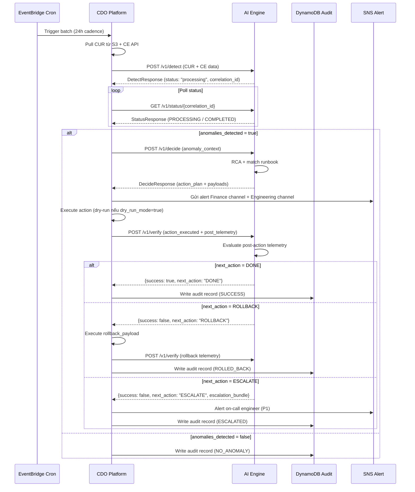

# AI API Contract — Task Force 2 (FinOps Watch)

<!-- Owner: Nhóm AI — TF2 FinOps Watch
     Signed by: AI Lead + CDO Lead (CDO-01) + CDO Lead (CDO-02) + Reviewer Panel
     Date signed: 2026-06-25 (W11 T5)
     Version: v1.1.0
     🔒 FREEZE — Không thay đổi nếu không có Formal Change Request được cả hai bên ký -->

---

## Mục lục

1. [Mục đích & Phạm vi](#1-mục-đích--phạm-vi)
2. [Luồng tích hợp tổng thể](#2-luồng-tích-hợp-tổng-thể)
3. [Quy tắc chung & Bảo mật](#3-quy-tắc-chung--bảo-mật)
4. [Cross-Cutting Headers](#4-cross-cutting-headers)
5. [Đặc tả API Endpoints](#5-đặc-tả-api-endpoints)
   - 5.1 `POST /v1/detect` — Phát hiện Bất thường (Bất đồng bộ)
   - 5.2 `POST /v1/decide` — Lập Kế hoạch Can thiệp
   - 5.3 `POST /v1/verify` — Xác thực Kết quả
   - 5.4 `GET /health` — Health Check
   - 5.5 `GET /v1/status/{id}` — Kiểm tra Trạng thái Tiến trình (Detect & Remediation)
   - 5.6 `POST /v1/audit/{audit_id}/rollback` — Kích hoạt Rollback
6. [Anomaly Types — Enum Reference](#6-anomaly-types--enum-reference)
7. [Containment Actions — Enum Reference](#7-containment-actions--enum-reference)
8. [SLO & Xử lý Lỗi](#8-slo--xử-lý-lỗi)
9. [Sequence Diagram — Luồng Hoàn Chỉnh](#9-sequence-diagram--luồng-hoàn-chỉnh)
10. [Tài liệu liên quan](#10-tài-liệu-liên-quan)

---

## 1. Mục đích & Phạm vi

Tài liệu này định nghĩa **toàn bộ Giao diện lập trình ứng dụng (API)** mà **Nhóm AI expose** cho **Nhóm CDO consume** trong hệ thống TF2 FinOps Watch.

Cam kết kỹ thuật này đảm bảo chu trình phát hiện → lập kế hoạch → can thiệp → xác thực hoạt động nhất quán, an toàn và có thể kiểm toán. 

> [!NOTE]
> **Thiết kế Bất đồng bộ (Async Detection)**: Vì tiến trình phân tích dữ liệu CUR/CE lớn kết hợp gọi LLM AWS Bedrock có thể kéo dài (30-45 giây), API `/v1/detect` được thiết kế xử lý bất đồng bộ (trả về trạng thái `processing` ngay lập tức). CDO sẽ polling endpoint `/v1/status/{correlation_id}` để lấy kết quả nhằm tránh timeout 504 của Gateway.

```
CUR/CE Data (CDO Pull)
        │
        ▼
POST /v1/detect ──────────────────► Trả về trạng thái "processing" + correlation_id
        │
        ▼ (CDO Polling cho đến khi DONE)
GET /v1/status/{correlation_id} ──► Nhận kết quả phát hiện anomalies_list
        │
        │ (nếu anomalies_detected = true)
        ▼
POST /v1/decide ──────────────────► RCA + Action Plan + AWS CLI payload + Rollback payload
        │
        │ CDO thực thi action (dry-run hoặc thật)
        ▼
POST /v1/verify ──────────────────► Đánh giá hiệu quả → DONE / RETRY / ROLLBACK / ESCALATE
```

**Phạm vi:**
- Phát hiện 5 loại bất thường chi phí: `runaway_usage`, `idle_resource`, `untagged_spend`, `sudden_spike`, `gradual_drift`
- Containment an toàn: chỉ trên môi trường `dev`, `staging`, `sandbox`, `ml-research`
- Hard Boundary: **KHÔNG BAO GIỜ** terminate production, xóa data, chỉnh IAM

---

## 2. Luồng tích hợp tổng thể

```
┌─────────────────────────────────────────────────────────────────────┐
│                        CDO Platform                                 │
│                                                                     │
│  EventBridge Cron                                                   │
│       │ (24h batch)                                                 │
│       ▼                                                             │
│  [Pull CUR/CE Data] ──► POST /v1/detect ──────────────────────────►│──┐
│                                                                     │  │
│  ◄─────────────────────── DetectResponse (status: "processing") ───│◄─┘
│       │                                                             │
│  ┌───►│ (CDO Polling liên tục)                                      │
│  │    ▼                                                             │
│  └─── GET /v1/status/{correlation_id} ─────────────────────────────►│──┐
│                                                                     │  │
│  ◄─────────────────────── StatusResponse (anomalies_list) ─────────│◄─┘
│       │                                                             │
│       │ (if anomalies_detected = true)                              │
│       ▼                                                             │
│  POST /v1/decide ─────────────────────────────────────────────────►│──┐
│                                                                     │  │
│  ◄─────────────────── DecideResponse (action_plan + payloads) ─────│◄─┘
│       │                                                             │
│       │ (Execute action — dry-run or real)                          │
│       ▼                                                             │
│  [CDO Executes AWS CLI] ──► POST /v1/verify ──────────────────────►│──┐
│                                                                     │  │
│  ◄─────── VerifyResponse (next_action: DONE/RETRY/ROLLBACK/ESC) ───│◄─┘
│                                                                     │
│  [Write Audit Trail to DynamoDB] ◄── all steps logged              │
└─────────────────────────────────────────────────────────────────────┘
                                  │
                          AI Engine (Fargate/Lambda)
                          Private Subnet — Internal ALB
```

---

## 3. Quy tắc chung & Bảo mật

| Thuộc tính | Quy định |
|---|---|
| **Base Path** | `/v1/` |
| **Protocol** | HTTPS (TLS 1.2+) only |
| **Xác thực** | **AWS IAM SigV4** — không dùng static API key |
| **Cross-account** | STS `assume-role` kèm Session Tag `tenant_id` |
| **Network** | AI Engine chạy trong **Private Subnet**, sau **Internal ALB** — cấm public internet |
| **Content-Type** | `application/json` cho tất cả request/response |
| **Idempotency** | Header `X-Idempotency-Key` bắt buộc cho `/v1/detect`, `/v1/decide`, `/v1/verify` |
| **Rate Limit** | Tối đa **100 requests/phút** per tenant |
| **Integrity** | `X-Payload-SHA256` (SHA256 của request body) bắt buộc |
| **Clock Skew** | Request bị reject nếu `X-Request-Timestamp` lệch > 300 giây so với server |
| **Multi-tenant** | Phân tách dữ liệu hoàn toàn qua `X-Tenant-Id` |

### 3.1 Quy tắc Idempotency chi tiết

`X-Idempotency-Key` lưu DynamoDB với TTL 24 giờ. Xử lý theo 3 trường hợp:

| Trạng thái Key | Payload | Hành vi |
|---|---|---|
| Chưa tồn tại | Bất kỳ | Xử lý bình thường |
| **Đang xử lý** (`IN_PROGRESS`) | Bất kỳ | `409 Conflict` + tiến trình hiện tại |
| **Đã hoàn thành** + payload **khớp** SHA256 | Khớp | `200 OK` + kết quả đã cache |
| **Đã hoàn thành** + payload **khác** SHA256 | Không khớp | `400 ERR_IDEMPOTENCY_MISMATCH` |

### 3.2 Error Budget Lock

Nếu tỷ lệ rollback vượt **1% trong cửa sổ 30 ngày**, AI Engine tự động chuyển Tenant sang `LOCKED_MODE`:
- Mọi `/v1/decide` → chỉ trả về `dry_run_mode: true`, không có action thật
- CDO nhận `X-Containment-Status: LOCKED` trong response header
- Unlock yêu cầu thủ công từ AI Team Lead

---

## 4. Cross-Cutting Headers

Áp dụng cho **mọi request** (ngoại trừ `/health`):

| Header | Type | Bắt buộc | Mô tả |
|---|---|---|---|
| `Content-Type` | string | ✓ | Cố định: `application/json` |
| `Accept` | string | ✓ | Cố định: `application/json` |
| `X-Tenant-Id` | string (UUID v4) | ✓ | Định danh Tenant — cô lập dữ liệu + phân quyền |
| `Authorization` | string | ✓ | AWS IAM SigV4 Signature |
| `X-Idempotency-Key` | string | ✓ | Format: `{tenant_id}:{uuid_v4}` — chống double-process |
| `X-Payload-SHA256` | string | ✓ | SHA256 hex của request body — verify integrity |
| `X-Request-Timestamp` | string (RFC3339 UTC) | ✓ | Thời điểm CDO tạo request. Reject nếu skew > 300s |
| `X-Correlation-Id` | string (UUID v4) | optional | Trace ID E2E. AI Engine tự sinh nếu thiếu |
| `X-Dry-Run-Mode` | string | ✓ | `"true"` hoặc `"false"` — phải nhất quán với body |

---

## 5. Đặc tả API Endpoints

### 5.1 POST /v1/detect — Phát hiện Bất thường Chi phí (Bất đồng bộ)

Nhận dữ liệu telemetry CUR + Cost Explorer + CloudWatch, ghi nhận yêu cầu và bắt đầu tiến trình phân tích bất đồng bộ.

#### A. Request Headers
Theo [Cross-Cutting Headers §4](#4-cross-cutting-headers) + `X-Dry-Run-Mode` bắt buộc.

#### B. Request Body

* **Mô tả trường dữ liệu yêu cầu (Fields Description)**:

| Trường (Field) | Kiểu dữ liệu (Type) | Bắt buộc (Required) | Mô tả (Description) |
|---|---|---|---|
| `data_source_type` | string (Enum) | ✓ | Kiểu nạp dữ liệu: `RAW_JSON` (gửi data trực tiếp ≤10MB) hoặc `S3_POINTER` (gửi URI S3) |
| `is_ad_hoc` | boolean | optional | `true` = quét khẩn cấp ngoài lịch, bỏ qua idempotency. Mặc định: `false` |
| `telemetry_delay_event` | boolean | optional | `true` = CUR chưa finalized, CDO fallback sang CE. AI Engine sẽ hạ confidence. Mặc định: `false` |
| `aws_cost_explorer_daily` | array (of objects) | ✓ | Dữ liệu tổng hợp hàng ngày từ CE API — luôn bắt buộc. Chi tiết schema theo telemetry-contract.md §6 |
| `aws_cur_line_items` | array (of objects) | conditional | Dữ liệu CUR resource-level — bắt buộc khi `data_source_type = RAW_JSON`. Schema theo telemetry-contract.md §7 |
| `s3_bucket_uri` | string | conditional | URI S3 file CUR nén — bắt buộc khi `data_source_type = S3_POINTER` |
| `resource_utilization_metrics` | array (of objects) | optional | Dữ liệu hiệu năng vật lý CloudWatch (cpu_percent, database_connections...). Chi tiết cấu trúc xem tại telemetry-contract.md §8.1 |

* **Lược đồ Schema Yêu cầu**:
```json
{
  "$schema": "http://json-schema.org/draft-07/schema#",
  "title": "DetectRequest",
  "type": "object",
  "properties": {
    "data_source_type": {
      "type": "string",
      "enum": ["RAW_JSON", "S3_POINTER"],
      "description": "Kiểu nạp dữ liệu CUR"
    },
    "is_ad_hoc": {
      "type": "boolean",
      "default": false
    },
    "telemetry_delay_event": {
      "type": "boolean",
      "default": false,
      "description": "true nếu CUR chưa cập nhật đầy đủ — AI Engine giảm confidence, chỉ alert-only"
    },
    "aws_cost_explorer_daily": {
      "type": "array",
      "description": "Dữ liệu CE API — vĩ mô, daily grain. Schema theo telemetry-contract.md §6",
      "items": {
        "type": "object",
        "properties": {
          "date":                   { "type": "string", "format": "date" },
          "linked_account_id":      { "type": "string", "pattern": "^[0-9]{12}$" },
          "linked_account_name":    { "type": "string" },
          "service_code":           { "type": "string", "description": "e.g. AmazonEC2, AmazonRDS" },
          "service":                { "type": "string", "description": "Tên hiển thị CE" },
          "region":                 { "type": "string", "description": "e.g. ap-southeast-1" },
          "unblended_cost":         { "type": "number", "minimum": 0 },
          "cost_ratio_to_7d_avg":   { "type": "number", "minimum": 0 },
          "day_of_week":            { "type": "integer", "minimum": 0, "maximum": 6 },
          "is_weekend":             { "type": "boolean" },
          "is_estimated":           { "type": "boolean" }
        },
        "required": ["date", "linked_account_id", "service_code", "service", "region", "unblended_cost", "cost_ratio_to_7d_avg", "day_of_week", "is_weekend", "is_estimated"]
      }
    },
    "aws_cur_line_items": {
      "type": "array",
      "description": "Dữ liệu CUR resource-level — vi mô. Schema theo telemetry-contract.md §7",
      "items": {
        "type": "object",
        "properties": {
          "bill_billing_period_start_date":    { "type": "string", "format": "date-time" },
          "line_item_usage_start_date":        { "type": "string", "format": "date-time" },
          "line_item_usage_end_date":          { "type": "string", "format": "date-time" },
          "line_item_usage_account_id":        { "type": "string", "pattern": "^[0-9]{12}$" },
          "line_item_usage_account_name":      { "type": "string" },
          "line_item_product_code":            { "type": "string" },
          "line_item_usage_type":              { "type": "string" },
          "line_item_operation":               { "type": "string" },
          "line_item_resource_id":             { "type": "string" },
          "line_item_usage_amount":            { "type": "number", "minimum": 0 },
          "pricing_unit":                      { "type": "string" },
          "line_item_unblended_rate":          { "type": "number", "minimum": 0 },
          "line_item_unblended_cost":          { "type": "number", "minimum": 0 },
          "usage_density_24h":                 { "type": "number", "minimum": 0, "maximum": 1 },
          "resource_tags_user_environment":    { "type": "string", "enum": ["prod", "prod-core", "prod-payments", "staging", "dev", "sandbox", "ml-research", "data-analytics"] },
          "resource_tags_user_team":           { "type": ["string", "null"] },
          "resource_tags_user_owner":          { "type": ["string", "null"] },
          "resource_tags_user_cost_center":    { "type": ["string", "null"] }
        },
        "required": [
          "line_item_usage_start_date", "line_item_usage_account_id",
          "line_item_product_code", "line_item_usage_type",
          "line_item_resource_id", "line_item_usage_amount",
          "pricing_unit", "line_item_unblended_cost",
          "usage_density_24h", "resource_tags_user_environment"
        ]
      }
    },
    "s3_bucket_uri": {
      "type": "string",
      "pattern": "^s3://[a-z0-9\-]+/.+\.json\.gz$",
      "description": "URI S3 file CUR nén — bắt buộc khi S3_POINTER"
    },
    "resource_utilization_metrics": {
      "type": "array",
      "description": "Dữ liệu hiệu năng vật lý CloudWatch. Schema theo telemetry-contract.md §8.1",
      "items": {
        "type": "object",
        "properties": {
          "resource_id":           { "type": "string" },
          "cpu_percent":           { "type": "number", "minimum": 0, "maximum": 100 },
          "memory_mib":            { "type": "number", "minimum": 0 },
          "network_in_bytes":      { "type": "number", "minimum": 0 },
          "network_out_bytes":     { "type": "number", "minimum": 0 },
          "disk_io_ops":           { "type": "number", "minimum": 0 },
          "database_connections":  { "type": ["integer", "null"], "minimum": 0 },
          "gpu_utilization":       { "type": ["number", "null"], "minimum": 0, "maximum": 100 },
          "idle_hours_continuous": { "type": ["integer", "null"], "minimum": 0 }
        },
        "required": ["resource_id", "cpu_percent", "network_in_bytes", "network_out_bytes"]
      }
    }
  },
  "required": ["data_source_type", "aws_cost_explorer_daily"],
  "if": { "properties": { "data_source_type": { "const": "RAW_JSON" } } },
  "then": { "required": ["data_source_type", "aws_cost_explorer_daily", "aws_cur_line_items"] },
  "else": { "required": ["data_source_type", "aws_cost_explorer_daily", "s3_bucket_uri"] },
  "additionalProperties": false
}
```

* **Payload Yêu cầu Mẫu**:
```json
{
  "data_source_type": "RAW_JSON",
  "is_ad_hoc": false,
  "telemetry_delay_event": false,
  "aws_cost_explorer_daily": [
    {
      "date": "2026-06-23",
      "linked_account_id": "200000000012",
      "linked_account_name": "squad-ml-research",
      "service_code": "AmazonEC2",
      "service": "Amazon Elastic Compute Cloud - Compute",
      "region": "ap-southeast-1",
      "unblended_cost": 427.50,
      "cost_ratio_to_7d_avg": 18.2,
      "day_of_week": 1,
      "is_weekend": false,
      "is_estimated": false
    }
  ],
  "aws_cur_line_items": [
    {
      "bill_billing_period_start_date": "2026-06-01T00:00:00Z",
      "line_item_usage_start_date": "2026-06-23T00:00:00Z",
      "line_item_usage_end_date": "2026-06-24T00:00:00Z",
      "line_item_usage_account_id": "200000000012",
      "line_item_usage_account_name": "squad-ml-research",
      "line_item_product_code": "AmazonEC2",
      "line_item_usage_type": "BoxUsage:g4dn.xlarge",
      "line_item_operation": "RunInstances",
      "line_item_resource_id": "i-0abcd1234efgh5678",
      "line_item_usage_amount": 24.0,
      "pricing_unit": "Hrs",
      "line_item_unblended_rate": 17.81,
      "line_item_unblended_cost": 427.50,
      "usage_density_24h": 1.0,
      "resource_tags_user_environment": "ml-research",
      "resource_tags_user_team": "squad-ml-core",
      "resource_tags_user_owner": "dev@company.com",
      "resource_tags_user_cost_center": "CC-9001"
    }
  ],
  "resource_utilization_metrics": [
    {
      "resource_id": "i-0abcd1234efgh5678",
      "cpu_percent": 95.0,
      "memory_mib": 16000.0,
      "network_in_bytes": 1048576,
      "network_out_bytes": 2048576,
      "disk_io_ops": 120,
      "database_connections": null,
      "gpu_utilization": 90.0,
      "idle_hours_continuous": 0
    }
  ]
}
```

#### C. Response Body

* **Mô tả trường dữ liệu phản hồi (Fields Description)**:

| Trường (Field) | Kiểu dữ liệu (Type) | Bắt buộc (Required) | Mô tả (Description) |
|---|---|---|---|
| `success` | boolean | ✓ | Request nạp dữ liệu hợp lệ |
| `status` | string (Enum) | ✓ | Trạng thái tiếp nhận tiến trình. Giá trị: `processing` |
| `correlation_id` | string (UUID v4) | ✓ | Trace ID sinh ra cho phiên phân tích. Dùng để polling status và tracking |
| `message` | string | ✓ | Thông điệp thông báo trạng thái tiếp nhận |

* **Lược đồ Schema Phản hồi**:
```json
{
  "$schema": "http://json-schema.org/draft-07/schema#",
  "title": "DetectResponse",
  "type": "object",
  "properties": {
    "success": { "type": "boolean" },
    "status": { "type": "string", "enum": ["processing"] },
    "correlation_id": { "type": "string", "format": "uuid" },
    "message": { "type": "string" }
  },
  "required": ["success", "status", "correlation_id", "message"],
  "additionalProperties": false
}
```

* **Payload Response Mẫu**:
```json
{
  "success": true,
  "status": "processing",
  "correlation_id": "9b1deb4d-3b7d-4bad-9bdd-2b0d7b3dcb6d",
  "message": "Dữ liệu telemetry đã được tiếp nhận thành công. Tiến trình phân tích bất thường đang được thực thi bất đồng bộ."
}
```

---

### 5.2 POST /v1/decide — Lập Kế hoạch Can thiệp

Nhận thông tin bất thường từ `/v1/status/{correlation_id}` sau khi phát hiện hoàn tất, thực hiện Root Cause Analysis (RCA), và trả về kế hoạch hành động kèm AWS CLI payload + rollback command + dữ liệu dashboard tách riêng cho Finance và Engineering.

#### A. Request Headers
Theo [Cross-Cutting Headers §4](#4-cross-cutting-headers). `X-Correlation-Id` **bắt buộc** — phải khớp với `correlation_id` từ `/v1/detect`.

#### B. Request Body

* **Mô tả trường dữ liệu yêu cầu (Fields Description)**:

| Trường (Field) | Kiểu dữ liệu (Type) | Bắt buộc (Required) | Mô tả (Description) |
|---|---|---|---|
| `correlation_id` | string (UUID v4) | ✓ | Trace ID từ `/v1/detect` — bắt buộc phải khớp |
| `idempotency_key` | string (UUID v4) | ✓ | Khóa chống trùng lặp |
| `dry_run_mode` | boolean | ✓ | `true` = chỉ sinh log/audit, không thực thi thật |
| `anomaly_context` | object | ✓ | Ngữ cảnh bất thường cần lập kế hoạch |
| `anomaly_context.anomaly_id` | string | ✓ | ID bất thường từ `anomalies_list[].anomaly_id` |
| `anomaly_context.anomaly_type` | string (Enum) | ✓ | Loại bất thường — xem §6 |
| `anomaly_context.resource_id` | string | ✓ | ARN tài nguyên |
| `anomaly_context.environment` | string | ✓ | Môi trường tài nguyên |
| `anomaly_context.unblended_cost_24h_usd` | number | ✓ | Chi phí 24h |
| `anomaly_context.cost_ratio_to_7d_avg` | number | ✓ | Hệ số tăng |
| `anomaly_context.responsible_team` | string\|null | ✓ | Squad chịu trách nhiệm |
| `anomaly_context.cost_center_code` | string\|null | optional | Mã trung tâm chi phí |

* **Lược đồ Schema Yêu cầu**:
```json
{
  "$schema": "http://json-schema.org/draft-07/schema#",
  "title": "DecideRequest",
  "type": "object",
  "properties": {
    "correlation_id":  { "type": "string", "format": "uuid" },
    "idempotency_key": { "type": "string", "format": "uuid" },
    "dry_run_mode":    { "type": "boolean" },
    "anomaly_context": {
      "type": "object",
      "properties": {
        "anomaly_id":               { "type": "string" },
        "anomaly_type":             { "type": "string", "enum": ["runaway_usage", "idle_resource", "untagged_spend", "sudden_spike", "gradual_drift"] },
        "resource_id":              { "type": "string" },
        "environment":              { "type": "string", "enum": ["prod", "prod-core", "prod-payments", "staging", "dev", "sandbox", "ml-research", "data-analytics"] },
        "unblended_cost_24h_usd":   { "type": "number", "minimum": 0 },
        "cost_ratio_to_7d_avg":     { "type": "number", "minimum": 0 },
        "responsible_team":         { "type": ["string", "null"] },
        "cost_center_code":         { "type": ["string", "null"] }
      },
      "required": ["anomaly_id", "anomaly_type", "resource_id", "environment", "unblended_cost_24h_usd", "cost_ratio_to_7d_avg", "responsible_team"]
    }
  },
  "required": ["correlation_id", "idempotency_key", "dry_run_mode", "anomaly_context"],
  "additionalProperties": false
}
```

* **Payload Request Mẫu**:
```json
{
  "correlation_id": "9b1deb4d-3b7d-4bad-9bdd-2b0d7b3dcb6d",
  "idempotency_key": "a1b2c3d4-e5f6-7890-abcd-ef1234567890",
  "dry_run_mode": true,
  "anomaly_context": {
    "anomaly_id": "ANM-2026-0623A",
    "anomaly_type": "runaway_usage",
    "resource_id": "i-0abcd1234efgh5678",
    "environment": "ml-research",
    "unblended_cost_24h_usd": 427.50,
    "cost_ratio_to_7d_avg": 18.2,
    "responsible_team": "squad-ml-core",
    "cost_center_code": "CC-9001"
  }
}
```

#### C. Response Body

* **Mô tả trường dữ liệu phản hồi (Fields Description)**:

| Trường (Field) | Kiểu dữ liệu (Type) | Bắt buộc (Required) | Mô tả (Description) |
|---|---|---|---|
| `matched_runbook` | string | ✓ | Tên Runbook khớp từ thư viện |
| `action_plan` | array (of objects) | ✓ | Kế hoạch hành động tuần tự |
| `action_plan[].step` | integer | ✓ | Thứ tự bước (bắt đầu từ 1) |
| `action_plan[].action` | string (Enum) | ✓ | Loại hành động — xem §7 |
| `action_plan[].target` | string | ✓ | ARN tài nguyên |
| `action_plan[].params` | object | optional | Tham số bổ sung |
| `applied_payload` | object | ✓ | Lệnh AWS CLI thực thi can thiệp |
| `applied_payload.action_type` | string (Enum) | ✓ | `inject_aws_tag`, `stop_instance`, `stop_sagemaker_notebook`, `restrict_quota` |
| `applied_payload.aws_cli_command` | string | ✓ | Lệnh CLI đầy đủ, CDO thực thi trực tiếp |
| `rollback_payload` | object | ✓ | Lệnh AWS CLI rollback trạng thái cũ |
| `rollback_payload.action_type` | string (Enum) | ✓ | `remove_aws_tag`, `start_instance`, `start_sagemaker_notebook`, `restore_quota` |
| `rollback_payload.aws_cli_rollback_command` | string | ✓ | Lệnh rollback đầy đủ |
| `rollback_payload.original_resource_id` | string | ✓ | ARN gốc để verify rollback đúng mục tiêu |
| `finance_dashboard_data` | object | ✓ | Dữ liệu cho Finance Dashboard & CFO (không có technical detail) |
| `engineering_dashboard_data` | object | ✓ | Dữ liệu cho Engineering Console & Slack alert |
| `correlation_id` | string (UUID v4) | ✓ | Trace ID — dùng lại cho `/v1/verify` |
| `dry_run_mode` | boolean | ✓ | Echo lại giá trị từ request |

* **Lược đồ Schema Phản hồi**:
```json
{
  "$schema": "http://json-schema.org/draft-07/schema#",
  "title": "DecideResponse",
  "type": "object",
  "properties": {
    "matched_runbook": { "type": "string" },
    "action_plan": {
      "type": "array",
      "items": {
        "type": "object",
        "properties": {
          "step":   { "type": "integer", "minimum": 1 },
          "action": { "type": "string", "enum": ["tag-for-review", "time-gated-countdown", "auto-shutdown", "quota-cap"] },
          "target": { "type": "string" },
          "params": { "type": "object" }
        },
        "required": ["step", "action", "target"]
      }
    },
    "applied_payload": {
      "type": "object",
      "properties": {
        "action_type":     { "type": "string", "enum": ["inject_aws_tag", "stop_instance", "stop_sagemaker_notebook", "restrict_quota"] },
        "aws_cli_command": { "type": "string" }
      },
      "required": ["action_type", "aws_cli_command"]
    },
    "rollback_payload": {
      "type": "object",
      "properties": {
        "action_type":                { "type": "string", "enum": ["remove_aws_tag", "start_instance", "start_sagemaker_notebook", "restore_quota"] },
        "aws_cli_rollback_command":   { "type": "string" },
        "original_resource_id":       { "type": "string" }
      },
      "required": ["action_type", "aws_cli_rollback_command", "original_resource_id"]
    },
    "finance_dashboard_data": {
      "type": "object",
      "properties": {
        "target_recipient":   { "type": "string" },
        "metrics": {
          "type": "object",
          "properties": {
            "unblended_cost_24h_usd":       { "type": "number" },
            "cost_ratio_to_7d_avg":         { "type": "number" },
            "projected_monthly_waste_usd":  { "type": "number" }
          },
          "required": ["unblended_cost_24h_usd", "cost_ratio_to_7d_avg", "projected_monthly_waste_usd"]
        },
        "allocation": {
          "type": "object",
          "properties": {
            "responsible_team": { "type": "string" },
            "cost_center_code": { "type": "string" }
          },
          "required": ["responsible_team", "cost_center_code"]
        },
        "executive_summary": { "type": "string" }
      },
      "required": ["target_recipient", "metrics", "allocation", "executive_summary"]
    },
    "engineering_dashboard_data": {
      "type": "object",
      "properties": {
        "target_recipient": { "type": "string" },
        "technical_context": {
          "type": "object",
          "properties": {
            "aws_service":        { "type": "string" },
            "usage_type":         { "type": "string" },
            "pricing_unit":       { "type": "string" },
            "usage_amount_24h":   { "type": "number" },
            "usage_density_24h":  { "type": "number" }
          },
          "required": ["aws_service", "usage_type", "pricing_unit", "usage_amount_24h", "usage_density_24h"]
        },
        "root_cause_analysis": {
          "type": "object",
          "properties": {
            "primary_driver_feature":   { "type": "string" },
            "technical_reason":         { "type": "string" },
            "missing_mandatory_tags":   { "type": "array", "items": { "type": "string" } }
          },
          "required": ["primary_driver_feature", "technical_reason"]
        }
      },
      "required": ["target_recipient", "technical_context", "root_cause_analysis"]
    },
    "correlation_id": { "type": "string", "format": "uuid" },
    "dry_run_mode":   { "type": "boolean" }
  },
  "required": ["matched_runbook", "action_plan", "applied_payload", "rollback_payload", "finance_dashboard_data", "engineering_dashboard_data", "correlation_id", "dry_run_mode"],
  "additionalProperties": false
}
```

* **Payload Response Mẫu**:
```json
{
  "matched_runbook": "RunawayMLClusterContainmentRunbook",
  "action_plan": [
    {
      "step": 1,
      "action": "tag-for-review",
      "target": "i-0abcd1234efgh5678",
      "params": {}
    },
    {
      "step": 2,
      "action": "time-gated-countdown",
      "target": "i-0abcd1234efgh5678",
      "params": {
        "time_lock_seconds": 14400,
        "fallback_action": "auto-shutdown"
      }
    }
  ],
  "applied_payload": {
    "action_type": "inject_aws_tag",
    "aws_cli_command": "aws ec2 create-tags --resources i-0abcd1234efgh5678 --tags Key=finops:review,Value=pending Key=finops:anomaly-id,Value=ANM-2026-0623A --region ap-southeast-1"
  },
  "rollback_payload": {
    "action_type": "remove_aws_tag",
    "aws_cli_rollback_command": "aws ec2 delete-tags --resources i-0abcd1234efgh5678 --tags Key=finops:review Key=finops:anomaly-id --region ap-southeast-1",
    "original_resource_id": "i-0abcd1234efgh5678"
  },
  "finance_dashboard_data": {
    "target_recipient": "Finance Team & CFO Dashboard",
    "metrics": {
      "unblended_cost_24h_usd": 427.50,
      "cost_ratio_to_7d_avg": 18.2,
      "projected_monthly_waste_usd": 12825.00
    },
    "allocation": {
      "responsible_team": "squad-ml-core",
      "cost_center_code": "CC-9001"
    },
    "executive_summary": "GPU instance i-0abcd1234efgh5678 thuộc squad-ml-core đã chạy liên tục 24/7 trong 3 ngày qua mà không có hoạt động sản xuất, gây lãng phí $427.50/ngày. Nếu không can thiệp, chi phí lãng phí ước tính tháng này là $12,825. Hành động gắn thẻ cảnh báo đã được khởi động (dry-run)."
  },
  "engineering_dashboard_data": {
    "target_recipient": "Engineering Console & Slack #finops-alert-engineering",
    "technical_context": {
      "aws_service": "AmazonEC2",
      "usage_type": "BoxUsage:g4dn.xlarge",
      "pricing_unit": "Hrs",
      "usage_amount_24h": 24.0,
      "usage_density_24h": 1.0
    },
    "root_cause_analysis": {
      "primary_driver_feature": "usage_density_24h",
      "technical_reason": "EC2 g4dn.xlarge instance chạy 100% thời gian trong 24h (usage_density_24h=1.0). Không có training job nào được schedule trong 3 ngày qua. Nghi ngờ dev quên tắt instance sau khi training hoàn tất.",
      "missing_mandatory_tags": []
    }
  },
  "correlation_id": "9b1deb4d-3b7d-4bad-9bdd-2b0d7b3dcb6d",
  "dry_run_mode": true
}
```

---

### 5.3 POST /v1/verify — Xác thực Kết quả Can thiệp

CDO gửi báo cáo thực thi + dữ liệu telemetry post-action. AI Engine đánh giá hiệu quả và chỉ dẫn bước tiếp theo.

#### A. Request Headers
Theo [Cross-Cutting Headers §4](#4-cross-cutting-headers). `X-Correlation-Id` **bắt buộc**.

#### B. Request Body

* **Mô tả trường dữ liệu yêu cầu (Fields Description)**:

| Trường (Field) | Kiểu dữ liệu (Type) | Bắt buộc (Required) | Mô tả (Description) |
|---|---|---|---|
| `correlation_id` | string (UUID v4) | ✓ | Trace ID — phải khớp xuyên suốt 3 bước |
| `idempotency_key` | string (UUID v4) | ✓ | Khóa chống trùng lặp |
| `dry_run_mode` | boolean | ✓ | Phải nhất quán với bước `/v1/decide` |
| `action_executed` | object | ✓ | Chi tiết hành động CDO đã thực thi |
| `action_executed.action` | string (Enum) | ✓ | Loại hành động đã chạy — xem §7 |
| `action_executed.target` | string | ✓ | ARN tài nguyên bị tác động |
| `action_executed.status` | string (Enum) | ✓ | `COMPLETED` hoặc `FAILED` |
| `action_executed.execution_time_seconds` | integer | optional | Thời gian thực thi tính bằng giây |
| `post_telemetry_window` | object | ✓ | Telemetry sau can thiệp — cùng cấu trúc với detect request |

* **Lược đồ Schema Yêu cầu**:
```json
{
  "$schema": "http://json-schema.org/draft-07/schema#",
  "title": "VerifyRequest",
  "type": "object",
  "properties": {
    "correlation_id":  { "type": "string", "format": "uuid" },
    "idempotency_key": { "type": "string", "format": "uuid" },
    "dry_run_mode":    { "type": "boolean" },
    "action_executed": {
      "type": "object",
      "properties": {
        "action":                   { "type": "string", "enum": ["tag-for-review", "time-gated-countdown", "auto-shutdown", "quota-cap"] },
        "target":                   { "type": "string" },
        "status":                   { "type": "string", "enum": ["COMPLETED", "FAILED"] },
        "execution_time_seconds":   { "type": "integer", "minimum": 0 }
      },
      "required": ["action", "target", "status"]
    },
    "post_telemetry_window": {
      "type": "object",
      "description": "Telemetry sau can thiệp — cùng cấu trúc với detect request",
      "properties": {
        "data_source_type":         { "type": "string", "enum": ["RAW_JSON", "S3_POINTER"] },
        "aws_cost_explorer_daily":  { "type": "array" },
        "aws_cur_line_items":       { "type": "array" },
        "s3_bucket_uri":            { "type": "string" }
      },
      "required": ["data_source_type", "aws_cost_explorer_daily"]
    }
  },
  "required": ["correlation_id", "idempotency_key", "dry_run_mode", "action_executed", "post_telemetry_window"],
  "additionalProperties": false
}
```

* **Payload Request Mẫu**:
```json
{
  "correlation_id": "9b1deb4d-3b7d-4bad-9bdd-2b0d7b3dcb6d",
  "idempotency_key": "b2c3d4e5-f6a7-8901-bcde-f12345678901",
  "dry_run_mode": true,
  "action_executed": {
    "action": "tag-for-review",
    "target": "i-0abcd1234efgh5678",
    "status": "COMPLETED",
    "execution_time_seconds": 3
  },
  "post_telemetry_window": {
    "data_source_type": "RAW_JSON",
    "aws_cost_explorer_daily": [
      {
        "date": "2026-06-24",
        "linked_account_id": "200000000012",
        "linked_account_name": "squad-ml-research",
        "service_code": "AmazonEC2",
        "service": "Amazon Elastic Compute Cloud - Compute",
        "region": "ap-southeast-1",
        "unblended_cost": 0.00,
        "cost_ratio_to_7d_avg": 0.0,
        "day_of_week": 2,
        "is_weekend": false,
        "is_estimated": false
      }
    ],
    "aws_cur_line_items": []
  }
}
```

#### C. Response Body

* **Mô tả trường dữ liệu phản hồi (Fields Description)**:

| Trường (Field) | Kiểu dữ liệu (Type) | Bắt buộc (Required) | Mô tả (Description) |
|---|---|---|---|
| `success` | boolean | ✓ | Chỉ số chi phí đã quay về baseline |
| `regression_detected` | boolean | ✓ | Phát hiện sự cố/chi phí tăng đột biến do side effect của action |
| `next_action` | string (Enum) | ✓ | Chỉ dẫn tiếp theo cho CDO Platform: `DONE`, `RETRY`, `ROLLBACK`, `ESCALATE` |
| `escalation_bundle` | object | conditional | Gói thông tin ngữ cảnh để CDO log/alert khi cần escalate (bắt buộc khi `next_action = ESCALATE`) |
| `escalation_bundle.reason` | string | ✓ | Lý do chi tiết tự chữa lành thất bại |
| `escalation_bundle.logs` | array (of strings) | optional | Log thô của hệ thống AI |
| `escalation_bundle.metrics` | object | optional | Snapshot metrics lúc gặp lỗi |

* **Lược đồ Schema Phản hồi**:
```json
{
  "$schema": "http://json-schema.org/draft-07/schema#",
  "title": "VerifyResponse",
  "type": "object",
  "properties": {
    "success": { "type": "boolean" },
    "regression_detected": { "type": "boolean" },
    "next_action": { 
      "type": "string", 
      "enum": ["DONE", "RETRY", "ROLLBACK", "ESCALATE"] 
    },
    "escalation_bundle": {
      "type": "object",
      "properties": {
        "reason": { "type": "string" },
        "logs": {
          "type": "array",
          "items": { "type": "string" }
        },
        "metrics": {
          "type": "object",
          "properties": {
            "unblended_cost_24h_usd": { "type": "number" },
            "cost_ratio_to_7d_avg": { "type": "number" },
            "usage_density_24h": { "type": "number" }
          },
          "required": ["unblended_cost_24h_usd", "cost_ratio_to_7d_avg", "usage_density_24h"]
        }
      },
      "required": ["reason"]
    }
  },
  "required": ["success", "regression_detected", "next_action"],
  "additionalProperties": false
}
```

* **Payload Response Mẫu (DONE)**:
```json
{
  "success": true,
  "regression_detected": false,
  "next_action": "DONE"
}
```

* **Payload Response Mẫu (ESCALATE)**:
```json
{
  "success": false,
  "regression_detected": true,
  "next_action": "ESCALATE",
  "escalation_bundle": {
    "reason": "Sau khi gắn tag, instance vẫn tiếp tục chạy và cost không giảm. Không có owner phản hồi sau 4 giờ countdown. Yêu cầu kỹ sư on-call quyết định shutdown thủ công.",
    "logs": [
      "2026-06-23T22:05:00Z [WARN] tag-for-review applied but cost_ratio_to_7d_avg still 18.2",
      "2026-06-23T22:05:00Z [WARN] No owner response within countdown window"
    ],
    "metrics": {
      "unblended_cost_24h_usd": 427.50,
      "cost_ratio_to_7d_avg": 18.2,
      "usage_density_24h": 1.0
    }
  }
}
```

---

### 5.4 GET /health — Health Check

ALB và ECS Fargate gọi định kỳ mỗi 30 giây để xác định độ tin cậy của container. **Không yêu cầu xác thực.**

#### A. Response Body

* **Mô tả trường dữ liệu phản hồi (Fields Description)**:

| Trường (Field) | Kiểu dữ liệu (Type) | Bắt buộc (Required) | Mô tả (Description) |
|---|---|---|---|
| `status` | string | ✓ | Trạng thái tổng quan: `healthy`, `degraded`, `unhealthy` |
| `timestamp` | string (RFC3339 UTC) | ✓ | Thời điểm server chạy health check |
| `services` | object | ✓ | Trạng thái chi tiết các dependencies |
| `services.dynamodb` | string (Enum) | ✓ | `connected` hoặc `disconnected` |
| `services.bedrock_api` | string (Enum) | ✓ | `accessible` hoặc `inaccessible` |
| `services.s3_cur_bucket` | string (Enum) | ✓ | `reachable` hoặc `unreachable` |

* **Lược đồ Schema Phản hồi**:
```json
{
  "$schema": "http://json-schema.org/draft-07/schema#",
  "title": "HealthResponse",
  "type": "object",
  "properties": {
    "status": { "type": "string", "enum": ["healthy", "degraded", "unhealthy"] },
    "timestamp": { "type": "string", "format": "date-time" },
    "services": {
      "type": "object",
      "properties": {
        "dynamodb": { "type": "string", "enum": ["connected", "disconnected"] },
        "bedrock_api": { "type": "string", "enum": ["accessible", "inaccessible"] },
        "s3_cur_bucket": { "type": "string", "enum": ["reachable", "unreachable"] }
      },
      "required": ["dynamodb", "bedrock_api", "s3_cur_bucket"]
    }
  },
  "required": ["status", "timestamp", "services"],
  "additionalProperties": false
}
```

* **Payload Response Mẫu**:
```json
{
  "status": "healthy",
  "timestamp": "2026-06-25T10:00:00Z",
  "services": {
    "dynamodb": "connected",
    "bedrock_api": "accessible",
    "s3_cur_bucket": "reachable"
  }
}
```

---

### 5.5 GET /v1/status/{id} — Kiểm tra Trạng thái Tiến trình (Detect & Remediation)

CDO sử dụng endpoint này để thăm dò (poll) kết quả xử lý của 2 loại tiến trình khác nhau tùy thuộc vào định dạng của `{id}` truyền vào:
1. **Trường hợp A (Thăm dò kết quả detection)**: Khi `{id}` là `correlation_id` (UUID v4).
2. **Trường hợp B (Thăm dò tiến trình tự chữa lành)**: Khi `{id}` là `audit_id` / `anomaly_id` (định dạng: `ANM-YYYY-MMDD[A-Z]`).

#### A. Response Body (Trường hợp A — `{id}` là `correlation_id` UUID v4)

* **Mô tả trường dữ liệu phản hồi (Fields Description)**:

| Trường (Field) | Kiểu dữ liệu (Type) | Bắt buộc (Required) | Mô tả (Description) |
|---|---|---|---|
| `status` | string (Enum) | ✓ | Trạng thái detection: `PROCESSING` (đang chạy), `COMPLETED` (đã xong), `FAILED` (lỗi) |
| `anomalies_detected` | boolean | optional | Có phát hiện bất thường hay không (chỉ trả về khi status = `COMPLETED`) |
| `anomalies_list` | array (of objects) | optional | Danh sách bất thường phát hiện (chỉ trả về khi status = `COMPLETED`) |
| `correlation_id` | string (UUID v4) | ✓ | Trả lại correlation_id đã truyền |
| `error_message` | string | optional | Chi tiết lỗi hệ thống (chỉ trả về khi status = `FAILED`) |

* **Lược đồ Schema Phản hồi (Trường hợp A)**:
```json
{
  "$schema": "http://json-schema.org/draft-07/schema#",
  "title": "DetectionStatusResponse",
  "type": "object",
  "properties": {
    "status": { "type": "string", "enum": ["PROCESSING", "COMPLETED", "FAILED"] },
    "anomalies_detected": { "type": "boolean" },
    "anomalies_list": {
      "type": "array",
      "items": {
        "type": "object",
        "properties": {
          "anomaly_id":              { "type": "string", "pattern": "^ANM-[0-9]{4}-[0-9]{4}[A-Z]$" },
          "anomaly_type":            { "type": "string", "enum": ["runaway_usage", "idle_resource", "untagged_spend", "sudden_spike", "gradual_drift"] },
          "severity":                { "type": "string", "enum": ["HIGH", "MEDIUM", "LOW"] },
          "confidence_score":        { "type": "number", "minimum": 0.0, "maximum": 1.0 },
          "resource_id":             { "type": "string" },
          "environment":             { "type": "string" },
          "responsible_team":        { "type": ["string", "null"] },
          "unblended_cost_24h_usd":  { "type": "number", "minimum": 0 },
          "cost_ratio_to_7d_avg":    { "type": "number", "minimum": 0 },
          "ai_model_used":           { "type": "string" },
          "alert_routing": {
            "type": "object",
            "properties": {
              "finance":     { "type": "boolean" },
              "engineering": { "type": "boolean" }
            },
            "required": ["finance", "engineering"]
          }
        },
        "required": ["anomaly_id", "anomaly_type", "severity", "confidence_score", "resource_id", "environment", "responsible_team", "unblended_cost_24h_usd", "cost_ratio_to_7d_avg", "ai_model_used", "alert_routing"]
      }
    },
    "correlation_id": { "type": "string", "format": "uuid" },
    "error_message": { "type": "string" }
  },
  "required": ["status", "correlation_id"],
  "additionalProperties": false
}
```

* **Payload Response Mẫu — Đang xử lý (PROCESSING)**:
```json
{
  "status": "PROCESSING",
  "correlation_id": "9b1deb4d-3b7d-4bad-9bdd-2b0d7b3dcb6d"
}
```

* **Payload Response Mẫu — Hoàn thành (COMPLETED)**:
```json
{
  "status": "COMPLETED",
  "anomalies_detected": true,
  "anomalies_list": [
    {
      "anomaly_id": "ANM-2026-0623A",
      "anomaly_type": "runaway_usage",
      "severity": "HIGH",
      "confidence_score": 0.94,
      "resource_id": "i-0abcd1234efgh5678",
      "environment": "ml-research",
      "responsible_team": "squad-ml-core",
      "unblended_cost_24h_usd": 427.50,
      "cost_ratio_to_7d_avg": 18.2,
      "ai_model_used": "amazon.nova-pro-v1:0",
      "alert_routing": {
        "finance": true,
        "engineering": true
      }
    }
  ],
  "correlation_id": "9b1deb4d-3b7d-4bad-9bdd-2b0d7b3dcb6d"
}
```

#### B. Response Body (Trường hợp B — `{id}` là `anomaly_id` / `audit_id`)

* **Mô tả trường dữ liệu phản hồi (Fields Description)**:

| Trường (Field) | Kiểu dữ liệu (Type) | Bắt buộc (Required) | Mô tả (Description) |
|---|---|---|---|
| `audit_id` | string | ✓ | Định danh phiên kiểm toán sự cố (`ANM-YYYY-MMDD[A-Z]`) |
| `status` | string (Enum) | ✓ | Trạng thái: `PENDING_APPROVAL`, `IN_PROGRESS`, `SUCCESS`, `ROLLED_BACK`, `ESCALATED` |
| `containment_locked` | boolean | ✓ | `true` nếu tenant hiện tại đang bị khóa tự động can thiệp (chỉ cho phép dry-run) |
| `error_budget_remaining_pct` | number | ✓ | Tỷ lệ error budget còn lại của tenant (0.0 → 100.0) |
| `actions_log` | array (of objects) | ✓ | Nhật ký lịch sử các bước đã thực hiện cho incident này |
| `actions_log[].timestamp` | string (RFC3339) | ✓ | Thời điểm thực hiện |
| `actions_log[].action` | string (Enum) | ✓ | Tác vụ: `tag-for-review`, `time-gated-countdown`, `auto-shutdown`, `quota-cap` |
| `actions_log[].status` | string | ✓ | Kết quả bước (ví dụ: `COMPLETED`, `DRY_RUN_COMPLETED`, `FAILED`) |
| `actions_log[].actor` | string | ✓ | Tác nhân thực thi |

* **Lược đồ Schema Phản hồi (Trường hợp B)**:
```json
{
  "$schema": "http://json-schema.org/draft-07/schema#",
  "title": "RemediationStatusResponse",
  "type": "object",
  "properties": {
    "audit_id": { "type": "string", "pattern": "^ANM-[0-9]{4}-[0-9]{4}[A-Z]$" },
    "status": {
      "type": "string",
      "enum": ["PENDING_APPROVAL", "IN_PROGRESS", "SUCCESS", "ROLLED_BACK", "ESCALATED"]
    },
    "containment_locked": { "type": "boolean" },
    "error_budget_remaining_pct": { "type": "number", "minimum": 0, "maximum": 100 },
    "actions_log": {
      "type": "array",
      "items": {
        "type": "object",
        "properties": {
          "timestamp": { "type": "string", "format": "date-time" },
          "action": { "type": "string", "enum": ["tag-for-review", "time-gated-countdown", "auto-shutdown", "quota-cap"] },
          "status": { "type": "string" },
          "actor": { "type": "string" }
        },
        "required": ["timestamp", "action", "status", "actor"]
      }
    }
  },
  "required": ["audit_id", "status", "containment_locked", "error_budget_remaining_pct", "actions_log"],
  "additionalProperties": false
}
```

* **Payload Response Mẫu**:
```json
{
  "audit_id": "ANM-2026-0623A",
  "status": "PENDING_APPROVAL",
  "containment_locked": false,
  "error_budget_remaining_pct": 97.3,
  "actions_log": [
    {
      "timestamp": "2026-06-23T17:05:46Z",
      "action": "tag-for-review",
      "status": "DRY_RUN_COMPLETED",
      "actor": "finops-ai-engine-role"
    }
  ]
}
```

* **Response Header khi bị lock**:
```
X-Containment-Status: LOCKED
X-Lock-Reason: error_budget_exceeded_1pct
X-Lock-Since: 2026-06-20T08:00:00Z
```

---

### 5.6 POST /v1/audit/{audit_id}/rollback — Kích hoạt Rollback thủ công

Sử dụng bởi kỹ sư/vận hành viên khi phát hiện False Positive để hoàn tác hành động can thiệp đã xảy ra, đồng thời trigger cập nhật error budget tracking.

#### A. Request Body

* **Mô tả trường dữ liệu yêu cầu (Fields Description)**:

| Trường (Field) | Kiểu dữ liệu (Type) | Bắt buộc (Required) | Mô tả (Description) |
|---|---|---|---|
| `reason` | string | ✓ | Lý do thực hiện rollback (ví dụ: False Positive) |
| `rolled_back_by` | string | ✓ | Email định danh kỹ sư kích hoạt rollback |

* **Lược đồ Schema Yêu cầu**:
```json
{
  "$schema": "http://json-schema.org/draft-07/schema#",
  "title": "RollbackRequest",
  "type": "object",
  "properties": {
    "reason": { "type": "string" },
    "rolled_back_by": { "type": "string", "format": "email" }
  },
  "required": ["reason", "rolled_back_by"],
  "additionalProperties": false
}
```

* **Payload Request Mẫu**:
```json
{
  "reason": "False positive — instance này đang dùng cho experiment được approve",
  "rolled_back_by": "engineer@company.com"
}
```

#### B. Response Body

* **Mô tả trường dữ liệu phản hồi (Fields Description)**:

| Trường (Field) | Kiểu dữ liệu (Type) | Bắt buộc (Required) | Mô tả (Description) |
|---|---|---|---|
| `rollback_initiated` | boolean | ✓ | Xác nhận lệnh rollback hạ tầng đã được kích hoạt thành công |
| `false_positive_count_updated` | boolean | ✓ | Xác nhận đã cập nhật đếm số ca FP cho mô hình AI |
| `new_error_budget_burned_pct` | number | ✓ | Tỷ lệ hao hụt của Error Budget hiện tại sau hành động này |
| `containment_locked` | boolean | ✓ | Chế độ lock tự động hoạt động có bị kích hoạt hay không |
| `message` | string | ✓ | Chi tiết thông báo từ hệ thống |

* **Lược đồ Schema Phản hồi**:
```json
{
  "$schema": "http://json-schema.org/draft-07/schema#",
  "title": "RollbackResponse",
  "type": "object",
  "properties": {
    "rollback_initiated": { "type": "boolean" },
    "false_positive_count_updated": { "type": "boolean" },
    "new_error_budget_burned_pct": { "type": "number", "minimum": 0 },
    "containment_locked": { "type": "boolean" },
    "message": { "type": "string" }
  },
  "required": ["rollback_initiated", "false_positive_count_updated", "new_error_budget_burned_pct", "containment_locked", "message"],
  "additionalProperties": false
}
```

* **Payload Response Mẫu**:
```json
{
  "rollback_initiated": true,
  "false_positive_count_updated": true,
  "new_error_budget_burned_pct": 1.5,
  "containment_locked": true,
  "message": "Error budget vượt 1%. Tenant chuyển sang LOCKED_MODE — mọi containment action sẽ là dry-run."
}
```

---

## 6. Anomaly Types — Enum Reference

| Enum Value | Tên | Mô tả | Signal chính | Severity mặc định |
|---|---|---|---|---|
| `runaway_usage` | Runaway Usage | Tài nguyên tính toán chạy 24/7, không giảm tải. Điển hình: GPU training cluster quên tắt | `usage_density_24h ≥ 0.95` kéo dài > 1 ngày | HIGH |
| `idle_resource` | Idle Resource | Tài nguyên được provision nhưng sử dụng thực tế gần như 0 | `usage_density_24h ≤ 0.05` kéo dài > 3 ngày | MEDIUM |
| `untagged_spend` | Untagged Spend | Chi phí lớn từ tài nguyên không có tag `team` | `resource_tags_user_team = null` + `unblended_cost > threshold` | MEDIUM |
| `sudden_spike` | Sudden Spike | Chi phí tăng đột biến dạng bậc thang trong thời gian ngắn | `cost_ratio_to_7d_avg > 3.0` trong 1 ngày | HIGH |
| `gradual_drift` | Gradual Drift | Chi phí tăng từ từ qua nhiều tuần do auto-scaling lỗi | Trend slope > 5%/tuần trong 4 tuần | LOW |

---

## 7. Containment Actions — Enum Reference

| Enum Value | Mô tả | Môi trường được phép | Hard Boundary |
|---|---|---|---|
| `tag-for-review` | Gắn tag `finops:review=pending` lên resource | Tất cả | Không có — luôn an toàn |
| `time-gated-countdown` | Gắn tag + thông báo owner, countdown 4h trước khi auto-shutdown | dev, staging, sandbox, ml-research | Không được dùng trên prod |
| `auto-shutdown` | Stop EC2/RDS/SageMaker instance | **Chỉ** dev, sandbox, ml-research | **CỨNG**: Không được dùng trên prod/prod-core/prod-payments |
| `quota-cap` | Giảm Service Quota để ngăn spawn thêm resource | dev, sandbox | Chỉ dev/sandbox |

> ⛔ **Hard Boundary nhắc lại:** `auto-shutdown` và `quota-cap` có điều kiện `resource_tags_user_environment NOT IN ('prod', 'prod-core', 'prod-payments')` được enforce ở cả AI Engine **và** IAM Permission Boundary của CDO (xem deployment-contract.md §4.3).

---

## 8. SLO & Xử lý Lỗi

### 8.1 Service Level Objectives

| Metric | Target | Đo bằng |
|---|---|---|
| **P99 Latency** `/v1/detect` | < 300 ms | CloudWatch `p99(Duration)` |
| **P99 Latency** `/v1/decide` | < 500 ms | CloudWatch `p99(Duration)` |
| **P99 Latency** `/v1/verify` | < 500 ms | CloudWatch `p99(Duration)` |
| **Availability** | 99.5% | ALB `HealthyHostCount > 0` per 5 phút |
| **Error Rate (5xx)** | < 0.5% | `5xxErrorRate` trên tổng request |
| **LLM Inference** (Bedrock) | < 30 giây | AI Engine hard timeout 45s |
| **Detection Precision** | ≥ 80% | Backtest 3 tháng |
| **False Positive Rate** | ≤ 10% | Backtest 3 tháng |

### 8.2 Error Handling

| HTTP Code | Internal Code | Kịch bản | Hành động CDO |
|---|---|---|---|
| `400` | `ERR_INVALID_SCHEMA` | Body sai schema, thiếu field bắt buộc | Kiểm tra log, fix client — **KHÔNG** retry |
| `400` | `ERR_IDEMPOTENCY_MISMATCH` | Trùng `X-Idempotency-Key` nhưng body khác | Fix logic tạo key — **KHÔNG** retry |
| `400` | `ERR_REPLAY_DETECTED` | Request có timestamp lệch > 300s (Replay Attack) | CDO đồng bộ NTP server và retry |
| `401` | `ERR_AUTH_FAILED` | SigV4 sai hoặc token hết hạn | Làm mới credentials, retry 1 lần |
| `403` | `ERR_CROSS_TENANT_DENIED` | `anomaly_id` không thuộc `X-Tenant-Id` | Cảnh báo bảo mật, chặn luồng ngay |
| `404` | `ERR_ANOMALY_NOT_FOUND` | `anomaly_id` không tồn tại | Kiểm tra đầu vào — KHÔNG retry |
| `409` | `ERR_DUP_IDEMPOTENCY` | Key đang xử lý (IN_PROGRESS) | Polling `GET /v1/status/{id}` |
| `422` | `ERR_CONTAINMENT_NOT_SUPPORTED` | Anomaly type không hỗ trợ auto-contain | Alert SRE kiểm tra thủ công |
| `429` | `ERR_RATE_LIMITED` | Vượt 100 req/phút per tenant | Exponential backoff: 1s→2s→4s→8s→16s |
| `500` | `ERR_LLM_TIMEOUT` | Bedrock > 45s hard timeout | AI tự hủy, ghi `FAILED`. CDO chuyển Fallback Rule-Based |
| `503` | `ERR_SERVICE_DOWN` | AI Engine sập hoặc Bedrock throttle >60% | Kích hoạt Fallback tĩnh nội bộ CDO |

---

## 9. Sequence Diagram — Luồng Hoàn Chỉnh



---

## 10. Tài liệu liên quan

| Tài liệu | Mô tả |
|---|---|
| `contracts/telemetry-contract.md` | Schema chi tiết của CUR 2.0 và CE API signals |
| `contracts/deployment-contract.md` | ECS Fargate compute, IAM Boundaries, Network config |
| `docs/01_requirements.md` | Success criteria, hard constraints từ client |
| `docs/02_solution_design.md` | Architecture overview, component breakdown |
| `docs/03_ai_engine_spec.md` | Model governance, Bedrock Guardrails |
| `docs/05_adrs.md` | ADR-001 (Cadence), ADR-002 (SigV4), ADR-003 (DynamoDB Cache), ADR-004 (SLO Lock) |

---
