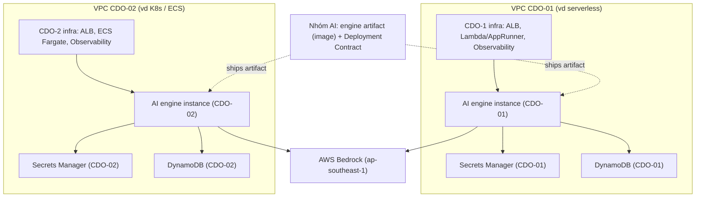
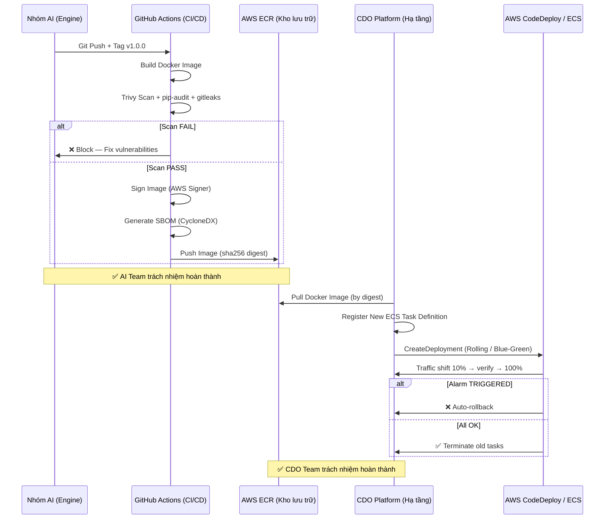

# Deployment Contract — Task Force 2 (FinOps Watch)

<!-- Owner: Nhóm AI 2
     Signed by: AI Lead + CDO Lead (CDO-01) + CDO Lead (CDO-02) + Reviewer Panel
     Date signed: 2026-06-25 (W11 T5)
     🔒 FREEZE — Không thay đổi nếu không có Formal Change Request được cả hai bên ký -->

## 1. Mục đích & Nguyên tắc cốt lõi

Định nghĩa **AI Engine cần được deploy như thế nào** — compute target, scale, secrets, network, rollback. Đây là **spec mỗi CDO dựa vào để deploy engine lên platform của mình** + size capacity đúng.

**Nguyên tắc cốt lõi (Key Principles)**:
- **Nhóm AI giao engine dưới dạng artifact (container image/code) + bản spec deploy này.**
- **MỖI trong 2 CDO (CDO-01, CDO-02) tự deploy engine lên platform riêng của mình** (K8s, serverless, ECS... — mỗi CDO một góc tiếp cận, cạnh tranh ở cách host tối ưu). Các giá trị compute/scale/network dưới đây là spec tham chiếu mỗi CDO phải đáp ứng (CDO K8s map sang pod/HPA, serverless sang Lambda/AppRunner — miễn tương đương).
- **Mỗi CDO có endpoint riêng**, mỗi instance được isolate multi-tenant theo `tenant_id`.
- > 💡 **Ngoại lệ tạm (bootstrap):** Từ T5 W11 → đầu W12, AI Team deploy **1 skeleton endpoint chung** để CDO integrate code path sớm. Đây là giàn giáo tạm thời, KHÔNG phải nơi engine sống cuối cùng. Đến W12, mỗi CDO phải host instance thật của mình — đây mới là "deployed trên 2 CDO platform" để đánh giá.

---

## 2. Ranh giới trách nhiệm (Ownership Boundary Contract)

Ranh giới trách nhiệm rõ ràng giữa AI Team và CDO Team khi xảy ra sự cố vận hành:

```yaml
ownership:
  ai_team:                        # Bàn giao container image + spec
    - detection_logic             # Thuật toán Isolation Forest + Nova LLM
    - rca_reasoning               # Root Cause Analysis prompt engineering
    - recommendation_generation   # Khuyến nghị containment và rollback
    - fallback_logic              # Nova Pro → Nova Lite → Rules Engine
    - contract_management         # Schema versioning, API contract
    - container_image             # Build + sign + push Docker Image lên ECR
    - eval_baseline               # Precision/recall/F1 benchmark maintenance

  cdo_team:                       # Sở hữu hạ tầng và quyền thực thi riêng
    - infra_deployment            # Deploy ECS Fargate/Lambda trên platform riêng
    - iam_permissions             # Cấu hình IAM Roles, Policies, Permission Boundaries
    - telemetry_ingestion         # Thu thập CUR S3, Cost Explorer, CloudWatch
    - action_execution            # Thực thi lệnh từ AI recommendation
    - rollback_orchestration      # Thực hiện hoàn tác containment action
    - queue_management            # Quản lý SQS Primary, DLQ và Rollback queue
    - network_security            # Cấu hình Security Groups, NACLs, Route 53
    - dashboard_hosting           # Host Finance Dashboard & Engineering Console
```

---

## 3. Quy chuẩn Artifact — An toàn Chuỗi cung ứng

Tuân thủ OpenSSF SLSA Level 2. Container Image phải đảm bảo tính bất biến (immutable):

```yaml
artifact:
  image_repository: "200000000012.dkr.ecr.ap-southeast-1.amazonaws.com/tf2/finops-ai-engine"
  image_tag: "v1.0.0"             # Semantic versioning
  image_digest: "sha256:d95a947d174640bb8e9ef96a099a4e2b02e70e9a59e9a4f216e91f1a4e21a2eb" # CDO deploy bằng digest
  signed_image: true              # Xác thực qua AWS Signer KMS Key
  sbom_attached: true             # SBOM định dạng CycloneDX
  build_id: "42"                  # CI pipeline build ID
  build_timestamp: "2026-06-25T10:00:00Z"
  vulnerability_scan: trivy       # Zero Critical CVE policy
```

---

## 4. Compute & Scaling Contract

Thông số tham chiếu mà CDO Platform phải đáp ứng hoặc cấu hình tương đương trên môi trường hosting của mình:

| Aspect | Configuration / Value | Giải thích / Rationale |
|---|---|---|
| **Target** | ECS Fargate task (hoặc Lambda nếu light load) | Hạ tầng serverless không quản lý EC2, chạy trong private subnet |
| **Cluster** | `tf-2-aiops-cluster` | Tên cluster riêng cho AI Ops |
| **Service name** | `ai-engine` | Tên dịch vụ |
| **Image source** | ECR repo URI + image tag/digest | Tham chiếu artifact bất biến (§3) |
| **CPU per task** | 1024 (1 vCPU) | Đảm bảo hiệu năng chạy Isolation Forest + call LLM API |
| **Memory per task**| 2048 MB (2 GB) | Headroom cho CUR dataframe và memory overhead |
| **Replicas** | min 2, max 10 | Đảm bảo tính HA, survive single AZ failure, budget guardrail |
| **Autoscale trigger 1** | Target CPU 70% | Scale-up dựa trên CPU utilization |
| **Autoscale trigger 2** | Target request count 100 per task | Scale-up dựa trên số request đồng thời |
| **Scale-up cooldown**| 60 giây | Phản ứng nhanh với spike requests |
| **Scale-down cooldown**| 300 giây | Tránh tình trạng flapping |
| **Cold start mitigation**| Provisioned Concurrency = 2 (nếu CDO chọn Lambda) | Giảm thiểu cold start cho luồng tích hợp sớm |

---

## 5. Networking Contract

Đảm bảo an toàn mạng (Network Security) và cách ly giữa các CDO Platform:

| Aspect | Configuration | Giải thích / Rationale |
|---|---|---|
| **Subnet type** | private | AI Engine chạy hoàn toàn cô lập, không expose ra internet |
| **ALB** | internal only (không public-facing) | Chỉ các dịch vụ nội bộ thuộc CDO Platform mới truy cập được |
| **Security group** | `tf-2-ai-engine-sg` | Security group riêng của dịch vụ |
| **Ingress rules** | Chỉ allow từ các services gọi engine trong cùng CDO platform | Ngăn chặn truy cập chéo giữa CDO-01 và CDO-02 |
| **Egress rules** | Chỉ allow tới Bedrock endpoint + Secrets Manager VPC endpoint + DynamoDB VPCe | Thu hẹp bề mặt tấn công |
| **DNS** | Resolve được trong VPC (Route 53 private hosted zone) | Tên miền phân giải nội bộ |

### Deployment Topology Diagram



### Per-CDO Deployment Endpoints

Mỗi CDO tự deploy engine trên platform riêng của mình, sử dụng domain phân giải qua Route 53 Private Hosted Zone:

| CDO platform | Endpoint (instance riêng của CDO) | Auth |
|---|---|---|
| CDO-01 | `https://ai-engine.cdo-01.tf-2.internal/` | IAM SigV4 |
| CDO-02 | `https://ai-engine.cdo-02.tf-2.internal/` | IAM SigV4 |
| _(bootstrap)_ skeleton chung | `https://ai-engine-skeleton.tf-2.internal/` (chỉ T5 W11 → đầu W12) | IAM SigV4 |

---

## 6. Security Contract — Hard Boundaries

### 6.1 Forbidden Actions (Không thương lượng)

Hành vi bị cấm đối với AI Engine (Bảo đảm an toàn tuyệt đối):
- **Không tự ý chấm dứt tài nguyên trên production** (`prod-core`, `prod-payments`).
- **Không bao giờ xóa dữ liệu** (S3 Objects, DynamoDB items, RDS instances).
- **Không được tự ý chỉnh sửa IAM** (Roles, Policies, Permission Boundaries).
- **Không tạo IAM User** mới.
- **Không thay đổi Security Groups** hoặc Network ACLs.
- **Không tự ý thực thi trực tiếp**: AI Engine chỉ đưa ra khuyến nghị (Recommendation), việc thực thi (Execution) thuộc trách nhiệm và quyền quyết định của CDO Platform.
- **Không truy cập Public Internet**: Chỉ chạy trong private subnet, mọi giao tiếp AWS qua VPC Endpoint.

### 6.2 Environment Safety Matrix

Chiến lược can thiệp theo môi trường để kiểm soát Blast Radius:

| Môi trường | Hành động được phép | Threshold Confidence | Auto-execute? |
|---|---|---|---|
| `prod-core` | tag-for-review + Slack Alert SRE | N/A | ❌ Không bao giờ |
| `prod-payments` | tag-for-review + Slack Alert SRE | N/A | ❌ Không bao giờ |
| `staging` | time-gated-countdown (4h) → shutdown | N/A | ⏱️ Chờ countdown |
| `dev` / `sandbox` | auto-shutdown | ≥ 0.80 | ✅ Có |
| `ml-research` | auto-shutdown GPU instances | ≥ 0.80 | ✅ Có |
| `data-analytics` | quota-cap via Service Quotas API | ≥ 0.85 | ✅ Có |

---

## 7. State & Queue Contract

AI Engine Container được thiết kế hoàn toàn **stateless**. Trạng thái được lưu trữ bên ngoài qua DynamoDB do CDO Platform cung cấp:

```yaml
state_stores:
  idempotency_store:
    service: dynamodb
    table: tf-2-ai-idempotency
    ttl: 24h
  audit_store:
    service: dynamodb
    table: tf-2-ai-audit-ledger
    ttl: 90d                       # Stream sang S3 Archive sau 90 ngày
  anomaly_store:
    service: dynamodb
    table: tf-2-ai-anomalies
  feedback_store:
    service: dynamodb
    table: tf-2-ai-feedback-loops

queue_contract:
  primary: finops-watch-detect
  dead_letter: finops-watch-detect-dlq
  rollback: finops-watch-rollback         # CDO gửi trạng thái rollback về AI Engine audit
  retention_days: 14
  poison_threshold: 3                      # Max retry trước khi chuyển vào DLQ
  visibility_timeout: 300s                 # Khớp với container timeout
```

---

## 8. Secrets & Rotation Contract

| Secret Name | Source / Path | Mô tả |
|---|---|---|
| `BEDROCK_API_KEY` | AWS Secrets Manager: `tf-2/ai-engine/bedrock` | Hoặc sử dụng IAM Role Permissions (Recommended) để gọi trực tiếp Bedrock API |
| `AWS_REGION` | env var (mặc định `ap-southeast-1`) | Khu vực deploy dịch vụ |

> ⚠️ Cấm sử dụng Long-lived access keys. Mọi credential phải được rotate tự động qua Secrets Manager rotation policy hoặc thông qua IAM execution role ngắn hạn.

---

## 9. Rollout Strategy: Canary & ECS Rolling Update

CDO Platform đề xuất sử dụng luồng CI/CD qua **GitHub Actions + ECS Rolling Update** (hoặc Canary Deployment qua **AWS CodeDeploy**):

| Step | Traffic Split | Interval | Điều kiện Abort (Auto Rollback ngay lập tức) |
|---|---|---|---|
| **1. Canary Test** | 10% | 5 phút | Error rate > 1% HOẶC P99 latency > 800ms HOẶC health-check fail |
| **2. Target Shift** | 50% | 5 phút | Error rate > 1% HOẶC P99 latency > 800ms |
| **3. Full Shift** | 100% | - | Bake period 15 phút, monitor burn-rate fast alert |

### Rollback Contract

| Aspect | Value / Configuration |
|---|---|
| **Primary method** | ArgoCD rollback to previous git SHA (hoặc CodeDeploy Auto-Rollback) |
| **Secondary method** | ECS service update --force-new-deployment (manual) |
| **Target RTO** | < 60 giây |
| **Auto-trigger** | Yes (Khi met bất kỳ abort criteria nào trong canary rollout) |

---

## 10. Health Check

Cấu hình Health Check endpoint để ALB kiểm tra trạng thái Task:

| Field | Value | Mô tả |
|---|---|---|
| **Path** | `/health` | Endpoint healthcheck |
| **Port** | 8080 | Cổng ứng dụng lắng nghe |
| **Interval** | 30 giây | Khoảng cách giữa 2 lần check |
| **Healthy threshold** | 2 consecutive 200 | Trở thành Healthy sau 2 lần 200 liên tiếp |
| **Unhealthy threshold**| 3 consecutive non-200 | Trở thành Unhealthy sau 3 lần lỗi liên tiếp |
| **Deep Check** | Verify DB connection + Bedrock connectivity | Đảm bảo các dependency hoạt động |

---

## 11. Observability

| Aspect | Configuration |
|---|---|
| **OTel endpoint** | collector URL per CDO platform (config qua env var `OTEL_EXPORTER_ENDPOINT`) |
| **Log destination** | CloudWatch Logs (retention 14 ngày, JSON format) |
| **Metrics** | Prometheus / CloudWatch (CDO tùy chọn cấu hình) |
| **Traces** | OpenTelemetry → Jaeger / AWS X-Ray |

---

## 12. Failure Modes & Response

| Failure Mode | Detection | Response |
|---|---|---|
| **Task crash** | ECS health check / ALB Target Group | Auto-restart task mới |
| **Region outage** | Route 53 healthcheck alarm | Failover sang secondary region (nếu CDO thiết kế DR) |
| **Bedrock throttling**| HTTP 429 / App-level metric | Exponential backoff + Fallback sang Nova Lite / Rules-based |
| **Memory leak** | Memory > 90% (CloudWatch Alarm) | Rolling restart tasks |
| **Dependency Down** | DB connection timeout | Retry với exponential backoff, nếu kéo dài → forced DRY-RUN |

---

## 13. Budget Guardrails — Circuit Breaker

Bảo vệ ngân sách Bedrock **< $50 USD / tháng** (tương đương **$1.67 USD / ngày**) cho mỗi tenant/CDO:

```yaml
budget_guardrails:
  max_daily_cost_usd: 1.67
  max_monthly_cost_usd: 50.00
  breaker_escalation:
    - level_1: fallback_to_nova_lite     # 80% daily budget
    - level_2: fallback_to_rules_engine  # 100% daily budget
    - level_3: halt_all_processing       # 120% monthly budget → P1 alert
```

### 1% Error Budget Lock
- **SLA**: Số can thiệp thành công / Tổng số can thiệp tự động.
- **SLO**: 99.0% (Error Budget = 1%).
- **Hành vi**: Nếu Undo Rate (tỷ lệ rollback can thiệp từ SRE) > 1% trong cửa sổ trượt 30 ngày → Hệ thống tự động chuyển sang trạng thái `LOCKED` (chỉ chạy Dry-run/Alert-only) để bảo vệ hạ tầng.

---

## Appendix A. Handover Workflow



---

## Appendix B. IAM Policy Example (Containment Service — CDO Side)

CDO cấu hình IAM Role cho Containment Worker tuân thủ **Least Privilege + Explicit Deny** để bảo vệ production:

```json
{
  "Version": "2012-10-17",
  "Statement": [
    {
      "Sid": "AllowReadOnlyAndTagging",
      "Effect": "Allow",
      "Action": [
        "ec2:Describe*", "rds:Describe*", "sagemaker:Describe*",
        "ec2:CreateTags", "rds:AddTagsToResource", "sagemaker:AddTags"
      ],
      "Resource": "*"
    },
    {
      "Sid": "AllowContainmentOnNonProd",
      "Effect": "Allow",
      "Action": [
        "ec2:StopInstances",
        "rds:StopDBInstance",
        "sagemaker:StopNotebookInstance"
      ],
      "Resource": "*",
      "Condition": {
        "StringNotEquals": {
          "aws:ResourceTag/Environment": ["prod-core", "prod-payments"]
        }
      }
    },
    {
      "Sid": "AllowQuotaContainmentOnNonProd",
      "Effect": "Allow",
      "Action": [
        "servicequotas:RequestServiceQuotaIncrease",
        "servicequotas:GetServiceQuota"
      ],
      "Resource": "*"
    },
    {
      "Sid": "ExplicitDenyDangerous",
      "Effect": "Deny",
      "Action": [
        "ec2:TerminateInstances", "rds:DeleteDBInstance", "rds:DeleteDBCluster",
        "s3:DeleteObject", "s3:DeleteBucket",
        "iam:*", "sts:AssumeRole"
      ],
      "Resource": "*"
    }
  ]
}
```

---

## Appendix C. ADR Index (Cross-reference)

| ADR | Quyết định | Lý do | Trade-off |
|---|---|---|---|
| ADR-001 | Decentralized Per-CDO Deployment | CDO độc lập hạ tầng, bảo mật tenant tốt hơn, compete cách host | Mất lợi thế shared prompt cache của single instance |
| ADR-002 | Batch Cadence 24h | CUR cập nhật 8-12h, data lag chấp nhận được | Độ trễ phát hiện tối đa là 24h |
| ADR-003 | DynamoDB Cache CE results | CE rate limit 5 req/s, cache tránh throttle | Tăng chi phí DynamoDB tối thiểu |
| ADR-004 | IAM SigV4 Auth (no API keys) | Không dùng static secret, xoay vòng tự động | CDO phải cấu hình IAM role signing |
| ADR-005 | 1% Error Budget Lock | Bảo vệ production khi có lỗi hệ thống | Có thể block nhầm một số can thiệp đúng |

---

## Open Questions (Resolved)

- **Q1: Multi-region cho disaster recovery - có trong scope capstone không?**
  - *Resolved:* Không thuộc phạm vi bắt buộc của Capstone Phase 2. Tuy nhiên, CDO Platform có thể tự thiết kế cấu trúc Active-Passive hoặc Active-Active chéo vùng để làm điểm cộng cạnh tranh (Differentiation Angle).
- **Q2: Cost cap per task force per ngày - đặt mức nào?**
  - *Resolved:* Giới hạn ngân sách Bedrock là **$50 USD / tháng** (tương đương **$1.67 USD / ngày**) cho mỗi tenant/CDO. AI Engine tích hợp sẵn Circuit Breaker ngắt kết nối Bedrock để tuân thủ giới hạn này.

---

## Related Documents

- `ai-api-contract.md` — Đặc tả 5 API endpoints, Idempotency rules, Response schema.
- `telemetry-contract.md` — Định nghĩa các tín hiệu telemetry (CUR, CE, CloudWatch, Logs).
- `docs/01_requirements.md` — Tiêu chí thành công và các ràng buộc kỹ thuật.
- `docs/02_solution_design.md` — Thiết kế giải pháp kiến trúc và luồng dữ liệu.
- `docs/03_ai_engine_spec.md` — Đặc tả mô hình AI và Bedrock Guardrails.
- `docs/05_adrs.md` — Architecture Decision Records.
