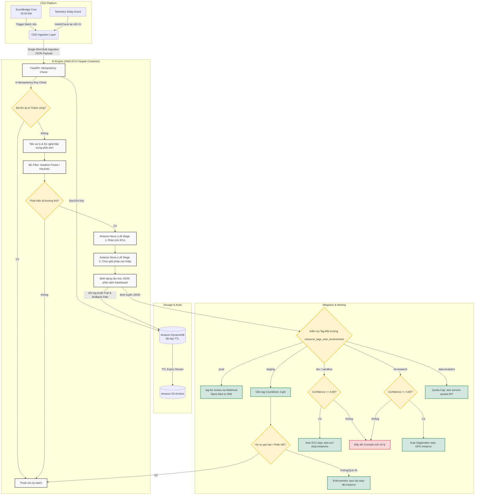
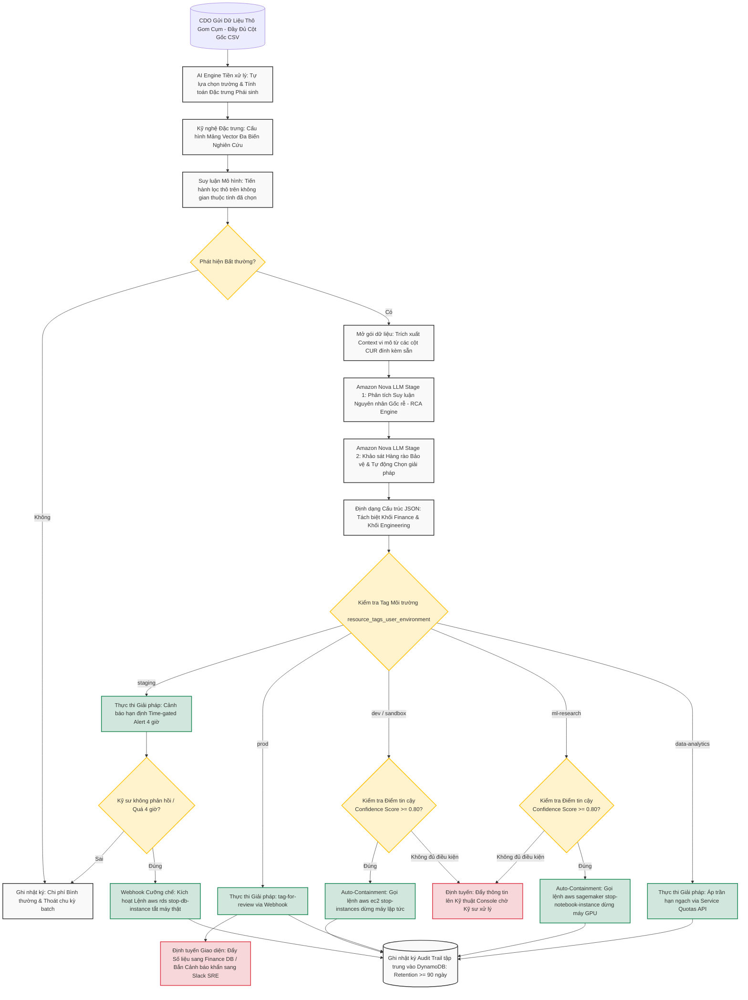

# Solution Design - FinOps Watch System

<!-- Doc owner: Nhóm AI (Trường, Thảo, Hảo)
     Status: Updated with PM Requirements, Pipeline Flowchart & Internal Research
     Word target: 1500-2500 từ -->

## 1. High-level architecture

Hệ thống FinOps Watch hoạt động theo mô hình **Scheduled Batch** được kích hoạt tự động theo chu kỳ 24 giờ. Luồng xử lý đi từ việc thu thập dữ liệu chi phí thô, chuẩn hóa, phân tích dị thường hai giai đoạn và tự động thực thi các hành động ngăn chặn an toàn phân tách theo môi trường.



*Diagram caption: Luồng xử lý định kỳ của FinOps Watch. CDO Platform chịu trách nhiệm trigger batch định kỳ và nạp dữ liệu gom cụm một lần (Single-Shot Ingestion) qua Internal ALB đến AI Engine (ECS Fargate). AI Engine thực hiện lọc thô qua mô hình Isolation Forest trước khi chuyển cho Amazon Nova LLM phân tích nguyên nhân gốc rễ và định tuyến giải pháp can thiệp theo ma trận 5 vùng môi trường. Mọi hoạt động được ghi lại tại DynamoDB (vết kiểm toán 90 ngày) và đồng bộ về S3.*

### 1.1. System Architecture Diagram


*(Xem hình ảnh gốc chất lượng cao tại [finops_architecture_diagram.jpg](file:///C:/Users/ASUS/OneDrive/Obsidian%20Vault/XBrain-Phase2/Capstone_Project/templates/ai/docs/assets/finops_architecture_diagram.jpg))*

*Hình 1.1: Sơ đồ kiến trúc khối và phân tầng chức năng hệ thống FinOps Watch (CDO Ingestion -> AI Engine -> Storage -> Webhook Alert & Containment).*

### 1.2. System Constraints & Compliance Boundaries
Để đảm bảo an toàn tuyệt đối cho hạ tầng doanh nghiệp, hệ thống được ràng buộc bởi các giới hạn và quy định tuân thủ nghiêm ngặt sau:
* **Ranh giới đỏ cứng (Red Boundaries):**
  * **NEVER terminate prod:** Tuyệt đối không bao giờ được tắt, hủy, hạ cấp hay xóa bỏ bất kỳ tài nguyên nào thuộc môi trường Production (`prod-core`, `prod-payments`).
  * **NEVER delete data:** Không thực hiện hành vi xóa dữ liệu hóa đơn, log hạch toán hoặc vết kiểm toán (Cấm sử dụng lệnh `delete` trên S3/DynamoDB).
  * **NEVER modify IAM:** Hệ thống cấm tuyệt đối hành vi tự động chỉnh sửa quyền hạn IAM, sửa đổi Policy hoặc thay đổi chính sách bảo mật baseline của doanh nghiệp.
  * **Retention Requirement:** Mọi lịch sử can thiệp hạ tầng, snapshot và payload khôi phục (`Audit trail`) phải được lưu trữ tập trung tối thiểu $\ge 90 \text{ ngày}$ phục vụ kiểm toán.
* **Ngân sách hoạt động (Circuit Breaker):** Tích hợp sẵn cơ chế tự ngắt (Circuit Breaker) trong mã nguồn AI Engine để khống chế chi phí token gọi sang Amazon Bedrock API dưới ngưỡng **$50 USD / tháng**.
* **Chỉ số đo lường thành công (Success Criteria):**
  * **AI Detection Precision:** $\ge 80\%$ trên tập backtest dữ liệu 3 tháng.
  * **False Positive (FP) Rate:** $\le 10\%$ trên tập dữ liệu backtest.
  * **Anomaly Coverage:** $\ge 3$ Anomaly Types (`runaway training`, `idle resource`, `mis-tagged spend`).
  * **Time Frame Detection Cadence:** 24 giờ chu kỳ quét batch.
  * **Auto-Containment Implementation:** $\ge 3$ Kịch bản can thiệp (`tag-for-review`, `time-gated-countdown`, `auto-shutdown`) / $\ge 2$ Kịch bản chạy thử nghiệm an toàn (`dry-run mode`).
* **Lộ trình thực hiện (Timeline):** Thiết kế hoàn thành trong Tuần 11. Đóng gói Docker và ráp nối API với CDO trong Tuần 12. Mốc **Code Freeze** cố định vào lúc **8h00 sáng Thứ 5 Tuần 12 (02/07/2026)**.

---

## 2. Component breakdown

| Component | Responsibility | Tech choice | Why |
|---|---|---|---|
| **Ingestion Layer** | Kéo dữ liệu từ AWS Cost Explorer API và CUR S3. Đóng gói 100% cột dữ liệu thô từ `cost_explorer_daily.csv` và `cur_line_items.csv` thành một Payload JSON duy nhất (Single-Shot Ingestion). Xử lý trễ dữ liệu (`telemetry_delay_event`). | **AWS EventBridge + AWS Lambda / ECS** (CDO Platform quản lý) | EventBridge cron đảm bảo lịch trigger chính xác lúc 02:00 AM hàng ngày. Lambda/ECS xử lý gom cụm dữ liệu gọn nhẹ, tránh gọi API nhiều lượt (API round-trips) và đảm bảo truyền tải dữ liệu an toàn nội bộ qua Private Network. |
| **AI Engine (Pre-Filter)** | Nhận Payload, tiền xử lý dữ liệu thô, lọc bỏ nhiễu, tính toán các đặc trưng phái sinh (như mật độ sử dụng 24h `usage_density_24h`), thực hiện phát hiện dị thường thô bằng thuật toán học máy Isolation Forest hoặc heuristic để loại bỏ 95% dữ liệu bình thường. | **FastAPI (Python, scikit-learn, pandas) chạy trên AWS ECS Fargate** | Chạy trong private subnet đáp ứng bảo mật. Isolation Forest lọc thô cực nhanh, tiết kiệm token LLM đáng kể (chỉ gửi 5% dữ liệu nghi ngờ tới Bedrock), giúp giữ chi phí Bedrock dưới $50/tháng và đạt SLO xử lý nhanh. |
| **AI Engine (GenAI RCA)** | Nhận các điểm dữ liệu nghi ngờ từ bộ lọc ML.<br>Stage 1: Phân tích nguyên nhân gốc rễ (RCA) bằng ngôn ngữ tự nhiên thân thiện với tài chính, phát hiện tag lỗi (`mis-tagged spend` nếu `owner` trống).<br>Stage 2: Xác định lệnh can thiệp AWS CLI và chiến lược giảm thiểu dựa trên ma trận môi trường (`prod`, `staging`, `dev`, `ml-research`, `data-analytics`). Xuất JSON cấu trúc phân tách. | **Amazon Bedrock API + Amazon Nova (Pro / Lite)** | Amazon Nova cung cấp khả năng suy luận mạnh mẽ, hỗ trợ ngôn ngữ tự nhiên tốt và chi phí token tối ưu. Bedrock tích hợp sẵn các lớp bảo mật (Bedrock Guardrails) ngăn chặn Prompt Injection, lọc thông tin PII và đảm bảo Grounding Check. |
| **Audit Store** | Kiểm tra chạy trùng lặp (Idempotency check) thông qua composite key `X-Idempotency-Key` (TTL 24h). Lưu trữ vết kiểm toán (Audit Trail) tối thiểu 90 ngày ghi lại snapshot trạng thái tài nguyên, payload can thiệp và payload rollback. | **Amazon DynamoDB + S3 Standard/Glacier Archive** | DynamoDB đáp ứng tốc độ truy vấn cực nhanh (<10ms) phục vụ kiểm tra idempotency và hiển thị Dashboard. DynamoDB TTL tự động xóa log sau 90 ngày giúp tiết kiệm chi phí, kết hợp DynamoDB Streams đẩy log nén dài hạn về S3 phục vụ tuân thủ (compliance). |
| **Output / Action** | Nhận Payload JSON từ AI Engine, định tuyến thông báo (đẩy số liệu sang Finance Dashboard, bắn alert Slack chi tiết kỹ thuật cho SRE/Engineering Team), thực thi các câu lệnh can thiệp AWS CLI giả lập trên hạ tầng thông qua Webhook. | **FastAPI Webhook + Slack API / Jira API + AWS SDK (boto3)** | Tự động hóa hoàn toàn quy trình ứng phó theo ma trận an toàn mà không cần con người can thiệp trực tiếp ở các vùng thấp, đồng thời duy trì hàng rào an toàn ở vùng cao (prod). |

---

## 3. Data flow (step-by-step)

### 3.1. Detailed Algorithm Flowchart
Dưới đây là sơ đồ chi tiết luồng xử lý dữ liệu và thuật toán lai (Isolation Forest + LLM) được triển khai trong AI Engine:



### 3.2. Quy trình 7 bước thực thi chi tiết
1. **Bước 1: Trigger định kỳ & Xử lý độ trễ CUR (EventBridge & Telemetry)**
   * EventBridge Cron kích hoạt CDO Ingestion lúc **02:00 AM hàng ngày** (khung giờ đêm cố định).
   * Nếu dữ liệu CUR từ AWS bị trễ (data lag 12-24h), CDO Platform gửi `telemetry_delay_event` tới AI Engine để hoãn batch job (`SUSPENDED`). AI Engine sẽ tự động kiểm tra lại sau mỗi 1 giờ cho đến khi dữ liệu sẵn sàng.
2. **Bước 2: Single-Shot Bulk Ingestion**
   * CDO đóng gói toàn bộ 100% cột dữ liệu thô (tương ứng với `cost_explorer_daily.csv` và `cur_line_items.csv`) vào **một Payload JSON duy nhất**, gửi đến AI Engine qua Internal ALB. Việc gửi 1 lần này loại bỏ độ trễ do gọi API nhiều lượt.
3. **Bước 3: Kiểm tra chống chạy lặp (Idempotency Check)**
   * AI Engine nhận yêu cầu, trích xuất `X-Idempotency-Key` (composite key kết hợp thời gian, mã tài khoản, và dịch vụ).
   * Truy vấn nhanh vào DynamoDB (<10ms). Nếu khóa đã tồn tại ở trạng thái `SUCCESS`, bỏ qua lượt chạy. Nếu chưa, ghi nhận trạng thái `PROCESSING`.
4. **Bước 4: Tiền xử lý & Kỹ nghệ Đặc trưng (Feature Engineering & ML Filter)**
   * AI Engine tự động lọc các trường nhiễu, tính toán đặc trưng phái sinh kỹ thuật (như mật độ sử dụng 24h `usage_density_24h`).
   * Chạy mô hình **Isolation Forest (IF)** và Heuristic để lọc thô. Nếu chi phí bình thường, ghi log `Normal` và thoát chu kỳ batch. Nếu phát hiện dị thường, chuyển tiếp dữ liệu vi mô sang mô hình GenAI.
5. **Bước 5: Phân tích hai giai đoạn với Amazon Nova (GenAI RCA & Mitigation Selection)**
   * **Stage 1 (RCA Engine):** Amazon Nova phân tích chéo dữ liệu kỹ thuật và CUR log để đưa ra tóm tắt nguyên nhân gốc rễ (Executive Summary) bằng ngôn ngữ tài chính. Nếu cột `resource_tags_user_owner` bị thiếu (`NaN`), kết luận lỗi `mis-tagged spend`.
   * **Stage 2 (Mitigation Action Engine):** Dựa trên tag môi trường `resource_tags_user_environment`, mô hình đối chiếu ma trận an toàn để sinh câu lệnh can thiệp CLI chính xác.
   * Định dạng đầu ra thành một JSON phân tách khối Finance (`finance_dashboard_data`) và khối Kỹ thuật (`engineering_dashboard_data`).
6. **Bước 6: Thực thi can thiệp theo Ma trận 5 vùng môi trường**
   * Giao diện Finance Dashboard hiển thị biểu đồ, số liệu thâm hụt và tóm tắt tự nhiên từ `finance_dashboard_data`.
   * Webhook CDO nhận lệnh và thực thi theo môi trường của tài nguyên phát hiện:
     * **prod:** Chỉ chạy lệnh `tag-for-review` (gắn tag `FinOps_Alert: Review_Required`). Bắn alert Slack khẩn cho đội SRE.
       ```bash
       aws ec2 create-tags --resources <line_item_resource_id> --tags Key=FinOps_Alert,Value=Review_Required
       ```
     * **staging:** Gắn tag countdown (`FinOps_Alert: Staging_Review_Countdown`). Thiết lập đếm ngược 4 giờ. Nếu không có yêu cầu gia hạn (Extend), webhook gọi `aws rds stop-db-instance` tắt máy thật.
       ```bash
       aws ec2 create-tags --resources <line_item_resource_id> --tags Key=FinOps_Alert,Value=Staging_Review_Countdown
       aws rds stop-db-instance --db-instance-identifier <line_item_resource_id>
       ```
     * **dev / sandbox:** Nếu $Confidence \ge 0.80$, gọi lệnh cưỡng chế tắt máy ngay lập tức. Nếu $<0.80$, chỉ đẩy lên Console chờ kỹ sư.
       ```bash
       aws ec2 stop-instances --instance-ids <line_item_resource_id>
       ```
     * **ml-research:** Nếu $Confidence \ge 0.80$, gọi lệnh ngắt GPU instance chạy idle. Nếu $<0.80$, đẩy lên Console.
       ```bash
       aws sagemaker stop-notebook-instance --notebook-instance-name <line_item_resource_id>
       ```
     * **data-analytics:** Thực thi áp đặt giới hạn chi phí trần bằng Service Quotas API để tránh vòng lặp truy vấn lỗi làm vọt chi phí.
       ```bash
       aws service-quotas request-service-quota-increase --service-code <service_code> --quota-code <quota_code> --desired-value <safe_low_budget_value>
       ```
7. **Bước 7: Ghi log Audit Trail**
   * Ghi lại snapshot tài nguyên, câu lệnh rollback tương ứng (ví dụ: `aws ec2 start-instances`) và kết quả thực thi vào DynamoDB với thời hạn lưu giữ $\ge 90$ ngày, sau đó stream nén sang S3 Archive phục vụ kiểm toán dài hạn.

### 3.3. Đặc tả dữ liệu đầu vào (CDO Ingestion Interface)
CDO Platform đẩy mảng JSON chứa đầy đủ 100% cột dữ liệu thô bao gồm:
* **Khối vĩ mô (`aws_cost_explorer_daily`):** `date`, `linked_account_id`, `linked_account_name`, `service`, `service_code`, `region`, `unblended_cost`, `is_estimated`.
* **Khối vi mô (`aws_cur_line_items`):** `identity_line_item_id`, `bill_billing_period_start_date`, `bill_billing_period_end_date`, `line_item_usage_start_date`, `line_item_usage_end_date`, `line_item_line_item_type`, `line_item_usage_type`, `line_item_operation`, `line_item_usage_amount`, `line_item_normalization_factor`, `line_item_normalized_usage_amount`, `line_item_currency_code`, `line_item_unblended_cost`, `line_item_resource_id`, `resource_tags_user_environment`, `resource_tags_user_owner`, `resource_tags_user_team`, `resource_tags_user_cost_center`.

### 3.4. Đặc tả dữ liệu đầu ra (Multi-Dashboard JSON Specification)
Mô hình xuất ra một cấu trúc JSON duy nhất phân tách thành hai khối dữ liệu:
* `anomaly_metadata`: Lưu thông tin định danh bất thường (ID, timestamp, resource ID, environment, confidence score, model).
* `finance_dashboard_data`: Chứa số liệu tiền (`unblended_cost_24h_usd`, `projected_monthly_waste_usd`), trung tâm chi phí (`cost_center_code`), đội chịu trách nhiệm (`responsible_team`) và báo cáo tự nhiên (`executive_summary`) cho Finance.
* `engineering_dashboard_data`: Chứa context kỹ thuật (`usage_type`, `usage_density_24h`), phân tích lỗi (`root_cause_analysis`, `missing_mandatory_tags`), chiến lược can thiệp (`mitigation_action` bao gồm payload và mã lệnh CLI).

---

## 4. Alternatives considered (KEY)

### 4.1 AI Pattern: Pure Statistical vs Pure LLM vs Hybrid
* **Option A (Pure Statistical/ML):** Sử dụng các mô hình Z-Score, Isolation Forest quét trực tiếp dữ liệu chi phí.
  * *Pros:* Chạy cực nhanh, chi phí vận hành rẻ, dễ lập trình và backtest.
  * *Cons:* Không hiểu ngữ cảnh nghiệp vụ, dẫn đến tỷ lệ báo động giả (FP rate) rất cao khi gặp các sự kiện hợp lệ (load test, flash sale). Không giải thích được bằng ngôn ngữ tài chính.
* **Option B (Pure LLM Agent):** Nạp toàn bộ dữ liệu CUR chi tiết vào LLM và yêu cầu phát hiện.
  * *Pros:* Hiểu sâu các tag, phát hiện được các lỗi logic nghiệp vụ.
  * *Cons:* Chi phí gọi API khổng lồ (vượt xa giới hạn $50/tháng), tốc độ phản hồi chậm, rủi ro ảo giác (hallucination).
* **✅ Chosen: Option C (Hybrid Architecture):** Lọc thô bằng mô hình thống kê/ML (Isolation Forest) kết hợp Heuristic để loại bỏ 95% dữ liệu bình thường, sau đó dùng bộ quy tắc (Rule-based) phối hợp với Amazon Nova (chỉ phân tích <5% điểm nghi ngờ).
  * *Reason:* Giữ chi phí vận hành ở mức tối thiểu, tốc độ xử lý nhanh, đáp ứng cam kết Precision $\ge 80\%$ và FP $\le 10\%$ nhờ loại bỏ hiệu quả các "bẫy FP".

### 4.2 Chu kỳ quét dữ liệu (Ingestion & Detection Cadence)
* **Option A (12 giờ):** Quét dữ liệu 2 lần mỗi ngày.
  * *Pros:* Phát hiện nhanh các đột biến chi phí cực lớn.
  * *Cons:* Dữ liệu CUR/Cost Explorer cập nhật rất chậm từ phía AWS (thường trễ 12-24h). Quét mỗi 12h sẽ gặp nhiều dữ liệu ước tính thô (`is_estimated = true`) chưa ổn định, gây tăng đột biến tỷ lệ báo giả (FP) và dễ bị khóa API (Rate Limit).
* **Option B (48 giờ):** Quét dữ liệu 2 ngày một lần.
  * *Pros:* Tiết kiệm chi phí gọi API, dữ liệu chi phí đã ổn định (finalized).
  * *Cons:* Trễ quá lâu. Một cluster quên tắt ($400/ngày) chạy suốt 48h sẽ gây thất thoát ít nhất $800 trước khi bị phát hiện.
* **✅ Chosen: Option C (24 giờ / Daily):** Quét dữ liệu 1 lần mỗi ngày lúc 02:00 AM.
  * *Reason:* Khớp hoàn hảo với chu kỳ cập nhật dữ liệu tự nhiên của AWS và cấu trúc tệp dữ liệu thực tế. Đảm bảo phát hiện lỗi quên tắt trong vòng 24h trong khi vẫn duy trì API limit an toàn.

### 4.3 Công nghệ lưu trữ Audit Trail
* **Option A (S3 + Athena):** Ghi trực tiếp log hành động ra file JSON trên S3 và dùng Athena để truy vấn.
  * *Pros:* Chi phí lưu trữ cực rẻ cho chu kỳ >90 ngày, dễ mở rộng.
  * *Cons:* Độ trễ truy vấn cao, không phù hợp cho việc hiển thị real-time trạng thái trên Dashboard UI hoặc kiểm tra Idempotency Key nhanh chóng.
* **✅ Chosen: Option B (DynamoDB + S3 Archive):** Lưu trữ các hành động nóng và trạng thái rollback chủ động trong DynamoDB sử dụng TTL 90 ngày để tự động xóa. Dữ liệu hết hạn sẽ được stream lưu trữ dài hạn tại S3.
  * *Reason:* Hỗ trợ Dashboard truy vấn mili-giây (<10ms), dễ dàng kiểm tra idempotency, thực hiện rollback tự động bằng cách đọc trực tiếp API payload được lưu sẵn trong DynamoDB.

### 4.4 Chiến lược can thiệp: Cưỡng chế dừng toàn diện vs Ma trận an toàn phân vùng
* **Option A (Hard Stop All):** Áp dụng tự động tắt tài nguyên thâm hụt trên mọi môi trường để tiết kiệm tối đa tiền.
  * *Pros:* Ngăn chặn rò rỉ chi phí nhanh nhất có thể.
  * *Cons:* Gây gián đoạn dịch vụ Production, vi phạm nghiêm trọng quy định tuân thủ bảo mật và ảnh hưởng trực tiếp đến doanh thu doanh nghiệp.
* **✅ Chosen: Option B (Safe Multi-Environment Containment Matrix):** Phân tách nghiêm ngặt kịch bản ứng phó theo ma trận 5 vùng môi trường thực tế doanh nghiệp (`prod`, `staging`, `dev/sandbox`, `ml-research`, `data-analytics`).
  * *Reason:* Triệt tiêu lãng phí tức thì ở các môi trường phát triển (vùng thấp) mà không gây gián đoạn dịch vụ cốt lõi ở vùng cao (prod). Tuân thủ ranh giới đỏ: Tuyệt đối không bao giờ được sờ vào Prod resource để tắt hay xóa, không xóa dữ liệu và không sửa đổi IAM quyền hạn.

---

## 5. Risk + mitigation

| Risk | Likelihood | Impact | Mitigation |
| :--- | :--- | :--- | :--- |
| **AI báo sai (False Positive) trên các sự kiện hợp lệ gây tắt nhầm** | Medium | High | • Áp dụng bộ lọc ngữ cảnh (Context Filter) đối chiếu với lịch sự kiện kinh doanh đã biết.<br>• Sử dụng Amazon Bedrock Guardrails Contextual Grounding Check (ngưỡng 0.7) để kiểm chứng thông tin đầu ra bám sát dữ liệu thực tế.<br>• Yêu cầu ngưỡng Confidence Score $\ge 0.80$ trước khi thực thi các kịch bản auto-containment tắt máy vật lý ở Dev/ML-Research. |
| **Chi phí gọi API Amazon Bedrock vượt ngưỡng $50 USD / tháng** | Medium | Medium | • Tích hợp sẵn cơ chế tự ngắt (Circuit Breaker) trong mã nguồn AI Engine để khống chế chi phí Token.<br>• Lọc thô bằng Isolation Forest trên hạ tầng Fargate nội bộ trước khi gọi Bedrock để giảm lượng dữ liệu cần LLM xử lý xuống dưới 5%. |
| **Can thiệp nhầm lẫn gây ảnh hưởng môi trường Production** | Low | Critical | • **Ranh giới đỏ cứng (Red Boundaries):** Mã nguồn AI Engine từ chối mọi lệnh can thiệp tắt máy nếu môi trường nhận diện là `prod` hoặc có ARN chứa keyword `prod-core`, `prod-payments`. Chỉ chạy chế độ `tag-for-review` và bắn alert Slack khẩn.<br>• Phân quyền IAM Role tối thiểu (Least Privilege), cấm quyền tắt RDS/EC2 thuộc Prod Accounts. |
| **Chạy lặp lại đè dữ liệu hoặc race condition khi nạp dữ liệu** | Medium | High | • Ép đính kèm Header `X-Idempotency-Key` định dạng Composite Key (`Time-bounded Composite Key`) có cấu hình TTL tự động hủy sau 24 giờ trên DynamoDB để triệt tiêu hoàn toàn thảm họa chạy lặp lại đè dữ liệu. |
| **Rò rỉ dữ liệu nhạy cảm giữa các tenant (Multi-tenant Leakage)** | Low | High | • Đảm bảo thiết kế logic định tuyến đa người thuê cô lập an toàn dữ liệu giữa các tenant thông qua thuộc tính định danh mã tài khoản (`X-Tenant-Id`) trong header.<br>• Container chạy hoàn toàn trong VPC Private Subnet, kết nối thông qua mạng Load Balancer nội bộ (Internal ALB), tuyệt đối cấm mở cổng public ra Internet. |

---

## 6. Open design questions

* **Q1: Phản hồi hai chiều từ Kênh Slack/Jira (Feedback Loop)**
  * Làm thế nào để kỹ sư có thể nhấn nút "Gia hạn" hoặc "Đánh dấu Hợp lệ" (Benign Alert) trực tiếp từ Slack và phản hồi này tự động đồng bộ ngược lại AI Engine nhằm huấn luyện lại baseline của mô hình Isolation Forest?
  * *Hướng xử lý:* Thiết kế API Endpoint nhận Webhook từ Slack để cập nhật trạng thái whitelist/bảng loại trừ trực tiếp trong DynamoDB.
* **Q2: Cơ chế tự động khôi phục (Rollback Verification)**
  * Sau khi kích hoạt Rollback (ví dụ: khởi động lại EC2/RDS bị tắt nhầm), làm sao để verify tài nguyên đã hoạt động bình thường trở lại và không tiếp tục bị AI quét dị thường ở chu kỳ tiếp theo?
  * *Hướng xử lý:* Ghi nhận trạng thái rollback thành công trong audit trail và tự động gắn thẻ bỏ qua (Bypass_Alert) tạm thời trong 24 giờ.

---

## Related documents

* `01_requirements_pm.md` - Tài liệu Requirements của dự án từ PM.
* `03_ai_engine_spec.md` - Chi tiết kiến trúc AI Engine, Prompt và Governance.
* `ALGORITHM PIPELINE FLOWCHART.md` - Sơ đồ chi tiết luồng xử lý thuật toán mô hình lai.
* `INTERNAL_RESEARCH_FINOPS.md` - Tài liệu nghiên cứu kỹ thuật và cấu trúc dữ liệu JSON.
* `05_adrs.md` - Nhật ký các quyết định kiến trúc quan trọng.
