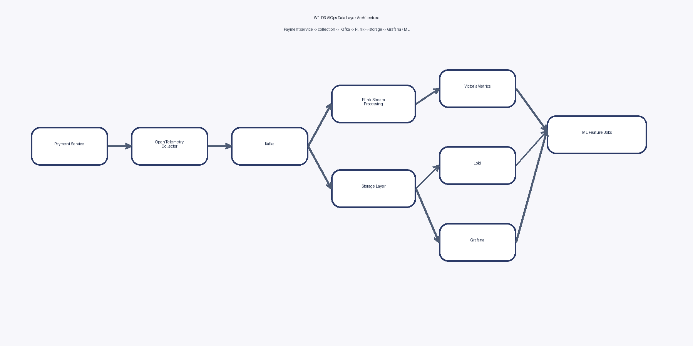
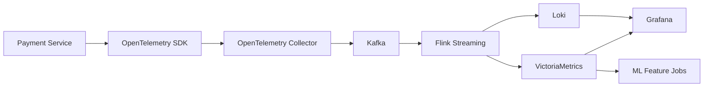

# Kiến trúc dữ liệu W1-D3

## Use case

Anomaly detection trên `payment service`.

## Sơ đồ tổng thể

## Luồng end-to-end

## Thành phần và lựa chọn công cụ

- Service: payment microservice phát sinh metric, log, trace.
- Collection: OpenTelemetry SDK và OpenTelemetry Collector.
- Transport: Kafka để buffer burst và hỗ trợ replay.
- Processing: Flink để làm stream processing, enrich, và tạo feature.
- Storage:
  - VictoriaMetrics cho metric.
  - Loki cho log.
- Query / ML:
  - Grafana cho dashboard và alert.
  - Job ML đọc output đã enrich để chấm điểm anomaly.

## Lý do chọn kiến trúc này

- Metric cần lưu rẻ, query rất nhanh và giữ dài ngày.
- Log cần tìm kiếm theo ngữ cảnh nhưng không muốn trả chi phí cao như Elasticsearch cho mọi thứ.
- Kafka tách producer khỏi storage, giúp hệ thống chịu tải tốt hơn khi downstream chậm.
- Flink giữ phần rolling feature ở gần luồng dữ liệu để inference gần thời gian thực hơn.
