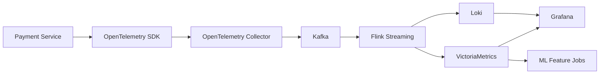

# W1-D3 Architecture

## Use case

Anomaly detection trên `payment service`.

## E2E data layer

## Tool choices

- Service: payment microservice emit metric/log/trace.
- Collection: OpenTelemetry SDK + OpenTelemetry Collector.
- Transport: Kafka to buffer bursts and allow replay.
- Processing: Flink for streaming enrichment and feature generation.
- Storage:
  - VictoriaMetrics for metrics.
  - Loki for logs.
- Query / ML:
  - Grafana for dashboards and alert views.
  - ML jobs read enriched stream outputs for anomaly scoring.

## Why this shape

- Metrics need cheap, long retention and very fast query.
- Logs need searchable context without paying Elasticsearch cost everywhere.
- Kafka decouples production spikes from downstream storage pressure.
- Flink keeps the rolling features close to the stream so the ML path can stay low latency.
