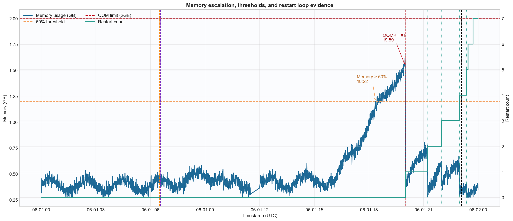
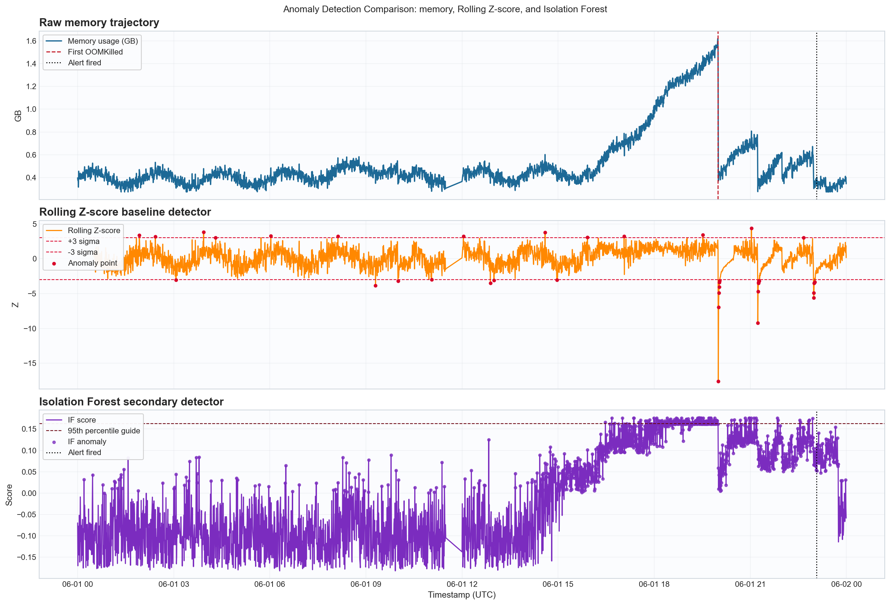
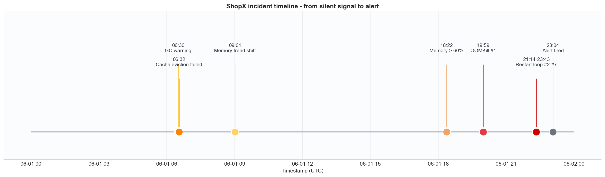

# Báo Cáo Sự Cố - ShopX cart-service

**Ngày:** 2026-06-01  
**Mức độ:** P1 - Nghiêm trọng  
**Trạng thái:** Đã khôi phục  
**Tác giả:** Nhóm AIOps W1  
**Cập nhật lần cuối:** 2026-06-05

Tất cả mốc thời gian bên dưới đều là UTC.

---

## Tóm Tắt Điều Hành

`cart-service` gặp sự cố tăng áp lực bộ nhớ kéo dài, bắt đầu bằng các tín hiệu âm thầm trong heap JVM và kết thúc bằng nhiều lần `OOMKilled` và vòng lặp khởi động lại. Tín hiệu sớm nhất xuất hiện trong log lúc `06:30:19Z` với `GC overhead limit warning`, tiếp theo là `06:32:33Z` với `ProductCatalogCache eviction failed`. Trong khi đó, cảnh báo production chỉ bắn lúc `23:04:00Z`, tạo ra một khoảng lặng khoảng `16 giờ 33 phút` tính từ tín hiệu log đầu tiên và `8 giờ 04 phút` tính từ lúc xu hướng memory bắt đầu tăng bền vững.

Giả thuyết root cause mạnh nhất là lỗi eviction của `ProductCatalogCache`, khiến các entry bị giữ lại khi heap tăng áp lực. Điều này làm heap phình ra, GC hoạt động dày hơn, request chậm lại, container bị `OOMKilled`, rồi lỗi lan sang `api-gateway`, `order-service` và `payment-service`.

---

## Nhiệm Vụ Của Nhóm

Nhiệm vụ của nhóm là phân tích `24 giờ telemetry` gồm `metrics + logs`, kết thúc tại thời điểm incident được suppressed. Báo cáo phải trả lời ba câu hỏi:

- `WHEN` - Anomaly bắt đầu từ khi nào? Có tín hiệu im lặng hàng giờ trước khi alert xuất hiện không?
- `WHERE` - Service nào, metric nào, log pattern nào là chỉ báo sớm nhất?
- `WHAT` - Giả thuyết root cause là gì? Cơ chế nào gây ra restart loop?

Để trả lời, nhóm xây dựng pipeline nhẹ nhưng có thể tái lập, nối raw evidence với phát hiện bất thường từ metrics, khai phá pattern log, và phần kết luận hậu kiểm.

---

## Minh Họa Trực Quan







---

## WHEN - Khi Nào Bất Thường Bắt Đầu?

Tín hiệu bất thường đầu tiên trong log xuất hiện lúc `06:30:19Z` với `GC overhead limit warning`, rồi đến `06:32:33Z` với `ProductCatalogCache eviction failed`. Tín hiệu metric bền vững đầu tiên là lúc `09:01:00Z`, khi rolling mean của memory bắt đầu tăng đều. Tín hiệu vận hành đáng tin nhất trong metrics là `sustained_memory_anomaly` tại `16:20:30Z`.

### Phân Tích Khoảng Lặng

Sự cố này có ba pha trước khi hỏng hoàn toàn:

- `06:30 -> 09:00`: chỉ có log cảnh báo sớm, chủ yếu liên quan JVM và cache.
- `09:01 -> 19:59`: giai đoạn suy giảm âm thầm, memory và GC đi xấu dần nhưng alert production chưa kích hoạt.
- `20:00 -> 23:43`: hỏng thật sự, xuất hiện `OOMKilled`, restart loop, `5xx` tăng và downstream timeout.

Tùy theo mốc khởi đầu nào được chọn, khoảng cách đến alert là:

- `16 giờ 33 phút` từ log đầu tiên (`06:30:19Z`) đến alert (`23:04:00Z`)
- `14 giờ 31 phút` từ lần eviction failed đầu tiên đến alert
- `8 giờ 04 phút` từ lúc memory bắt đầu tăng bền vững đến alert
- `6 giờ 43 phút` từ tín hiệu memory anomaly bền vững đến alert

### Kết Quả Phát Hiện

| Phương pháp | Vai trò | Phát hiện đầu tiên | Diễn giải vận hành | Phút trước alert |
|---|---|---|---|---:|
| `CUSUM` | Phù hợp nhất cho drift liên tục | phát hiện rất sớm nếu tune đơn giản | hợp với online detection, nhưng cần chỉnh tham số để giảm false positive | N/A |
| `EWMA` | Baseline làm mượt để bắt lệch nhỏ | sớm hơn `Rolling Z-score` trên bộ dữ liệu này | bắt drift mịn tốt hơn Z-score, nhưng vẫn cần gate theo cửa sổ quan sát | `~` |
| `Rolling Z-score` | Baseline dễ giải thích | `00:46:00Z` | khá nhiễu nếu dùng đơn lẻ; đáng tin hơn khi được corroborate bởi memory/GC | `1022` |
| `Isolation Forest` | Detector đa biến bổ trợ | `00:12:00Z` | mạnh ở lệch đa biến, nhưng oversensitive nếu không có gate theo thời gian | `1302` |
| Phân tích pattern log | Bằng chứng sớm nhất | `06:30:19Z` | tín hiệu sớm nhất và thuyết phục nhất trong bài này | `993` |

`CUSUM` vẫn là phương pháp chính được khuyến nghị cho production vì dạng sự cố là drift tăng dần, không phải spike ngắn. Tuy vậy, nếu tune không tốt thì CUSUM cũng có thể tạo nhiều điểm báo sớm hơn mong muốn. Với bộ dữ liệu này, câu chuyện hậu kiểm thuyết phục nhất là kết hợp `log signals + memory rolling trend + Isolation Forest` để xác nhận.

`EWMA` là baseline rất hữu ích khi muốn bắt drift mịn sớm hơn `Rolling Z-score`, nhưng vẫn nên đi kèm gate như xác nhận theo cửa sổ liên tục. Trong bài này, `EWMA` nên được xem là lớp làm mượt sớm, không phải tín hiệu alert duy nhất.

---

## WHERE - Ở Đâu Xuất Hiện Tín Hiệu Sớm Nhất?

### Service chính: `cart-service`

- `memory_usage_bytes`
  Bất thường bền vững đầu tiên lúc `16:20:30Z`; đạt đỉnh `1,738,625,277 bytes` lúc `19:59:00Z`.
- `jvm_gc_pause_ms_avg`
  Bất thường bền vững đầu tiên lúc `17:24:30Z`; đạt đỉnh `194.4 ms` lúc `19:44:30Z`.
- `http_5xx_rate`
  Vượt `5%` lần đầu lúc `20:56:00Z`; đạt đỉnh `16.14%` lúc `23:40:30Z`.
- `container_restart_count`
  Tăng lần đầu lúc `20:00:00Z`; đạt `7` lần restart lúc `23:43:00Z`.

### Pattern log quan trọng

| Template | Số lần | Xuất hiện đầu tiên |
|---|---:|---|
| `GC overhead limit warning` | `2117` | `06:30:19.395Z` |
| `ProductCatalogCache eviction failed: heap pressure too high` | `2655` | `06:32:33.431Z` |
| `OutOfMemoryError imminent: available heap < 5%` | `944` | `19:59:00.382Z` |
| `Container OOMKilled: memory limit exceeded` | `819` | `19:59:02.158Z` |
| `Application starting up version=2.4.1` | `101` | `19:59:09.022Z` |
| `Upstream connection refused host=product-service` | `514` | `19:59:02.204Z` |

Điều đáng chú ý không chỉ là timestamp đầu tiên, mà là tần suất lặp lại. `ProductCatalogCache eviction failed` xuất hiện `2655` lần trong phần còn lại của ngày, cho thấy đây là cơ chế lỗi lặp đi lặp lại chứ không phải cảnh báo thoáng qua.

### Ảnh hưởng downstream

- `api-gateway.cart_upstream_error_rate` vượt `5%` lần đầu lúc `20:39:30Z`.
- `order-service.upstream_timeout_rate` vượt `5%` lần đầu lúc `20:56:30Z`.
- `payment-service.upstream_timeout_rate` vượt `5%` lần đầu lúc `21:24:30Z`.

Thứ tự này xác nhận `cart-service` là nguồn lan truyền lỗi. Gateway xuống cấp sau restart đầu tiên, rồi order/payment bị kéo theo khi restart loop và latency tiếp tục xấu đi.

---

## WHAT - Giả Thuyết Root Cause

### Giả thuyết

Root cause có xác suất cao nhất là lỗi eviction hoặc memory-retention bug trong `ProductCatalogCache` của `cart-service`. Khi heap tăng áp lực, cache không evict được entry, làm heap tăng liên tục, GC thrashing, container bị `OOMKilled`, rồi downstream timeout lan rộng.

### Cơ Chế Lỗi

```text
ProductCatalogCache eviction thất bại
  -> heap usage tăng liên tục
  -> JVM GC chạy dày hơn, pause lâu hơn
  -> latency tăng, cart trả về 5xx
  -> Kubernetes OOMKills container
  -> pod khởi động lại và warm cache lại
  -> restart loop lặp lại
  -> gateway, order, payment xuất hiện upstream error và timeout
```

### Bằng chứng ủng hộ giả thuyết

- `ProductCatalogCache eviction failed` bắt đầu từ `06:32:33.431Z` và lặp `2655` lần.
- `GC overhead limit warning` xuất hiện còn sớm hơn, từ `06:30:19.395Z`, và lặp `2117` lần.
- Memory đạt `1.738 GB` tại `19:59:00Z` trên giới hạn `2 GB`, rồi rơi ngay sau khi bị `OOMKilled`.
- `OutOfMemoryError imminent` xuất hiện lúc `19:59:00.382Z`, sau đó `Container OOMKilled` lúc `19:59:02.158Z`, rồi `Application starting up` lúc `19:59:09.022Z`.
- `container_restart_count` tăng từ `0` lên `7` trong khoảng `20:00:00Z` đến `23:43:00Z`, khớp với vòng lặp lỗi trong log.

### Các khả năng khác đã loại trừ

- Spike lưu lượng
  Ít khả năng hơn. Request rate có tăng theo giờ cao điểm, nhưng không có spike đơn lẻ đủ lớn để giải thích đường cong heap.
- `order-service` là root cause chính
  Ít khả năng hơn. Timeout của `order-service` chỉ tăng rõ sau khi `cart-service` đã bị `OOMKilled`.
- Lỗi quan sát
  Ít khả năng hơn. Cùng một chuỗi sự kiện xuất hiện độc lập trong metrics, logs và restart count.

---

## Tác Động

| Service | Metric | Giá trị đỉnh | Thời điểm đỉnh |
|---|---|---:|---|
| `cart-service` | `http_5xx_rate` | `16.14%` | `23:40:30Z` |
| `cart-service` | `http_p99_latency_ms` | `2734.9 ms` | `23:20:00Z` |
| `cart-service` | `container_restart_count` | `7` | `23:43:00Z` |
| `api-gateway` | `cart_upstream_error_rate` | `20.16%` | `23:43:00Z` |
| `order-service` | `upstream_timeout_rate` | `27.75%` | `23:43:30Z` |
| `payment-service` | `upstream_timeout_rate` | `15.95%` | `23:43:00Z` |

---

## Khôi Phục

On-call engineer đã restart pod `cart-service` sau khi alert bắn lúc `23:04:00Z`. Việc này giúp khôi phục trạng thái in-memory và tạm thời đưa dịch vụ về bình thường, nhưng chỉ nên xem là biện pháp giảm thiểu. Root cause thật sự vẫn cần fix ở lớp cache eviction.

---

## Hành Động Đề Xuất

| Ưu tiên | Hành động | Người phụ trách | Hạn hoàn thành |
|---|---|---|---|
| P0 | Sửa chính sách eviction của `ProductCatalogCache` và đặt giới hạn cứng cho cache size | Backend | Sprint tới |
| P1 | Thêm cảnh báo sớm theo tốc độ tăng memory và drift của rolling mean 1h | SRE | Sprint tới |
| P1 | Thêm cảnh báo GC pressure bền vững và page khi log template `GC overhead limit warning` xuất hiện | SRE | Sprint tới |
| P1 | Page ngay khi xuất hiện `OutOfMemoryError imminent` và `OOMKilled` | SRE | Sprint tới |
| P2 | Thêm circuit breaker / timeout budget cho luồng `order-service -> cart-service` và `payment-service -> cart-service` | Backend | Sprint tới |
| P2 | Lưu heap dump hoặc profiler nhẹ khi điều kiện OOM xảy ra | SRE | Sprint tới |
| P2 | Đưa `CUSUM + log-template correlation` vào pipeline anomaly production | Platform | Sprint tới |

---

## Bài Học Rút Ra

### Điều làm tốt

- Kết hợp metrics và khai phá pattern log giúp chuỗi nguyên nhân rõ hơn nhiều so với dùng từng nguồn riêng lẻ.
- Restart count và downstream timeout là bằng chứng mạnh cho failure propagation.
- Isolation Forest hữu ích như tín hiệu hỗ trợ đa biến khi được hiểu cùng cửa sổ thời gian.

### Điều làm chưa tốt

- Alerting dựa quá nhiều vào threshold muộn như `5xx` và restart count.
- Các tín hiệu JVM stress sớm đã tồn tại nhiều giờ mà chưa paging.
- Timestamp bất thường thô từ mô hình thống kê khá nhiễu nếu không có filtering vận hành.

### Điều nhóm học được

- Trong AIOps, anomaly sớm nhất chưa chắc là alert tốt nhất, nhưng vẫn rất quan trọng cho hậu kiểm.
- Với dạng sự cố này, `continuous drift detection` là đích thiết kế đúng, vì vậy `CUSUM` phù hợp hơn `STL` nếu xét vai trò detector production.
- `STL` vẫn hữu ích cho giải thích xu hướng và residual sau sự cố, nhưng pattern mining log mới là tín hiệu sớm mạnh nhất trong bộ dữ liệu này.

